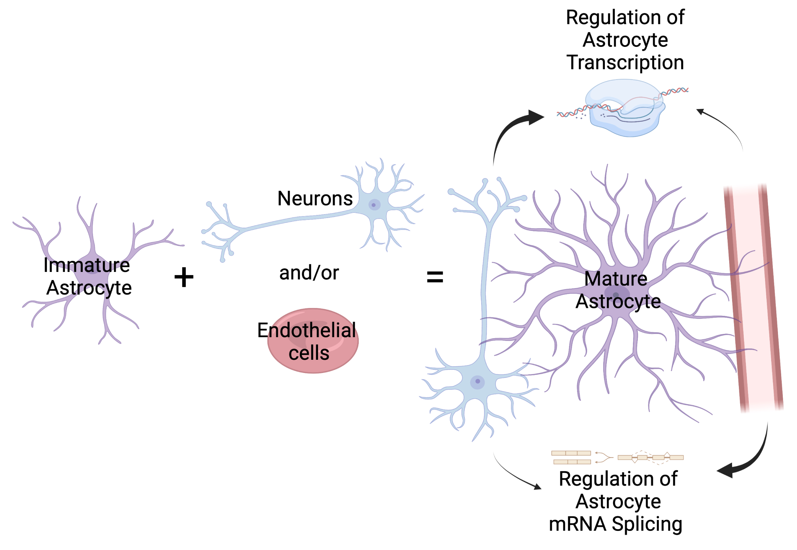
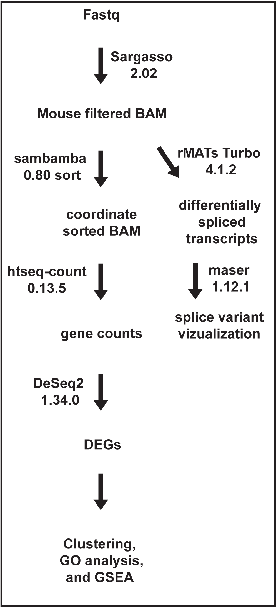

This repository is a preview of Martinez-Lozada, Farmer, et al, 2023. The full repository can be found at https://github.com/murailab/Astrocyte_Triple_Co-Culture/ once the final version of the manuscript has been accepted. The sequence data will be found at the NCBI Sequence Read Archive under [BioProject PRJNA961849](https://www.ncbi.nlm.nih.gov/bioproject/961849).

------------------------------------------------------------------------

# **Cooperative and competitive regulation of the astrocytic transcriptome by neurons and endothelial cells: Impact on astrocyte maturation**

Zila Martinez-Lozada, W. Todd Farmer, Alexandra L. Schober, Elizabeth Krizman, Michael B. Robinson, and Keith K. Murai

Abstract

Astrocytes have essential roles in central nervous system (CNS) health and disease. During development, immature astrocytes show complex interactions with neurons, endothelial cells, and other glial cell types. Interestingly, our work and that of others have shown that these interactions are important for astrocytic maturation. However, whether and how these cells work together to control this process remains poorly understood. Here, we test the hypothesis that cooperative interactions of astrocytes with neurons and endothelial cells promote astrocytic maturation. Astrocytes were cultured alone, with neurons, endothelial cells, or a combination of both. This was followed by astrocyte sorting, RNA sequencing, and bioinformatic analysis to detect transcriptional changes. Across culture configurations, 7,302 genes were differentially expressed by 4 or more-fold and organized into eight groups that demonstrate cooperative and antagonist effects of neurons and endothelia on astrocytes. We also discovered that neurons and endothelial cells caused splicing of 200 and 781 mRNAs, respectively. Changes in gene expression were validated using quantitative PCR, Western blot, and immunofluorescence analysis. We found that the transcriptomic data from the three-culture configuration correlated with protein expression of three representative targets (FAM107A, GAT3, and GLT1) in vivo. Alternative splicing results also correlated with cortical tissue isoform representation of a target (Fibronectin 1) at different developmental stages. By comparing our results to published transcriptomes of immature and mature astrocytes, we found that neurons or endothelia shift the astrocytic transcriptome toward a mature state and that the presence of both cell types has a greater effect on maturation than either cell alone. These results increase our understanding of cellular interactions/pathways that contribute to astrocytic maturation. They also provide insight into how alterations to neurons and/or endothelial cells may alter astrocytes with implications for astrocytic changes in CNS disorders and diseases.

## The Experiment

Bulk RNA-seq was performed on astrocytes after they were culture with neurons and/or endotheilial cells.

## The Pipeline  

 

## This Repository  

Folders:

sargasso_alignment - the scripts used to run species filtering alignment and gene counts

differential-gene-expression - contains the scripts and notebooks to perform differential gene expression analysis, gene ontology analysis, and gene set enrichment analysis  
  
qPCR_validation - notebook for the correlation of estimated log fold changes from RNA-seq to measured log fold changes from qPCR   

splicing - contains the scripts and notebooks used to perform differential splicing analysis
Preview for  Martinez-Lozada, Farmer, et al, 2023
