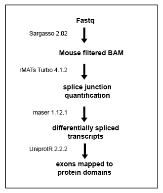

```{r setup, include=FALSE}
knitr::opts_chunk$set(cache = FALSE,
                      echo = TRUE,
                      warning = FALSE, 
                      message = FALSE, 
                      cache.lazy = FALSE, 
                      dev = c("png","pdf"), 
                      fig.keep = 'high', 
                      fig.path="figures/", 
                      fig.show="asis")
```

```{r libraries, echo=FALSE}

library(stringr)
library(knitr)
library(rmarkdown)
library(ggplot2)
# library(plotly)
library(tidyverse)
# library(pheatmap)
library(ggrepel)
library(RColorBrewer)
library(org.Mm.eg.db)
library(EnsDb.Mmusculus.v79)
library(ensembldb)
library(biomaRt)
# library(dplyr)
library(VennDiagram) 
library(maser) # cite
# library(protr)
library(UniprotR)
library(drawProteins)
library(ggvenn)
library(venneuler)
library(clusterProfiler)

source("functions.R")
select <- dplyr::select
edb <- EnsDb.Mmusculus.v79

```

# Overview

This notebook covers the differential splicing analysis of Martinez-Lozada, Farmer et. al 2023. Briefly, the splice junctions of mouse filtered BAM files of co-cultured astrocytes were quantified using rMATs [Shen et. al, 2014](https://www.pnas.org/doi/10.1073/pnas.1419161111). The Docker image of rMATs-Turbo used can be found [here](https://hub.docker.com/r/xinglab/rmats).

# The Pipeline

{width="400"}

# Helper Functions

```{r}

# fetch a dataframe of PSIs from a maser object using event ID  
get_psis <- function(maser_object, event_ID){
  psis <- as.data.frame(slot(maser_object, "SE_PSI")) %>%
  rownames_to_column("event") %>% 
  dplyr::filter(event == event_ID)  %>%
  pivot_longer( !event, names_to = "sample", values_to = "included") %>% 
  mutate(excluded = 1 - included ) %>% 
  mutate("culture" = str_remove(sample, "_\\d*")) %>%
  mutate(event = factor(event))
  return(psis)
}


# Extract the skipped exon PSI values from a maser object and make a boxplot  
boxplotPsiSE <- function(event_id, maser_object){
  PSI_df <- as.data.frame(maser_object@SE_PSI[event_id,]) %>% dplyr::rename("PSI" = "maser_object@SE_PSI[event_id, ]")
  PSI_df %>% mutate("culture" = str_remove(rownames(PSI_df), "_\\d*")) %>% ggplot() +
    geom_boxplot(aes(x = culture, y = PSI)) + theme_pub()
}

# Extract the mutually excluded exon PSI values from a maser object and make a boxplot  
boxplotPsiMXE <- function(event_id, maser_object){
  PSI_df <- as.data.frame(maser_object@MXE_PSI[event_id,]) %>% dplyr::rename("PSI" = "maser_object@MXE_PSI[event_id, ]")
  PSI_df %>% mutate("culture" = str_remove(rownames(PSI_df), "_\\d*")) %>% ggplot() +
  geom_boxplot(aes(x = culture, y = PSI)) + theme_pub()
}

# Returns the location of a skipped exon to the protein sequence
mapSkippedToProtein <- function(event_ID, SE_summary){
  exon_target <- dplyr::filter(SE_summary, ID==event_ID) %>% pull(exon_target)
  chr_target <- dplyr::filter(SE_summary, ID==event_ID) %>% pull(Chr) %>% str_remove("chr")
  g_target <- GRanges(paste(chr_target, exon_target, sep = ":"))
  return(genomeToProtein(g_target, EnsDb.Mmusculus.v79)) 
}

# Returns the location of a flanking regions of a skipped exon to the protein sequence
mapFlankingToProtein <- function(event_ID, SE_summary){
  up_target <- dplyr::filter(SE_summary, ID==event_ID) %>% pull(exon_upstream)
  down_target <- dplyr::filter(SE_summary, ID==event_ID) %>% pull(exon_downstream)
  chr_target <- dplyr::filter(SE_summary, ID==event_ID) %>% pull(Chr) %>% str_remove("chr")
  g_target <- GRanges(c(paste(chr_target, down_target, sep = ":"), paste(chr_target, up_target, sep = ":")))
  return(genomeToProtein(g_target, EnsDb.Mmusculus.v79)) 
}

# return a dataframe containing the features of a protein  
getDomainDf <- function(accession_string){
  print(paste0("Fetching Features for ", accession_string))
  uni_data <- drawProteins::get_features(paste(accession_string, collapse = ' '))
  prot_data <- drawProteins::feature_to_dataframe(uni_data)
  return(prot_data)
}

# fetch a Uniprot ID from an Ensembl Protein ID
uniToEnsP <- function(uniprot_id){
  res <- AnnotationDbi::select(edb, keys = uniprot_id, keytype = "UNIPROTID",
        columns = "PROTEINID",
          UniprotMappingTypeFilter("DIRECT"),
        multiVals = "first") %>% #distinct(UNIPROTID, .keep_all= TRUE) %>%
        dplyr::rename("accession" = UNIPROTID, "names" = PROTEINID)
  return(res)
}

# fetch the number of specific type of events from a maser object 
get_nevents <- function(type, maser_object){
  PSI <- slot(maser_object, paste0(type,"_","PSI"))
  nevents <- nrow(PSI)
  return(nevents)}

```

# Import the genomic annotations used in this notebook.

```{r}
gtf <- rtracklayer::import.gff("data/mm10_withEGFP.gtf")
```

# Overview of differential splicing in each comparison

Maser objects are created from the rMATs quantification of each comparison. Each object is filtered for coverage, FDR, and minimum difference. Pie charts of the number of differential events of each type is plotted for each comparison.

Types of splicing events:\
A3SS: Alternative 3' Splice Site\
A5SS: Alternative 5' Splice Site\
SE: Skipped Exon\
RI: Retained Intron\
MXE: Mutually Excluded Exon

## AvAEN

```{r}
AvEAN_maser <- maser("splicing/A_EAN_out/", c("A", "EAN") , ftype = "JCEC")
```

```{r}
AvEAN_filt <- filterByCoverage(AvEAN_maser, avg_reads = 5)
AvEAN_top <- topEvents(AvEAN_filt, fdr = 0.05, deltaPSI = 0.1)
AvEAN_top_mapped <- mapTranscriptsToEvents(AvEAN_top, gtf = gtf, ncores = 8)  
AvEAN_top_mapped
```

```{r}

types <- c("A3SS", "A5SS", "SE", "RI", "MXE")
 
nevents_per_type <- data_frame("type" = types, "nevents" = unlist(lapply(types, get_nevents, maser_object=AvEAN_top_mapped)))
# pdf("figures/splice_events.pdf")
ggplot(nevents_per_type, aes(x="", y=nevents, fill=type))+
geom_bar(width = 1, stat = "identity") +
  #scale_fill_grey() +
  coord_polar("y", start=0) +
  theme(
  axis.title.x = element_blank(),
  axis.title.y = element_blank(),
  panel.border = element_blank(),
  panel.grid=element_blank()) +
  geom_text(aes(y = nevents/5 + c(0, cumsum(nevents)[-length(nevents)]), 
                label = nevents))
# dev.off()
```

## AvAN

```{r}

AvAN_maser <- maser("splicing/A_AN_out", c("A", "AN") , ftype = "JCEC")

```

```{r}
AvAN_filt <- filterByCoverage(AvAN_maser, avg_reads = 5)
AvAN_top <- topEvents(AvAN_filt, fdr = 0.05, deltaPSI = 0.1)
AvAN_top_mapped <- mapTranscriptsToEvents(AvAN_top, gtf = gtf, ncores = 8)  
AvAN_top_mapped
```

```{r AvAN_pie}

nevents_AvAN_per_type <- data_frame("type" = types, "nevents" = unlist(lapply(types, get_nevents, maser_object=AvAN_top_mapped)))
#pdf("figures/AvAN_splice_events.pdf")
ggplot(nevents_AvAN_per_type, aes(x="", y=nevents, fill=type))+
geom_bar(width = 1, stat = "identity") +
  #scale_fill_grey() +
  coord_polar("y", start=0) +
  theme(
  axis.title.x = element_blank(),
  axis.title.y = element_blank(),
  panel.border = element_blank(),
  panel.grid=element_blank()) +
  geom_text(aes(y = nevents/5 + c(0, cumsum(nevents)[-length(nevents)]), 
                label = nevents)) + 
  ggtitle("AvAN")
#dev.off()
```

## AvAE

```{r}

AvAE_maser <- maser("splicing/A_AE_out", c("A", "AE"), ftype = "JCEC")

```

```{r}
AvAE_filt <- filterByCoverage(AvAE_maser, avg_reads = 5)
AvAE_top <- topEvents(AvAE_filt, fdr = 0.05, deltaPSI = 0.1)
AvAE_top_mapped <- mapTranscriptsToEvents(AvAE_top, gtf = gtf, ncores = 8)  
AvAE_top_mapped
```

```{r AvAE_pie}

nevents_AvAE_per_type <- data_frame("type" = types, "nevents" = unlist(lapply(types, get_nevents, maser_object=AvAE_top_mapped)))
#pdf("figures/AvAN_splice_events.pdf")
ggplot(nevents_AvAE_per_type, aes(x="", y=nevents, fill=type))+
geom_bar(width = 1, stat = "identity") +
  #scale_fill_grey() +
  coord_polar("y", start=0) +
  theme(
  axis.title.x = element_blank(),
  axis.title.y = element_blank(),
  panel.border = element_blank(),
  panel.grid=element_blank()) +
  geom_text(aes(y = nevents/5 + c(0, cumsum(nevents)[-length(nevents)]), 
                label = nevents)) + 
  ggtitle("AvAE")
#dev.off()
```

# Differentially skipped exons

Below is a summary table containing all of the differentially skipped exons between the A and AEN conditions sorted by FDR.

```{r}
SE_summary <- summary(AvEAN_top_mapped, type = "SE" ) %>%
  arrange(FDR) %>%
  dplyr::select(-list_ptn_a, -list_ptn_b) %>%
  dplyr::filter(txn_3exons != "", txn_2exons != "")  

write_tsv(SE_summary  , "results/skipped_exons.tsv")
SE_summary 
```

# Genes of interest with skipped exons

## Fn1

```{r}
dplyr::filter(SE_summary, geneSymbol=="Fn1") %>% select(ID, Chr, exon_target, Strand, exon_upstream)
```

### Box Plot of Inclusion vs. Skipping

```{r}
# Pull PSIs from maser objects

exon_position <- "71613763-71614035" # location of Fn1 spliced exon on Ch1. Used to get event IDs from other conditions  

# AvAEN
fn1_AvAEN <- get_psis(AvEAN_filt, "39903")

# AvAN
fn1_id_AvAN <- summary(AvAN_maser, type = "SE") %>% 
  filter(geneSymbol == "Fn1", exon_target == exon_position) %>% pull(ID)

fn1_AvAN <- get_psis(AvAN_filt, fn1_id_AvAN )

# AvAE
fn1_id_AvAE <- summary(AvAE_maser, type = "SE") %>% 
  filter(geneSymbol == "Fn1", exon_target == exon_position) %>% pull(ID)

fn1_AvAE <- get_psis(AvAE_filt, fn1_id_AvAE)

# Bind them all
fn1_psi <- rbind(fn1_AvAN %>% filter(culture == "AN"),
                 fn1_AvAE %>% filter(culture == "AE"),
                 fn1_AvAEN)
```

```{r}
# Plot PSIs of all conditions 

ggplot(fn1_psi, aes(x = culture, y = included)) +
  geom_boxplot() + 
  ggtitle("Proportion of Fn1 Exon 25 Spliced In")
```

```{r fn1_boxplot}
# Plot Fn1 PSIs of AvAEN  
#pdf("figures/fn1_psi.pdf")
fn1_AvAEN  %>%
  ggplot(aes(y = included, x = culture, fill = culture)) +
 stat_summary(fun.y = mean, geom = "bar") + 
  stat_summary(fun.data = mean_se, geom = "errorbar", width = 0.4) + 
  ylim(0, 1) +
  ggtitle("Fn1 Exon 25") + theme_pub()
#dev.off()
```

### Sashimi Plots Created in IGV and edited in Illustrator

```{r}
# region of interest for IGV  
# get chr,  start of upstream, and end of downstream  

```

### Map genomic regions of exons to proteins

Note that the skipped exon in Fn1 corresponds to a single FN domain. See the publication text for discussion.

```{r}
skipped_prot <- mapSkippedToProtein("39903", SE_summary)
flanking_prot <- mapFlankingToProtein("39903", SE_summary)
exon_features <- bind_rows(
  as.data.frame(ranges(skipped_prot[[1]])) %>% mutate("feature" = "skipped"),
  as.data.frame(ranges(flanking_prot[[1]])) %>% mutate("feature" = "upstream"),
  as.data.frame(ranges(flanking_prot[[2]])) %>% mutate("feature" = "downstream")
)
```

```{r}
# Fetch features of Fn1 proteins  
pros <- unique(AnnotationDbi::select(edb, keys = unique(exon_features$names), keytype = "PROTEINID",
       columns = "UNIPROTID")$UNIPROTID)
prot_data <- getDomainDf(pros)
```

```{r}
# wrangle Fibronectin data  
prot_data <- prot_data %>% mutate(description = str_remove(description, "\\ \\d{1,2}.*"))  ## Clean up domain names  
prot_data <- prot_data %>% mutate(description = str_replace(description, "Fibronectin\ type-", "Fn")) ## Abbreviate  
prot_data <- prot_data %>% dplyr::filter(order %in% c(1:4)) # peptide fragments removed  
```

```{r}
# Table to join EnsP accessions to selected Uniprot domains
acc_table <- prot_data %>% group_by(order, accession, entryName) %>%
  summarise(.groups = "keep") %>%
  ungroup()
acc_table <- right_join(acc_table, uniToEnsP(acc_table$accession), by = "accession")
exon_features <- exon_features %>% left_join(acc_table, by="names") %>% drop_na(order)
```

```{r fn1_structure, fig.width=24, fig.height=8}
offset <- 0.3
# draw protein features from database  
p <- draw_canvas(prot_data )
p <- draw_chains(p, prot_data)
p <- draw_domains(p, prot_data,
            label_size = 2 )
# mark skipped exon
p <- p +
  geom_rect(exon_features, mapping = aes(xmin = start , xmax = end, ymin = order-offset , ymax=order+offset, fill = feature), alpha = 0.7)

# background and y-axis
p <- p + theme_bw(base_size = 10) + # white backgnd & change text size
    theme(panel.grid.minor=element_blank(),
        panel.grid.major=element_blank()) +
    theme(axis.ticks = element_blank(),
        axis.text.y = element_blank()) +
    theme(panel.border = element_blank()) 
#pdf("figures/fn1_protein.pdf", width = 16)
p
#dev.off()
```

## Prom1

In this dataset Prom1 has 3 differentially spliced events in the AvAEN comparison. To examine if the 4 culture conditions influence splicing differentially, we identify the three skipped exon event IDs in each condition and combine the PSIs from each condition into a single dataframe and plot. To ensure that the correct events were used for each comparison, their genomic locations were verified manually.

The N-terminal event occurs in the extracellular domain of the protein while the C-terminal events occur in the intracellular region of the protein. See the manuscript for a discussion.

### Prom1 AvAEN

```{r}
# Identify the genomic location of differential spliced exons so that they may be found in other comparisons.  
Prom1_exons <- summary(AvEAN_top_mapped, type = "SE" ) %>% dplyr::filter(ID %in% c("9625", "9611", "9609")) %>% select(ID, Chr, Strand, exon_target, exon_upstream, exon_downstream)
Prom1_exons
```

```{r}
# Pull data for relevant events  
prom1_AvEAN <- as.data.frame(AvEAN_maser@SE_PSI[c("9625", "9611", "9609"),]) %>%
  rownames_to_column("event") %>% 
  pivot_longer( !event, names_to = "sample", values_to = "included") %>% 
  mutate(excluded = 1 - included ) %>% 
  mutate("culture" = str_remove(sample, "_\\d*"))  %>%
  #mutate(event = factor(event, levels = c("9625", "9611", "9609")) %>% 
  mutate(across(event, str_replace, "9625", "EC"),
         across("event", str_replace, "9611", "IC1"),
         across("event", str_replace, "9609", "IC2"))

```

### Prom1 AvAN

```{r}
# Get IDs of Prom1 splicing 
avAN_sum <- summary(AvAN_maser, type = "SE" )
  avAN_sum[(avAN_sum$Chr %in% Prom1_exons$Chr &
                                               avAN_sum$Strand %in% Prom1_exons$Strand & avAN_sum$Strand %in% Prom1_exons$Strand &
                                               avAN_sum$exon_target %in% Prom1_exons$exon_target &
                                               avAN_sum$exon_upstream %in% Prom1_exons$exon_upstream &
                                               avAN_sum$exon_downstream %in% Prom1_exons$exon_downstream),] %>%
  select(ID, Chr, Strand, exon_target, exon_upstream, exon_downstream)
```

```{r}
# Pull data for relevant events  
AN_prom1_events = c("9629", "9614", "9612")
prom1_AvAN <- as.data.frame(AvAN_maser@SE_PSI) %>% 
  rownames_to_column("event") %>% 
  filter(event %in% AN_prom1_events) %>%
  pivot_longer( !event, names_to = "sample", values_to = "included") %>% 
  mutate(excluded = 1 - included ) %>% 
  mutate("culture" = str_remove(sample, "_\\d*")) %>%
 # mutate(event = factor(event, levels = c("9625", "9611", "9609")) %>% 
  mutate(across(event, str_replace, "9629", "EC"),
         across("event", str_replace, "9614", "IC1"),
         across("event", str_replace, "9612", "IC2"))

```

### Prom1 AvAE

```{r}
# Identify splicing events  
avAE_sum <- summary(AvAE_maser, type = "SE" )
  avAE_sum[(avAE_sum$Chr %in% Prom1_exons$Chr &
                                               avAE_sum$Strand %in% Prom1_exons$Strand & avAE_sum$Strand %in% Prom1_exons$Strand &
                                               avAE_sum$exon_target %in% Prom1_exons$exon_target &
                                               avAE_sum$exon_upstream %in% Prom1_exons$exon_upstream &
                                               avAE_sum$exon_downstream %in% Prom1_exons$exon_downstream),] %>%
  select(ID, Chr, Strand, exon_target, exon_upstream, exon_downstream)
```

```{r}
# pull relevant events  
AE_prom1_events = c( "10066", "10068","10081")
prom1_AvAE <- as.data.frame(AvAE_maser@SE_PSI[AE_prom1_events,]) %>%
  rownames_to_column("event") %>% 
  pivot_longer( !event, names_to = "sample", values_to = "included") %>% 
  mutate(excluded = 1 - included ) %>% 
  mutate("culture" = str_remove(sample, "_\\d*")) %>%
  #mutate(event = factor(event, levels = c("9625", "9611", "9609")) %>% 
  mutate(across(event, str_replace, "10081", "EC"),
         across("event", str_replace, "10068", "IC1"),
         across("event", str_replace, "10066", "IC2"))

```

```{r}
# bind Prom1 SE events from each condition  
prom1_psi <- bind_rows(prom1_AvAN, prom1_AvAE, prom1_AvEAN) %>% distinct()
write_csv(prom1_psi, "results/prom1_psi.csv")
```

### Plot PSIs of differntially spliced exons of Prom1 in each culture condition

```{r}
#pdf("figures/prom1_psi.pdf")
 prom1_psi %>% 
  ggplot(aes(x=event, y = included, fill = culture, color = culture)) + 
  geom_point(position = position_dodge(width=0.75)) + 
  theme_pub()
#dev.off()
```

### Sashimi Plots Created in IGV and edited in Illustrator

```{r}
# region of interest for IGV  
# get chr,  start of upstream, and end of downstream  

```

### Map genomic regions of exons to proteins

```{r}
# map the skipped exons to protein  
skipped_protA <- mapSkippedToProtein("9609", SE_summary)
skipped_protB <- mapSkippedToProtein("9625", SE_summary)
skipped_protC <- mapSkippedToProtein("9611", SE_summary)

exon_features <- bind_rows(
  as.data.frame(ranges(skipped_protA[[1]])) %>% mutate("feature" = "Intracellular2"),
  as.data.frame(ranges(skipped_protB[[1]])) %>% mutate("feature" = "Extracellular"),
  as.data.frame(ranges(skipped_protC[[1]])) %>% mutate("feature" = "Intracellular1")
) 
```

```{r}
# Fetch Prominin1 Proteins and their features  
pros <- AnnotationDbi::select(edb, keys = GeneNameFilter("Prom1"),
       columns = "UNIPROTID")$UNIPROTID

prot_data <- getDomainDf(pros)
```

```{r}
# Table to join EnsP acc to selected Uniprot domains
acc_table <- prot_data %>% group_by(order, accession, entryName) %>%
  summarise(.groups = "keep") %>%
  ungroup()
acc_table <- right_join(acc_table, uniToEnsP(acc_table$accession), by = "accession")
exon_features <- exon_features %>% left_join(acc_table, by="names") %>% drop_na(order)
exon_features
```

```{r prom1_structure, fig.width=12}
offset <- 0.3

p <- draw_canvas(prot_data )
p <- draw_chains(p, prot_data)
p <- draw_domains(p, prot_data )
# mark skipped exon
# 
p <- draw_repeat(p, prot_data)
p <- draw_motif(p, prot_data)
p <- draw_recept_dom(p, prot_data)
p <- draw_regions(p, prot_data)
p <- draw_phospho(p, prot_data, size = 8)

p <- p +
  geom_rect(exon_features, mapping = aes(xmin = start , xmax = end, ymin = order-offset , ymax=order+offset, color = feature), alpha = 0.7, )

# background and y-axis
p <- p + theme_bw(base_size = 10) + # white backgnd & change text size
    theme(panel.grid.minor=element_blank(),
        panel.grid.major=element_blank()) +
    theme(axis.ticks = element_blank(),
        axis.text.y = element_blank()) +
    theme(panel.border = element_blank()) + 
  ggtitle("Prom1")

# pdf("figures/prom1_structure.pdf", width = 12)
p
# dev.off()
```

# Venn diagram of unique differntially skipped exons across conditions

```{r}
# make a dataframe of all evenets and add an ID for each unique event.  
unique_events <- bind_rows(summary(AvEAN_top_mapped, type = "SE" ),
          summary(AvAE_top_mapped, type = "SE" ),
          summary(AvAN_top_mapped, type = "SE" )) %>% 
  select(geneSymbol, Chr, Strand, exon_target) %>%
  distinct() %>%
  mutate(id = row_number())

# get the significant SE events from each condition and join to total events on genomic location to maintain unique IDs for each event  
AvEAN_summary <- summary(AvEAN_top_mapped, type = "SE" ) %>% 
  select(geneSymbol, Chr, Strand, exon_target) %>% left_join(unique_events, by = c("geneSymbol", "Chr", "Strand", "exon_target"))
AvAN_summary <- summary(AvAN_top_mapped, type = "SE" ) %>% 
  select(geneSymbol, Chr, Strand, exon_target) %>% left_join(unique_events, by = c("geneSymbol", "Chr", "Strand", "exon_target"))
AvAE_summary <- summary(AvAE_top_mapped, type = "SE" ) %>% 
  select(geneSymbol, Chr, Strand, exon_target) %>% left_join(unique_events, by = c("geneSymbol", "Chr", "Strand", "exon_target"))

# make a list the event that appear in each condition  
id_list <- list(
  AvAN = AvAN_summary$id,
  AvAE = AvAE_summary$id,
  AvAEN = AvEAN_summary$id
)
```

```{r splicing_venn}
# pdf("figures/splicing_venn.pdf")
ggvenn(id_list)
# dev.off()
```

```{r splicing_venn_proportional}
# pdf("figures/splicing_venn_proportional.pdf")
plot(venneuler(c(AvAN = length(AvAN_summary$id),        
                 AvAE = length(AvAE_summary$id),
                 AvAEN = length(AvEAN_summary$id),
                 "AvAN&AvAE" = length(intersect(AvAN_summary$id, AvAE_summary$id)),
                 "AvAE&AvAEN" = length(intersect(AvAE_summary$id, AvEAN_summary$id)),
                 "AvAE&AvAN&AvAEN" = length(intersect(AvAE_summary$id, intersect(AvAN_summary$id, AvEAN_summary$id))),
                 "AvAN&AvAEN" = length(intersect(AvAN_summary$id, AvEAN_summary$id))
)
     ))
# dev.off()
```

# Gene Ontology of Differntially Spliced Genes

To test if the genes that undergo differential splicing are over-represented in MF and BP gene ontology gene sets clusterProfiler was used. See the manuscript for a discussion of these results.

```{r}
# pull all of the unique genes that have differential splicing for each comparison against pure astrocytes    
AN_splice_genes <- AvAN_summary %>% pull(geneSymbol) %>% unique()
AE_splice_genes <- AvAE_summary %>% pull(geneSymbol) %>% unique()
AEN_splice_genes <- AvEAN_summary %>% pull(geneSymbol) %>% unique()
splice_genes <- list("AN" = AN_splice_genes,
                     "AE" = AE_splice_genes,
                     "AEN" = AEN_splice_genes)

```

```{r}
# perform GO analysis using clusterProfiler  
splice_go_mf <- compareCluster(geneCluster = splice_genes, fun = enrichGO, OrgDb="org.Mm.eg.db", keyType = "SYMBOL",  ont="MF")
splice_go_mf <- enrichplot::pairwise_termsim(splice_go_mf)
splice_go_mf2 <- simplify(splice_go_mf, cutoff=0.7, by="pvalue", select_fun=min)
```

```{r}
#pdf("figures/spliceGO_MF.pdf")
enrichplot::dotplot(splice_go_mf2, title = "Molecular Function") 
# dev.off()
```

```{r}
splice_go_bp <- compareCluster(geneCluster = splice_genes, fun = enrichGO, OrgDb="org.Mm.eg.db", keyType = "SYMBOL",  ont="BP")
splice_go_bp <- enrichplot::pairwise_termsim(splice_go_bp)
splice_go_bp2 <- simplify(splice_go_bp, cutoff=0.7, by="pvalue", select_fun=min)
```

```{r}
# pdf("figures/spliceGO_BP.pdf")
enrichplot::dotplot(splice_go_bp2, title = "Biological Process") 
# dev.off()
```

```{r}
# write dataframe containing GO analysis  
bp <- splice_go_bp2@compareClusterResult %>% mutate("Ontology" = "BP")
mf <- splice_go_mf2@compareClusterResult %>% mutate("Ontology" = "MF")
write_tsv(bind_rows(bp, mf), "results/splice_GO_results.tsv")
```

# Environment

```{r}
sessionInfo()
```
