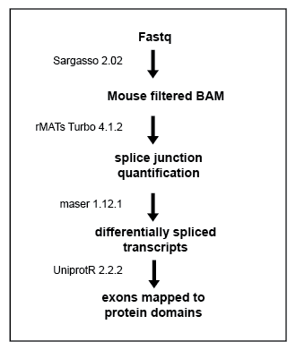

# Overview

This notebook covers the differential splicing analysis of
Martinez-Lozada, Farmer et. al 2023. Briefly, the splice junctions of
mouse filtered BAM files of co-cultured astrocytes were quantified using
rMATs [Shen et. al,
2014](https://www.pnas.org/doi/10.1073/pnas.1419161111). The Docker
image of rMATs-Turbo used can be found
[here](https://hub.docker.com/r/xinglab/rmats).

# The Pipeline



# Helper Functions

``` r
# fetch a dataframe of PSIs from a maser object using event ID  
get_psis <- function(maser_object, event_ID){
  psis <- as.data.frame(slot(maser_object, "SE_PSI")) %>%
  rownames_to_column("event") %>% 
  dplyr::filter(event == event_ID)  %>%
  pivot_longer( !event, names_to = "sample", values_to = "included") %>% 
  mutate(excluded = 1 - included ) %>% 
  mutate("culture" = str_remove(sample, "_\\d*")) %>%
  mutate(event = factor(event))
  return(psis)
}


# Extract the skipped exon PSI values from a maser object and make a boxplot  
boxplotPsiSE <- function(event_id, maser_object){
  PSI_df <- as.data.frame(maser_object@SE_PSI[event_id,]) %>% dplyr::rename("PSI" = "maser_object@SE_PSI[event_id, ]")
  PSI_df %>% mutate("culture" = str_remove(rownames(PSI_df), "_\\d*")) %>% ggplot() +
    geom_boxplot(aes(x = culture, y = PSI)) + theme_pub()
}

# Extract the mutually excluded exon PSI values from a maser object and make a boxplot  
boxplotPsiMXE <- function(event_id, maser_object){
  PSI_df <- as.data.frame(maser_object@MXE_PSI[event_id,]) %>% dplyr::rename("PSI" = "maser_object@MXE_PSI[event_id, ]")
  PSI_df %>% mutate("culture" = str_remove(rownames(PSI_df), "_\\d*")) %>% ggplot() +
  geom_boxplot(aes(x = culture, y = PSI)) + theme_pub()
}

# Returns the location of a skipped exon to the protein sequence
mapSkippedToProtein <- function(event_ID, SE_summary){
  exon_target <- dplyr::filter(SE_summary, ID==event_ID) %>% pull(exon_target)
  chr_target <- dplyr::filter(SE_summary, ID==event_ID) %>% pull(Chr) %>% str_remove("chr")
  g_target <- GRanges(paste(chr_target, exon_target, sep = ":"))
  return(genomeToProtein(g_target, EnsDb.Mmusculus.v79)) 
}

# Returns the location of a flanking regions of a skipped exon to the protein sequence
mapFlankingToProtein <- function(event_ID, SE_summary){
  up_target <- dplyr::filter(SE_summary, ID==event_ID) %>% pull(exon_upstream)
  down_target <- dplyr::filter(SE_summary, ID==event_ID) %>% pull(exon_downstream)
  chr_target <- dplyr::filter(SE_summary, ID==event_ID) %>% pull(Chr) %>% str_remove("chr")
  g_target <- GRanges(c(paste(chr_target, down_target, sep = ":"), paste(chr_target, up_target, sep = ":")))
  return(genomeToProtein(g_target, EnsDb.Mmusculus.v79)) 
}

# return a dataframe containing the features of a protein  
getDomainDf <- function(accession_string){
  print(paste0("Fetching Features for ", accession_string))
  uni_data <- drawProteins::get_features(paste(accession_string, collapse = ' '))
  prot_data <- drawProteins::feature_to_dataframe(uni_data)
  return(prot_data)
}

# fetch a Uniprot ID from an Ensembl Protein ID
uniToEnsP <- function(uniprot_id){
  res <- AnnotationDbi::select(edb, keys = uniprot_id, keytype = "UNIPROTID",
        columns = "PROTEINID",
          UniprotMappingTypeFilter("DIRECT"),
        multiVals = "first") %>% #distinct(UNIPROTID, .keep_all= TRUE) %>%
        dplyr::rename("accession" = UNIPROTID, "names" = PROTEINID)
  return(res)
}

# fetch the number of specific type of events from a maser object 
get_nevents <- function(type, maser_object){
  PSI <- slot(maser_object, paste0(type,"_","PSI"))
  nevents <- nrow(PSI)
  return(nevents)}
```

# Import the genomic annotations used in this notebook.

``` r
gtf <- rtracklayer::import.gff("data/mm10_withEGFP.gtf")
```

# Overview of differential splicing in each comparison

Maser objects are created from the rMATs quantification of each
comparison. Each object is filtered for coverage, FDR, and minimum
difference. Pie charts of the number of differential events of each type
is plotted for each comparison.

Types of splicing events:  
A3SS: Alternative 3’ Splice Site  
A5SS: Alternative 5’ Splice Site  
SE: Skipped Exon  
RI: Retained Intron  
MXE: Mutually Excluded Exon

## AvAEN

``` r
AvEAN_maser <- maser("splicing/A_EAN_out/", c("A", "EAN") , ftype = "JCEC")
```

``` r
AvEAN_filt <- filterByCoverage(AvEAN_maser, avg_reads = 5)
AvEAN_top <- topEvents(AvEAN_filt, fdr = 0.05, deltaPSI = 0.1)
AvEAN_top_mapped <- mapTranscriptsToEvents(AvEAN_top, gtf = gtf, ncores = 8)  
AvEAN_top_mapped
```

    ## A Maser object with 821 splicing events.
    ## 
    ## Samples description: 
    ## Label=A     n=5 replicates
    ## Label=EAN     n=4 replicates
    ## 
    ## Splicing events: 
    ## A3SS.......... 58 events
    ## A5SS.......... 42 events
    ## SE.......... 575 events
    ## RI.......... 78 events
    ## MXE.......... 68 events

``` r
types <- c("A3SS", "A5SS", "SE", "RI", "MXE")
 
nevents_per_type <- data_frame("type" = types, "nevents" = unlist(lapply(types, get_nevents, maser_object=AvEAN_top_mapped)))
# pdf("figures/splice_events.pdf")
ggplot(nevents_per_type, aes(x="", y=nevents, fill=type))+
geom_bar(width = 1, stat = "identity") +
  #scale_fill_grey() +
  coord_polar("y", start=0) +
  theme(
  axis.title.x = element_blank(),
  axis.title.y = element_blank(),
  panel.border = element_blank(),
  panel.grid=element_blank()) +
  geom_text(aes(y = nevents/5 + c(0, cumsum(nevents)[-length(nevents)]), 
                label = nevents))
```


``` r
# dev.off()
```

## AvAN

``` r
AvAN_maser <- maser("splicing/A_AN_out", c("A", "AN") , ftype = "JCEC")
```

``` r
AvAN_filt <- filterByCoverage(AvAN_maser, avg_reads = 5)
AvAN_top <- topEvents(AvAN_filt, fdr = 0.05, deltaPSI = 0.1)
AvAN_top_mapped <- mapTranscriptsToEvents(AvAN_top, gtf = gtf, ncores = 8)  
AvAN_top_mapped
```

    ## A Maser object with 222 splicing events.
    ## 
    ## Samples description: 
    ## Label=A     n=5 replicates
    ## Label=AN     n=5 replicates
    ## 
    ## Splicing events: 
    ## A3SS.......... 19 events
    ## A5SS.......... 8 events
    ## SE.......... 169 events
    ## RI.......... 20 events
    ## MXE.......... 6 events

``` r
nevents_AvAN_per_type <- data_frame("type" = types, "nevents" = unlist(lapply(types, get_nevents, maser_object=AvAN_top_mapped)))
#pdf("figures/AvAN_splice_events.pdf")
ggplot(nevents_AvAN_per_type, aes(x="", y=nevents, fill=type))+
geom_bar(width = 1, stat = "identity") +
  #scale_fill_grey() +
  coord_polar("y", start=0) +
  theme(
  axis.title.x = element_blank(),
  axis.title.y = element_blank(),
  panel.border = element_blank(),
  panel.grid=element_blank()) +
  geom_text(aes(y = nevents/5 + c(0, cumsum(nevents)[-length(nevents)]), 
                label = nevents)) + 
  ggtitle("AvAN")
```


``` r
#dev.off()
```

## AvAE

``` r
AvAE_maser <- maser("splicing/A_AE_out", c("A", "AE"), ftype = "JCEC")
```

``` r
AvAE_filt <- filterByCoverage(AvAE_maser, avg_reads = 5)
AvAE_top <- topEvents(AvAE_filt, fdr = 0.05, deltaPSI = 0.1)
AvAE_top_mapped <- mapTranscriptsToEvents(AvAE_top, gtf = gtf, ncores = 8)  
AvAE_top_mapped
```

    ## A Maser object with 781 splicing events.
    ## 
    ## Samples description: 
    ## Label=A     n=5 replicates
    ## Label=AE     n=5 replicates
    ## 
    ## Splicing events: 
    ## A3SS.......... 53 events
    ## A5SS.......... 39 events
    ## SE.......... 574 events
    ## RI.......... 54 events
    ## MXE.......... 61 events

``` r
nevents_AvAE_per_type <- data_frame("type" = types, "nevents" = unlist(lapply(types, get_nevents, maser_object=AvAE_top_mapped)))
#pdf("figures/AvAN_splice_events.pdf")
ggplot(nevents_AvAE_per_type, aes(x="", y=nevents, fill=type))+
geom_bar(width = 1, stat = "identity") +
  #scale_fill_grey() +
  coord_polar("y", start=0) +
  theme(
  axis.title.x = element_blank(),
  axis.title.y = element_blank(),
  panel.border = element_blank(),
  panel.grid=element_blank()) +
  geom_text(aes(y = nevents/5 + c(0, cumsum(nevents)[-length(nevents)]), 
                label = nevents)) + 
  ggtitle("AvAE")
```


``` r
#dev.off()
```

# Differentially skipped exons

Below is a summary table containing all of the differentially skipped
exons between the A and AEN conditions sorted by FDR.

``` r
SE_summary <- summary(AvEAN_top_mapped, type = "SE" ) %>%
  arrange(FDR) %>%
  dplyr::select(-list_ptn_a, -list_ptn_b) %>%
  dplyr::filter(txn_3exons != "", txn_2exons != "")  

write_tsv(SE_summary  , "results/skipped_exons.tsv")
SE_summary 
```

    ##        ID             GeneID    geneSymbol
    ## 1    1790 ENSMUSG00000024533        Spire1
    ## 2    1996 ENSMUSG00000024534        Sncaip
    ## 3    2137 ENSMUSG00000005417         Mprip
    ## 4    3615 ENSMUSG00000001323           Srr
    ## 5    5699 ENSMUSG00000045095         Magi1
    ## 6    7266 ENSMUSG00000032374         Plod2
    ## 7    9098 ENSMUSG00000035325        Sec31a
    ## 8    9100 ENSMUSG00000035325        Sec31a
    ## 9    9420 ENSMUSG00000026490      Cdc42bpa
    ## 10   9507 ENSMUSG00000060961        Slc4a4
    ## 11   9609 ENSMUSG00000029086         Prom1
    ## 12   9625 ENSMUSG00000029086         Prom1
    ## 13  11201 ENSMUSG00000021709         Erbin
    ## 14  13229 ENSMUSG00000028613          Lrp8
    ## 15  13318 ENSMUSG00000028519          Dab1
    ## 16  13670 ENSMUSG00000032076         Cadm1
    ## 17  15356 ENSMUSG00000027692          Tnik
    ## 18  15447 ENSMUSG00000036879          Phkb
    ## 19  15449 ENSMUSG00000036879          Phkb
    ## 20  22272 ENSMUSG00000028649         Macf1
    ## 21  22792 ENSMUSG00000029406       Pitpnm2
    ## 22  23515 ENSMUSG00000024462        Gabbr1
    ## 23  24531 ENSMUSG00000031996         Aplp2
    ## 24  24884 ENSMUSG00000038388          Mpp6
    ## 25  26581 ENSMUSG00000010453        Kansl3
    ## 26  27408 ENSMUSG00000045103           Dmd
    ## 27  28160 ENSMUSG00000031626        Sorbs2
    ## 28  28171 ENSMUSG00000031626        Sorbs2
    ## 29  28176 ENSMUSG00000031626        Sorbs2
    ## 30  31625 ENSMUSG00000045427       Hnrnph2
    ## 31  32906 ENSMUSG00000024608         Rps14
    ## 32  33184 ENSMUSG00000028041        Adam15
    ## 33  35476 ENSMUSG00000024978          Gpam
    ## 34  39284 ENSMUSG00000034109        Golim4
    ## 35  39903 ENSMUSG00000026193           Fn1
    ## 36  41530 ENSMUSG00000025724        Sec11a
    ## 37  42491 ENSMUSG00000002885        Adgre5
    ## 38  43447 ENSMUSG00000028284        Map3k7
    ## 39  43722 ENSMUSG00000021814         Anxa7
    ## 40  44171 ENSMUSG00000030605         Mfge8
    ## 41  44357 ENSMUSG00000071550        Cfap44
    ## 42  44401 ENSMUSG00000026670          Uap1
    ## 43  44402 ENSMUSG00000026670          Uap1
    ## 44  44787 ENSMUSG00000017119          Nbr1
    ## 45  45262 ENSMUSG00000090841          Myl6
    ## 46  45347 ENSMUSG00000055320         Tead1
    ## 47  51927 ENSMUSG00000025006        Sorbs1
    ## 48  53059 ENSMUSG00000011958         Bnip2
    ## 49  53379 ENSMUSG00000066456         Hmgn3
    ## 50  53973 ENSMUSG00000010047         Hyal2
    ## 51  54389 ENSMUSG00000009073           Nf2
    ## 52  55228 ENSMUSG00000020458          Rtn4
    ## 53  56612 ENSMUSG00000000631        Myo18a
    ## 54  59839 ENSMUSG00000022533       Atp13a3
    ## 55  63704 ENSMUSG00000035392       Dennd1a
    ## 56  64044 ENSMUSG00000022629        Kif21a
    ## 57  64195 ENSMUSG00000023021         Cers5
    ## 58     72 ENSMUSG00000025085        Ablim1
    ## 59  32268 ENSMUSG00000036435         Exoc1
    ## 60   7701 ENSMUSG00000020758         Itgb4
    ## 61  49753 ENSMUSG00000021843          Ktn1
    ## 62  44819 ENSMUSG00000019907      Ppp1r12a
    ## 63  43448 ENSMUSG00000028284        Map3k7
    ## 64  64045 ENSMUSG00000022629        Kif21a
    ## 65     80 ENSMUSG00000025085        Ablim1
    ## 66  13669 ENSMUSG00000032076         Cadm1
    ## 67  18242 ENSMUSG00000033213      AA467197
    ## 68  35794 ENSMUSG00000059456         Ptk2b
    ## 69  28177 ENSMUSG00000031626        Sorbs2
    ## 70  15278 ENSMUSG00000022199      Slc22a17
    ## 71  49892 ENSMUSG00000027750         Postn
    ## 72  58222 ENSMUSG00000025162        Csnk1d
    ## 73  44817 ENSMUSG00000019907      Ppp1r12a
    ## 74  18015 ENSMUSG00000025871 4833439L19Rik
    ## 75  37850 ENSMUSG00000030739         Myh14
    ## 76  37632 ENSMUSG00000025404        R3hdm2
    ## 77  21374 ENSMUSG00000026150           Mff
    ## 78     74 ENSMUSG00000025085        Ablim1
    ## 79  36372 ENSMUSG00000023008         Fmnl3
    ## 80  23422 ENSMUSG00000034903        Cobll1
    ## 81  34094 ENSMUSG00000041936          Agrn
    ## 82   4210 ENSMUSG00000031618         Nr3c2
    ## 83  47366 ENSMUSG00000013033        Adgrl1
    ## 84  10103 ENSMUSG00000021614          Vcan
    ## 85  38979 ENSMUSG00000031570         Plpp5
    ## 86  59576 ENSMUSG00000060227         Casc4
    ## 87  19961 ENSMUSG00000026767        Mindy3
    ## 88  55791 ENSMUSG00000000538        Tom1l2
    ## 89   6497 ENSMUSG00000041594         Tmtc4
    ## 90  18014 ENSMUSG00000025871 4833439L19Rik
    ## 91   2430 ENSMUSG00000025656       Arhgef9
    ## 92  18019 ENSMUSG00000025871 4833439L19Rik
    ## 93  22172 ENSMUSG00000031174          Rpgr
    ## 94  46960 ENSMUSG00000004677         Myo9b
    ## 95  22279 ENSMUSG00000028649         Macf1
    ## 96  48748 ENSMUSG00000054423         Cadps
    ## 97  51956 ENSMUSG00000025006        Sorbs1
    ## 98  39451 ENSMUSG00000028078         Dclk2
    ## 99  34425 ENSMUSG00000037935       Smarce1
    ## 100 11528 ENSMUSG00000039953        Clstn1
    ## 101 28175 ENSMUSG00000031626        Sorbs2
    ## 102 48091 ENSMUSG00000030849         Fgfr2
    ## 103 28356 ENSMUSG00000033577          Myo6
    ## 104 55943 ENSMUSG00000022636         Alcam
    ## 105 56619 ENSMUSG00000000631        Myo18a
    ## 106 41821 ENSMUSG00000025781        Atp5c1
    ## 107 27418 ENSMUSG00000045103           Dmd
    ## 108 52788 ENSMUSG00000024013          Fgd2
    ## 109 37420 ENSMUSG00000063511       Snrnp70
    ## 110 40057 ENSMUSG00000020014        Cfap54
    ## 111 37419 ENSMUSG00000063511       Snrnp70
    ## 112 25048 ENSMUSG00000026442         Nfasc
    ## 113 42859 ENSMUSG00000054640        Slc8a1
    ## 114 32576 ENSMUSG00000030782       Tgfb1i1
    ## 115 10106 ENSMUSG00000021614          Vcan
    ## 116 56946 ENSMUSG00000021262           Evl
    ## 117 24560 ENSMUSG00000027291         Vps39
    ## 118 11962 ENSMUSG00000040690       Col16a1
    ## 119 49743 ENSMUSG00000021843          Ktn1
    ## 120 36205 ENSMUSG00000020674          Pxdn
    ## 121 65022 ENSMUSG00000022791          Tnk2
    ## 122 19922 ENSMUSG00000067795 4930444P10Rik
    ## 123  9164 ENSMUSG00000024561          Mbd1
    ## 124 16308 ENSMUSG00000019856       Fam184a
    ## 125 31413 ENSMUSG00000030708       Dnajb13
    ## 126 55307 ENSMUSG00000005338         Cadm3
    ## 127 15001 ENSMUSG00000042766        Trim46
    ## 128 27590 ENSMUSG00000028399         Ptprd
    ## 129 23509 ENSMUSG00000030616         Sytl2
    ## 130  9611 ENSMUSG00000029086         Prom1
    ## 131 68593 ENSMUSG00000036528       Ppfibp2
    ## 132  2053 ENSMUSG00000024502       Jakmip2
    ## 133 24269 ENSMUSG00000031561         Tenm3
    ## 134 68459 ENSMUSG00000118380       Gm36037
    ## 135  5725 ENSMUSG00000034312        Iqsec1
    ## 136 27783 ENSMUSG00000039648         Kyat1
    ## 137  4627 ENSMUSG00000021000          Mia2
    ## 138 12946 ENSMUSG00000028693          Nasp
    ## 139 18650 ENSMUSG00000039958       Etfbkmt
    ## 140 19962 ENSMUSG00000026767        Mindy3
    ## 141  3507 ENSMUSG00000032246        Calml4
    ## 142 64647 ENSMUSG00000019467      Arhgef25
    ## 143 35746 ENSMUSG00000027210         Meis2
    ## 144 54510 ENSMUSG00000028402          Mpdz
    ## 145 23750 ENSMUSG00000062044         Lmtk3
    ## 146 35275 ENSMUSG00000068329         Htra2
    ## 147 64989 ENSMUSG00000049076         Acap2
    ## 148 17507 ENSMUSG00000085396         Firre
    ## 149 36588 ENSMUSG00000022749       Tbc1d23
    ## 150 20140 ENSMUSG00000047767       Atg16l2
    ## 151 23802 ENSMUSG00000039706          Ldb2
    ## 152 65023 ENSMUSG00000022791          Tnk2
    ## 153  5113 ENSMUSG00000032366          Tpm1
    ## 154  9633 ENSMUSG00000029428          Stx2
    ## 155  6437 ENSMUSG00000029778     Adcyap1r1
    ## 156 14232 ENSMUSG00000029328       Hnrnpdl
    ## 157 27768 ENSMUSG00000024127         Prepl
    ## 158 28174 ENSMUSG00000031626        Sorbs2
    ## 159 11720 ENSMUSG00000071454          Dtnb
    ## 160  6087 ENSMUSG00000067786          Nnat
    ## 161 19967 ENSMUSG00000026767        Mindy3
    ## 162 15771 ENSMUSG00000038844        Kif16b
    ## 163 37236 ENSMUSG00000041225      Arhgap12
    ## 164  7194 ENSMUSG00000025592         Dach2
    ## 165 25034 ENSMUSG00000086316          Nbdy
    ## 166 12636 ENSMUSG00000039156         Stim2
    ## 167  9296 ENSMUSG00000019978       Epb41l2
    ## 168 47365 ENSMUSG00000013033        Adgrl1
    ## 169 26305 ENSMUSG00000026836         Acvr1
    ## 170 50988 ENSMUSG00000110080        Gm6145
    ## 171 26870 ENSMUSG00000026730          Pter
    ## 172 36752 ENSMUSG00000017978        Cadps2
    ## 173 12067 ENSMUSG00000029822        Osbpl3
    ## 174 58815 ENSMUSG00000110277       Gm45871
    ## 175  6382 ENSMUSG00000030083         Abtb1
    ## 176 52447 ENSMUSG00000020593         Lpin1
    ## 177 49400 ENSMUSG00000114470       Gm49395
    ## 178 42489 ENSMUSG00000002885        Adgre5
    ## 179 24757 ENSMUSG00000037533       Rapgef6
    ## 180 34646 ENSMUSG00000063364 3300002I08Rik
    ## 181  1599 ENSMUSG00000034006       Slc66a2
    ## 182  5695 ENSMUSG00000045095         Magi1
    ## 183 62398 ENSMUSG00000002799          Jag2
    ## 184 30807 ENSMUSG00000026566         Mpzl1
    ## 185 52411 ENSMUSG00000024044       Epb41l3
    ## 186 40698 ENSMUSG00000028134         Ptbp2
    ## 187 47049 ENSMUSG00000041658         Rragb
    ## 188 37407 ENSMUSG00000087578     Ccdc142os
    ## 189 19959 ENSMUSG00000026767        Mindy3
    ## 190 50516 ENSMUSG00000034684        Sema3f
    ## 191 44682 ENSMUSG00000019966          Kitl
    ## 192 20815 ENSMUSG00000061887         Ssbp3
    ## 193 54968 ENSMUSG00000033149        Phldb2
    ## 194 36354 ENSMUSG00000022537        Tmem44
    ## 195 55318 ENSMUSG00000020271        Fbxw11
    ## 196 30563 ENSMUSG00000040297          Suco
    ## 197  2679 ENSMUSG00000026921         Egfl7
    ## 198 36355 ENSMUSG00000022537        Tmem44
    ## 199 63925 ENSMUSG00000024330       Col11a2
    ## 200 37405 ENSMUSG00000087578     Ccdc142os
    ## 201 21777 ENSMUSG00000040648       Ppip5k2
    ## 202 40562 ENSMUSG00000026708         Cenpl
    ## 203 37408 ENSMUSG00000087578     Ccdc142os
    ## 204 20808 ENSMUSG00000002458         Rgs19
    ## 205 66198 ENSMUSG00000067629       Syngap1
    ## 206 53117 ENSMUSG00000038535       Zfp280d
    ## 207  2817 ENSMUSG00000035642         Aamdc
    ## 208  7100 ENSMUSG00000029534           St7
    ## 209  4626 ENSMUSG00000021000          Mia2
    ## 210 20079 ENSMUSG00000029221       Slc30a9
    ## 211  6086 ENSMUSG00000067786          Nnat
    ## 212  4385 ENSMUSG00000049606        Zfp644
    ## 213 19380 ENSMUSG00000021306       Gpr137b
    ## 214 67049 ENSMUSG00000029761         Cald1
    ## 215 32854 ENSMUSG00000056938         Acbd4
    ## 216 32081 ENSMUSG00000074646 6430550D23Rik
    ## 217 14489 ENSMUSG00000003452         Bicd1
    ## 218 59711 ENSMUSG00000113204       Gm46430
    ## 219  1432 ENSMUSG00000045098         Kmt5b
    ## 220 57523 ENSMUSG00000034621       Gpatch8
    ## 221 27720 ENSMUSG00000093765       Gm20658
    ## 222 68478 ENSMUSG00000037236         Matr3
    ## 223  9424 ENSMUSG00000102644         Thap6
    ## 224  4400 ENSMUSG00000049606        Zfp644
    ## 225 68100 ENSMUSG00000063889          Crem
    ## 226  4925 ENSMUSG00000030231       Plekha5
    ## 227 28534 ENSMUSG00000022856       Tmem41a
    ## 228 48092 ENSMUSG00000030849         Fgfr2
    ## 229 27402 ENSMUSG00000028634        Hivep3
    ## 230 25049 ENSMUSG00000026442         Nfasc
    ## 231 63273 ENSMUSG00000072501       Phf20l1
    ## 232 65021 ENSMUSG00000022791          Tnk2
    ## 233 13036 ENSMUSG00000030815         Phkg2
    ## 234 31585 ENSMUSG00000026927         Entr1
    ## 235 27311 ENSMUSG00000026319         Relch
    ## 236 15547 ENSMUSG00000029569       Tmem168
    ## 237 60058 ENSMUSG00000024097         Srsf7
    ## 238 17898 ENSMUSG00000030846         Tial1
    ## 239  7530 ENSMUSG00000022708        Zbtb20
    ## 240 28975 ENSMUSG00000073643         Wdfy1
    ## 241 46514 ENSMUSG00000052516         Robo2
    ## 242 18517 ENSMUSG00000066113      Adamtsl1
    ## 243 23109 ENSMUSG00000025949       Pikfyve
    ## 244 56812 ENSMUSG00000083161       Gm11427
    ## 245 23537 ENSMUSG00000040174        Alkbh3
    ## 246 36346 ENSMUSG00000022537        Tmem44
    ## 247 48892 ENSMUSG00000021772       Nkiras1
    ## 248 34789 ENSMUSG00000031105      Slc25a14
    ## 249  5237 ENSMUSG00000043541         Casc1
    ## 250  8927 ENSMUSG00000051331       Cacna1c
    ## 251 34787 ENSMUSG00000031105      Slc25a14
    ## 252 34040 ENSMUSG00000097039          Pvt1
    ## 253 54054 ENSMUSG00000095199        Zfp967
    ## 254 11557 ENSMUSG00000063077         Kif1b
    ## 255 45605 ENSMUSG00000031441        Atp11a
    ## 256 49890 ENSMUSG00000027750         Postn
    ## 257 12754 ENSMUSG00000000085         Scmh1
    ## 258  5785 ENSMUSG00000057230          Aak1
    ## 259 53439 ENSMUSG00000033419        Snap91
    ## 260 54477 ENSMUSG00000032443        Zcwpw2
    ## 261 10345 ENSMUSG00000009418          Nav1
    ## 262 29856 ENSMUSG00000038685         Rtel1
    ## 263 17870 ENSMUSG00000026979          Psd4
    ## 264 29403 ENSMUSG00000037364          Srrt
    ## 265  7403 ENSMUSG00000036095          Dgkb
    ## 266 54712 ENSMUSG00000082286      Pisd-ps1
    ## 267 49256 ENSMUSG00000015968       Cacna1d
    ## 268 30121 ENSMUSG00000022756        Slc7a4
    ## 269 35912 ENSMUSG00000059921         Unc5c
    ## 270 16224 ENSMUSG00000039717         Ralyl
    ## 271 34863 ENSMUSG00000022498       Txndc11
    ## 272 15131 ENSMUSG00000100005 B130024G19Rik
    ## 273 44459 ENSMUSG00000035365        Parpbp
    ## 274   242 ENSMUSG00000025036         Sfxn2
    ## 275 48517 ENSMUSG00000035125         Gcfc2
    ## 276 29711 ENSMUSG00000036009       Mettl25
    ## 277  4078 ENSMUSG00000032826          Ank2
    ## 278 28976 ENSMUSG00000073643         Wdfy1
    ## 279 49818 ENSMUSG00000032502          Stac
    ## 280  3229 ENSMUSG00000006362       Cbfa2t3
    ## 281 47106 ENSMUSG00000034518        Hmgxb4
    ## 282 54001 ENSMUSG00000057969        Sema3b
    ## 283  6941 ENSMUSG00000004285       Atp6v1f
    ## 284 18316 ENSMUSG00000027763         Mbnl1
    ## 285 30208 ENSMUSG00000029699         Ssc4d
    ## 286 13075 ENSMUSG00000029206         Nsun7
    ## 287 31539 ENSMUSG00000024843          Chka
    ## 288  9054 ENSMUSG00000043940         Wdfy3
    ## 289 19672 ENSMUSG00000035236          Scai
    ## 290 35082 ENSMUSG00000031133       Arhgef6
    ## 291 42891 ENSMUSG00000039531          Zup1
    ## 292 55080 ENSMUSG00000020319         Wdpcp
    ## 293  7259 ENSMUSG00000029659         Medag
    ## 294 25125 ENSMUSG00000040225        Prrc2c
    ## 295 28390 ENSMUSG00000025950          Idh1
    ## 296 58594 ENSMUSG00000037386         Rims2
    ## 297 23993 ENSMUSG00000108778       Gm20083
    ## 298 28111 ENSMUSG00000033256           Shf
    ## 299 51658 ENSMUSG00000032198         Dock6
    ## 300 22562 ENSMUSG00000031302         Nlgn3
    ## 301 16313 ENSMUSG00000019856       Fam184a
    ## 302 32082 ENSMUSG00000074646 6430550D23Rik
    ## 303 66074 ENSMUSG00000037326        Capn15
    ## 304 10197 ENSMUSG00000029127        Zbtb49
    ## 305 49782 ENSMUSG00000028188        Spata1
    ## 306 11313 ENSMUSG00000029062        Cdk11b
    ## 307 42857 ENSMUSG00000054640        Slc8a1
    ## 308 55111 ENSMUSG00000031169         Porcn
    ## 309 55308 ENSMUSG00000020271        Fbxw11
    ## 310 59211 ENSMUSG00000021090         Lrrc9
    ## 311 64013 ENSMUSG00000066043       Phactr4
    ## 312 11571 ENSMUSG00000034940         Synrg
    ## 313 66060 ENSMUSG00000047454          Gphn
    ## 314 28809 ENSMUSG00000041757       Plekha6
    ## 315 29809 ENSMUSG00000027198          Ext2
    ## 316 38622 ENSMUSG00000057406          Nsd2
    ## 317 55494 ENSMUSG00000044807       Zfp354c
    ## 318 11294 ENSMUSG00000042213        Zfand4
    ## 319  9896 ENSMUSG00000029207         Apbb2
    ## 320 60803 ENSMUSG00000050891        Tatdn1
    ## 321 19531 ENSMUSG00000100235       Gm28557
    ## 322  4029 ENSMUSG00000029687          Ezh2
    ## 323 21252 ENSMUSG00000004127       Trmt10a
    ## 324  6665 ENSMUSG00000009894        Snap47
    ## 325 13374 ENSMUSG00000026527          Rgs7
    ## 326 32603 ENSMUSG00000018909         Arrb1
    ## 327 10683 ENSMUSG00000035696         Rnf38
    ## 328 38621 ENSMUSG00000057406          Nsd2
    ## 329 21724 ENSMUSG00000026173         Plcd4
    ## 330 16939 ENSMUSG00000097431       Gm26782
    ## 331 12165 ENSMUSG00000037443         Cep85
    ## 332 42914 ENSMUSG00000039480        Nt5dc1
    ##                                                                                                                                                                                                                                                 txn_3exons
    ## 1                                                                                                                                                                                                                    ENSMUST00000045105,ENSMUST00000224122
    ## 2                                                                                                                                                                                                 ENSMUST00000178678,ENSMUST00000025413,ENSMUST00000178883
    ## 3                                                                                                                                                                                                                                       ENSMUST00000066330
    ## 4                                                                                                                                                                              ENSMUST00000065211,ENSMUST00000108448,ENSMUST00000108447,ENSMUST00000147817
    ## 5                                                                                                                                                                              ENSMUST00000204347,ENSMUST00000089317,ENSMUST00000093769,ENSMUST00000203688
    ## 6                                                                                                                                                                                                                                       ENSMUST00000160359
    ## 7                                                                                                                                                                                                                    ENSMUST00000182988,ENSMUST00000182002
    ## 8                                                                                                                                                                                                                    ENSMUST00000182988,ENSMUST00000182002
    ## 9                                                                                                                                                                                                                                       ENSMUST00000143176
    ## 10                                                                                                                                                                             ENSMUST00000239214,ENSMUST00000148750,ENSMUST00000113218,ENSMUST00000130041
    ## 11                                                                                                                                                                                                                   ENSMUST00000074113,ENSMUST00000087441
    ## 12                                                                                                                                                                                                ENSMUST00000074113,ENSMUST00000171543,ENSMUST00000179059
    ## 13                                                                                                                                                                                                                                      ENSMUST00000191275
    ## 14                                                                                                                                                                                                                                      ENSMUST00000106732
    ## 15                                                                                                                                                                                                                                      ENSMUST00000146078
    ## 16                                                                                                                                                                                                                                      ENSMUST00000085909
    ## 17                                                                                                                                                          ENSMUST00000162037,ENSMUST00000160307,ENSMUST00000159680,ENSMUST00000162485,ENSMUST00000162777
    ## 18                                                                                                                                                                             ENSMUST00000159716,ENSMUST00000160611,ENSMUST00000053771,ENSMUST00000159882
    ## 19                                                                                                                                                                                                                   ENSMUST00000159716,ENSMUST00000160611
    ## 20                                                                                                                                                                                                                                      ENSMUST00000140596
    ## 21                                                                                                                                                                                                                                      ENSMUST00000161273
    ## 22                                                                                                                                                                                                                   ENSMUST00000025338,ENSMUST00000172792
    ## 23                                                                                                                                                                                                                   ENSMUST00000072634,ENSMUST00000213254
    ## 24                                                                                                                                                                                                ENSMUST00000166318,ENSMUST00000036225,ENSMUST00000167628
    ## 25                                                                                                                                                                                                                   ENSMUST00000186470,ENSMUST00000188961
    ## 26                                                                                                                                                                                                ENSMUST00000114000,ENSMUST00000239269,ENSMUST00000113991
    ## 27                     ENSMUST00000067065,ENSMUST00000138049,ENSMUST00000132139,ENSMUST00000141039,ENSMUST00000171337,ENSMUST00000067107,ENSMUST00000145458,ENSMUST00000134321,ENSMUST00000135336,ENSMUST00000134675,ENSMUST00000149752,ENSMUST00000150102
    ## 28                                                                                                                                                                                                                                      ENSMUST00000130011
    ## 29                                                                                                                                                                                                                   ENSMUST00000171337,ENSMUST00000140088
    ## 30                                                                                                                                                                                                                   ENSMUST00000050331,ENSMUST00000059297
    ## 31                                                                                                                                                                                                                                      ENSMUST00000235966
    ## 32                                                                                                                                                                                                                                      ENSMUST00000107448
    ## 33                                                                                                                                                                                                                                      ENSMUST00000235957
    ## 34                                                                                                                                                                                                                                      ENSMUST00000117242
    ## 35                                                                                                                                                                                                                                      ENSMUST00000055226
    ## 36                                                                                                                                                                                                                                      ENSMUST00000147881
    ## 37                                                                                                                                                                                                                                      ENSMUST00000075843
    ## 38                                                                                                                                                                                                                   ENSMUST00000037607,ENSMUST00000108184
    ## 39                                                                                                                                                                                                                                      ENSMUST00000100844
    ## 40                                                                                                                                                                                                                                      ENSMUST00000032825
    ## 41                                                                                                                                                                                                                                      ENSMUST00000142648
    ## 42                                                                                                                                                                                                                                      ENSMUST00000027981
    ## 43                                                                                                                                                                                                                   ENSMUST00000111351,ENSMUST00000027981
    ## 44                                                                                                 ENSMUST00000103099,ENSMUST00000103098,ENSMUST00000123558,ENSMUST00000107208,ENSMUST00000107212,ENSMUST00000107218,ENSMUST00000071537,ENSMUST00000149019
    ## 45                                                                                                                                                                                                                                      ENSMUST00000218127
    ## 46                                                                                                                                       ENSMUST00000059768,ENSMUST00000239442,ENSMUST00000239404,ENSMUST00000106638,ENSMUST00000164363,ENSMUST00000171197
    ## 47                                                                                                                                                                             ENSMUST00000239304,ENSMUST00000224667,ENSMUST00000099466,ENSMUST00000224227
    ## 48                                                                                                                                                                                                                                      ENSMUST00000034754
    ## 49                                                                                                                                                                                                                                      ENSMUST00000187193
    ## 50                                                                                                                                                                                                                                      ENSMUST00000195752
    ## 51                                                                                                                                                                                                                                      ENSMUST00000056290
    ## 52                                                                                                                                                                                                                   ENSMUST00000102843,ENSMUST00000102841
    ## 53                                        ENSMUST00000108375,ENSMUST00000108376,ENSMUST00000102488,ENSMUST00000092887,ENSMUST00000168348,ENSMUST00000169105,ENSMUST00000130627,ENSMUST00000130305,ENSMUST00000092884,ENSMUST00000164334,ENSMUST00000167856
    ## 54                                                                                                                                                                                                                   ENSMUST00000100013,ENSMUST00000229503
    ## 55                                                                                                                                                                                                                                      ENSMUST00000136460
    ## 56                                                                                                                                                                                                ENSMUST00000088614,ENSMUST00000109287,ENSMUST00000067205
    ## 57                                                                                                                                                                                                                   ENSMUST00000109035,ENSMUST00000176248
    ## 58                                                                                                 ENSMUST00000079360,ENSMUST00000111529,ENSMUST00000104902,ENSMUST00000111559,ENSMUST00000111528,ENSMUST00000111526,ENSMUST00000111555,ENSMUST00000111546
    ## 59                                                                                                                                                                                                                                      ENSMUST00000113493
    ## 60                                                                                                                                                                                                ENSMUST00000021107,ENSMUST00000169928,ENSMUST00000106460
    ## 61                                                                                                                    ENSMUST00000187839,ENSMUST00000022391,ENSMUST00000191018,ENSMUST00000186627,ENSMUST00000190182,ENSMUST00000190535,ENSMUST00000190999
    ## 62                                                                                                                                                                                                                   ENSMUST00000219263,ENSMUST00000070663
    ## 63                                                                                                                                                                                                ENSMUST00000037607,ENSMUST00000108184,ENSMUST00000131310
    ## 64                                                                                                                                                                                                                   ENSMUST00000100304,ENSMUST00000088614
    ## 65                                                                                                                                       ENSMUST00000099294,ENSMUST00000111559,ENSMUST00000111550,ENSMUST00000111558,ENSMUST00000111555,ENSMUST00000111546
    ## 66                                                                                                                                                                                                                                      ENSMUST00000114548
    ## 67                                                                                                                                                                                                ENSMUST00000142767,ENSMUST00000047498,ENSMUST00000110512
    ## 68                                                                                                                                                                                                ENSMUST00000022622,ENSMUST00000178730,ENSMUST00000111121
    ## 69                                                                                                                                                                                                ENSMUST00000132139,ENSMUST00000211095,ENSMUST00000146627
    ## 70                                                                                                                                                                                                                   ENSMUST00000227880,ENSMUST00000228588
    ## 71                                                                                                                                                                                                ENSMUST00000073012,ENSMUST00000081564,ENSMUST00000154157
    ## 72                                                                                                                                                                                                                   ENSMUST00000070575,ENSMUST00000141071
    ## 73                                                                                                                                                                                                                   ENSMUST00000219263,ENSMUST00000070663
    ## 74                                                                                                                                                                                                ENSMUST00000026989,ENSMUST00000143144,ENSMUST00000147318
    ## 75                                                                                                                                                                                                                                      ENSMUST00000048102
    ## 76                                                                                                                                       ENSMUST00000166820,ENSMUST00000077046,ENSMUST00000105250,ENSMUST00000064793,ENSMUST00000170336,ENSMUST00000105251
    ## 77                                                                                                                                                                                                                   ENSMUST00000073025,ENSMUST00000160786
    ## 78                                                           ENSMUST00000079360,ENSMUST00000111529,ENSMUST00000104902,ENSMUST00000111559,ENSMUST00000111528,ENSMUST00000111526,ENSMUST00000111558,ENSMUST00000111555,ENSMUST00000111546,ENSMUST00000111544
    ## 79                                                                                                                                                                                                                   ENSMUST00000120633,ENSMUST00000088233
    ## 80                                                                                                                                                                                                ENSMUST00000112429,ENSMUST00000112431,ENSMUST00000102726
    ## 81                                                                                                                                                                                                                   ENSMUST00000105575,ENSMUST00000181062
    ## 82                                                                                                                                                                                                                                      ENSMUST00000128862
    ## 83                                                                                                                                                                                                                   ENSMUST00000045393,ENSMUST00000152978
    ## 84                                                                                                                                                                                                                                      ENSMUST00000109546
    ## 85                                                                                                                                                                                                                   ENSMUST00000139836,ENSMUST00000209375
    ## 86                                                                                                                                                                                                ENSMUST00000078752,ENSMUST00000089912,ENSMUST00000126256
    ## 87                                                                                                                                                          ENSMUST00000129489,ENSMUST00000028105,ENSMUST00000130225,ENSMUST00000130097,ENSMUST00000153690
    ## 88                                                                                                                                                                                                                                      ENSMUST00000133420
    ## 89                                                                                                                                                                                                                                      ENSMUST00000126867
    ## 90                                                                                                                                                                                                ENSMUST00000153065,ENSMUST00000150938,ENSMUST00000126295
    ## 91                                                                                                                                                                                                                                      ENSMUST00000128565
    ## 92                                                                                                                                                                                                                   ENSMUST00000153065,ENSMUST00000150938
    ## 93                                                                                                                                                                                                                                      ENSMUST00000143532
    ## 94                                                                                                                                                                                                                   ENSMUST00000170242,ENSMUST00000212412
    ## 95                                                                                                 ENSMUST00000097897,ENSMUST00000151346,ENSMUST00000238731,ENSMUST00000238555,ENSMUST00000082108,ENSMUST00000106220,ENSMUST00000084301,ENSMUST00000106224
    ## 96                                                                                                                                                                                                                                      ENSMUST00000224106
    ## 97  ENSMUST00000239304,ENSMUST00000226047,ENSMUST00000224247,ENSMUST00000225148,ENSMUST00000225153,ENSMUST00000238831,ENSMUST00000225786,ENSMUST00000099466,ENSMUST00000165469,ENSMUST00000099467,ENSMUST00000224227,ENSMUST00000225858,ENSMUST00000224233
    ## 98                                                                                                                                                                                                                                      ENSMUST00000193632
    ## 99                                                                                                                                                                                                                   ENSMUST00000103133,ENSMUST00000135040
    ## 100                                                                                                                                                                                                                  ENSMUST00000039144,ENSMUST00000137232
    ## 101                                                                                                                                                                                                                                     ENSMUST00000155858
    ## 102                                                                                                                                                                                                                  ENSMUST00000120141,ENSMUST00000118296
    ## 103                                                                                                                                                                            ENSMUST00000035889,ENSMUST00000113268,ENSMUST00000184480,ENSMUST00000127779
    ## 104                                                                                                                                                                            ENSMUST00000023312,ENSMUST00000167115,ENSMUST00000164888,ENSMUST00000164728
    ## 105                                                                                                                                                                            ENSMUST00000108375,ENSMUST00000130627,ENSMUST00000164334,ENSMUST00000135375
    ## 106                                                                                                                                                                                                                  ENSMUST00000114896,ENSMUST00000114897
    ## 107                                                                                                                                                                            ENSMUST00000114000,ENSMUST00000239269,ENSMUST00000113992,ENSMUST00000113991
    ## 108                                                                                                                                                                                               ENSMUST00000024810,ENSMUST00000146800,ENSMUST00000123989
    ## 109                                                                                                                                                                                                                                     ENSMUST00000209993
    ## 110                                                                                                                                                                                                                                     ENSMUST00000220280
    ## 111                                                                                                                                                                                                                  ENSMUST00000211290,ENSMUST00000209993
    ## 112                                                                                                                                                                            ENSMUST00000094569,ENSMUST00000187861,ENSMUST00000186389,ENSMUST00000188307
    ## 113                                                                                                                                                                                               ENSMUST00000235015,ENSMUST00000163123,ENSMUST00000086538
    ## 114                                                                                                                                                                                                                  ENSMUST00000169919,ENSMUST00000167965
    ## 115                                                                                                                                                                                                                                     ENSMUST00000109546
    ## 116                                                                                                                                                                                               ENSMUST00000021689,ENSMUST00000223109,ENSMUST00000172409
    ## 117                                                                                                                                                                                                                  ENSMUST00000102501,ENSMUST00000156296
    ## 118                                                                                                                                                                                                                                     ENSMUST00000132251
    ## 119                                                                                                ENSMUST00000187839,ENSMUST00000190252,ENSMUST00000189986,ENSMUST00000022391,ENSMUST00000191446,ENSMUST00000187262,ENSMUST00000190182,ENSMUST00000186761
    ## 120                                                                                                                                                                                               ENSMUST00000220271,ENSMUST00000122328,ENSMUST00000155318
    ## 121                                                                                                                                      ENSMUST00000115126,ENSMUST00000115124,ENSMUST00000115123,ENSMUST00000238856,ENSMUST00000115120,ENSMUST00000238815
    ## 122                                                                                                                                                                                                                                     ENSMUST00000145070
    ## 123                                                                                                                                                                                                                                     ENSMUST00000224047
    ## 124                                                                                                                                                                                                                  ENSMUST00000218659,ENSMUST00000165986
    ## 125                                                                                                                                                                                               ENSMUST00000207405,ENSMUST00000130534,ENSMUST00000054923
    ## 126                                                                                                                                                                                               ENSMUST00000005470,ENSMUST00000157032,ENSMUST00000126963
    ## 127                                                                                                                                                                                               ENSMUST00000107464,ENSMUST00000041022,ENSMUST00000143637
    ## 128                                                                                                                                                                                                                                     ENSMUST00000107289
    ## 129                                                                                                                   ENSMUST00000190837,ENSMUST00000107211,ENSMUST00000190731,ENSMUST00000239078,ENSMUST00000098310,ENSMUST00000208486,ENSMUST00000209188
    ## 130                                                                                                                                                                                                                                     ENSMUST00000196378
    ## 131                                                                                                                                                                                                                                     ENSMUST00000040056
    ## 132                                                                                                                                                                                                                  ENSMUST00000082254,ENSMUST00000237288
    ## 133                                                                                                                                                                                                                                     ENSMUST00000033965
    ## 134                                                                                                                                                                                                                                     ENSMUST00000236489
    ## 135                                                                                                                                                                            ENSMUST00000101153,ENSMUST00000101151,ENSMUST00000212100,ENSMUST00000154198
    ## 136                                                                                                                                                                                                                                     ENSMUST00000113663
    ## 137                                                                                                                                                                                                                                     ENSMUST00000177370
    ## 138                                                                                                                                                                                                                                     ENSMUST00000030456
    ## 139                                                                                                                                                                                                                  ENSMUST00000111548,ENSMUST00000134306
    ## 140                                                                                                                                                                                                                                     ENSMUST00000129348
    ## 141                                                                                                                                                                                                                                     ENSMUST00000215968
    ## 142                                                                                                                                                                                                                                     ENSMUST00000218587
    ## 143                                                                                                                                      ENSMUST00000110907,ENSMUST00000110908,ENSMUST00000110906,ENSMUST00000074285,ENSMUST00000120995,ENSMUST00000151279
    ## 144                                                                                                                                                                            ENSMUST00000107262,ENSMUST00000107258,ENSMUST00000102830,ENSMUST00000220807
    ## 145                                                                                                                                                                                                                                     ENSMUST00000209351
    ## 146                                                                                                                                                                                                                                     ENSMUST00000132099
    ## 147                                                                                                                                                                                                                                     ENSMUST00000231125
    ## 148                                                                                                                                                                                                                  ENSMUST00000143999,ENSMUST00000148530
    ## 149                                                                                                                                                                                                                                     ENSMUST00000226586
    ## 150                                                                                                                                                                            ENSMUST00000120267,ENSMUST00000143630,ENSMUST00000139609,ENSMUST00000146445
    ## 151                                                                                                                                                                                                                  ENSMUST00000199534,ENSMUST00000199256
    ## 152                                                                                                                                                                                                                                     ENSMUST00000115126
    ## 153                                                                                                                                                                                               ENSMUST00000113685,ENSMUST00000050905,ENSMUST00000113684
    ## 154                                                                                                                                                                                                                  ENSMUST00000031378,ENSMUST00000128448
    ## 155                                                                                                                                                                                                                                     ENSMUST00000167234
    ## 156                                                                                                                                                                                                                  ENSMUST00000086900,ENSMUST00000141337
    ## 157                                                                                                                                                                                               ENSMUST00000171795,ENSMUST00000234036,ENSMUST00000234676
    ## 158                                                                                                                                                                                                                  ENSMUST00000067065,ENSMUST00000125295
    ## 159                                                                                                                                      ENSMUST00000173199,ENSMUST00000173240,ENSMUST00000174663,ENSMUST00000101637,ENSMUST00000174547,ENSMUST00000173542
    ## 160                                                                                                                                                                                                                  ENSMUST00000173595,ENSMUST00000173839
    ## 161                                                                                                                                                                                                                                     ENSMUST00000155530
    ## 162                                                                                                                                                                                                                                     ENSMUST00000230763
    ## 163                                                                                                                                                         ENSMUST00000077128,ENSMUST00000182213,ENSMUST00000182559,ENSMUST00000182038,ENSMUST00000181989
    ## 164                                                                                                                                                                                                                  ENSMUST00000113380,ENSMUST00000113378
    ## 165                                                                                                                                                                                               ENSMUST00000140575,ENSMUST00000155617,ENSMUST00000208235
    ## 166                                                                                                                                                                                                                                     ENSMUST00000201469
    ## 167                                                                                                                                                                                                                  ENSMUST00000217943,ENSMUST00000217844
    ## 168                                                                                                                                                                                                                                     ENSMUST00000139575
    ## 169                                                                                                                                                                                                                                     ENSMUST00000112601
    ## 170                                                                                                                                                                            ENSMUST00000211251,ENSMUST00000210902,ENSMUST00000210292,ENSMUST00000211689
    ## 171                                                                                                                                                                                                                                     ENSMUST00000154269
    ## 172                                                                                                                                                                                                                  ENSMUST00000115361,ENSMUST00000156986
    ## 173                                                                                                                                                                                               ENSMUST00000090019,ENSMUST00000114466,ENSMUST00000133141
    ## 174                                                                                                                                                                                                                  ENSMUST00000211710,ENSMUST00000210766
    ## 175                                                                                                                                                                                               ENSMUST00000032169,ENSMUST00000203137,ENSMUST00000203460
    ## 176                                                                                                                                                                                                                                     ENSMUST00000222989
    ## 177                                                                                                                                                                                                                                     ENSMUST00000224495
    ## 178                                                                                                                                                                                                                                     ENSMUST00000109802
    ## 179                                                                                                                                                                            ENSMUST00000102743,ENSMUST00000101206,ENSMUST00000207429,ENSMUST00000239168
    ## 180                                                                                                                                                                                                                                     ENSMUST00000152036
    ## 181                                                                                                                                                                                               ENSMUST00000131780,ENSMUST00000091798,ENSMUST00000140594
    ## 182                                                                                                                                                                                                                  ENSMUST00000204347,ENSMUST00000055224
    ## 183                                                                                                                                                                                                                                     ENSMUST00000075827
    ## 184                                                                                                                                                                                                                                     ENSMUST00000111435
    ## 185                                                                                                                                                                                                                                     ENSMUST00000225695
    ## 186                                                                                                                                                                                               ENSMUST00000200097,ENSMUST00000029780,ENSMUST00000195902
    ## 187                                                                                                                                                                                                                                     ENSMUST00000039720
    ## 188                                                                                                                                                                                                                  ENSMUST00000125657,ENSMUST00000138422
    ## 189                                                                                                                                                                                                                                     ENSMUST00000144645
    ## 190                                                                                                                                                                                                                  ENSMUST00000192727,ENSMUST00000193665
    ## 191                                                                                                                                                                                                                                     ENSMUST00000105283
    ## 192                                                                                                                                                                                                                                     ENSMUST00000097934
    ## 193                                                                                                                                                                                                                                     ENSMUST00000076333
    ## 194                                                                                                                                                                                                                                     ENSMUST00000089775
    ## 195                                                                                                                                                                                                                                     ENSMUST00000076383
    ## 196                                                                                                                                                                                                                                     ENSMUST00000048377
    ## 197                                                                             ENSMUST00000166920,ENSMUST00000238951,ENSMUST00000100290,ENSMUST00000238983,ENSMUST00000102907,ENSMUST00000139801,ENSMUST00000239075,ENSMUST00000174211,ENSMUST00000150404
    ## 198                                                                                                                                                                                                                  ENSMUST00000089775,ENSMUST00000144001
    ## 199                                                                                                                                                                                                                                     ENSMUST00000114255
    ## 200                                                                                                                                                                                                                                     ENSMUST00000125657
    ## 201                                                                                                                                                                                                                                     ENSMUST00000112845
    ## 202                                                                                                                                                                            ENSMUST00000192850,ENSMUST00000192150,ENSMUST00000194855,ENSMUST00000195571
    ## 203                                                                                                                                                                                                                                     ENSMUST00000138422
    ## 204                                                                                                                                                                                               ENSMUST00000002532,ENSMUST00000108779,ENSMUST00000108769
    ## 205                                                                                                                                                                                                                  ENSMUST00000193200,ENSMUST00000201186
    ## 206                                                                                                                                                                                                                                     ENSMUST00000183801
    ## 207                                                                                                                                                                                                                  ENSMUST00000072725,ENSMUST00000154853
    ## 208                                                                                                                                                         ENSMUST00000115419,ENSMUST00000081635,ENSMUST00000077080,ENSMUST00000138726,ENSMUST00000053148
    ## 209                                                                                                                                      ENSMUST00000175912,ENSMUST00000176752,ENSMUST00000177225,ENSMUST00000176464,ENSMUST00000177162,ENSMUST00000176336
    ## 210                                                                                                                                                                                                                                     ENSMUST00000202770
    ## 211                                                                                                                                                                                                                                     ENSMUST00000173839
    ## 212                                                                                                                                                                                                                                     ENSMUST00000112695
    ## 213                                                                                                                                                                                                                                     ENSMUST00000223093
    ## 214                                                                                                                                                         ENSMUST00000115027,ENSMUST00000031775,ENSMUST00000123823,ENSMUST00000136907,ENSMUST00000126181
    ## 215                                                                                                                                                                            ENSMUST00000092559,ENSMUST00000024492,ENSMUST00000129870,ENSMUST00000139374
    ## 216                                                                                                                                                                                                                                     ENSMUST00000144686
    ## 217                                                                                                                                                                                                                                     ENSMUST00000086829
    ## 218                                                                                                                                                                                                                                     ENSMUST00000221389
    ## 219                                                                                                                                                                                               ENSMUST00000113974,ENSMUST00000113973,ENSMUST00000237440
    ## 220                                                                                                                                                                                                                                     ENSMUST00000126804
    ## 221                                                                                                                                                                                                                                     ENSMUST00000175871
    ## 222                                                                                                                                                                                                                                     ENSMUST00000237780
    ## 223                                                                                                                                                                                                                  ENSMUST00000193925,ENSMUST00000191860
    ## 224                                                                                                                                                                                                                                     ENSMUST00000124263
    ## 225                                                                                                                                                                                                                  ENSMUST00000147138,ENSMUST00000154705
    ## 226                                                                                                                                                                                                                  ENSMUST00000205255,ENSMUST00000203483
    ## 227                                                                                                                                                                                                                                     ENSMUST00000023562
    ## 228                                                                                                ENSMUST00000153166,ENSMUST00000122054,ENSMUST00000120715,ENSMUST00000119260,ENSMUST00000117089,ENSMUST00000117691,ENSMUST00000117858,ENSMUST00000129103
    ## 229                                                                                                                                                                                                                                     ENSMUST00000123698
    ## 230                                                                                                                                                                                                                  ENSMUST00000163770,ENSMUST00000186389
    ## 231                                                                                                                                                                                                                                     ENSMUST00000229576
    ## 232                                                                                                                                                                            ENSMUST00000115124,ENSMUST00000238891,ENSMUST00000115121,ENSMUST00000239161
    ## 233                                                                                                                                                                                                                                     ENSMUST00000154891
    ## 234                                                                                                                                                                                                                  ENSMUST00000114102,ENSMUST00000133737
    ## 235                                                                                                                                                                                                                                     ENSMUST00000186807
    ## 236                                                                                                                                                                                                                                     ENSMUST00000155179
    ## 237                                                                                                                                                                                                                                     ENSMUST00000234503
    ## 238                                                                                                                                                                                                                                     ENSMUST00000205278
    ## 239                                                                                                                                                                                                                  ENSMUST00000151290,ENSMUST00000114694
    ## 240                                                                                                                                                                                                                  ENSMUST00000113513,ENSMUST00000113511
    ## 241                                                                                                                                                                                                                                     ENSMUST00000231426
    ## 242                                                                                                                                                                                                                  ENSMUST00000048885,ENSMUST00000141889
    ## 243                                                                                                                                                                                                                  ENSMUST00000081154,ENSMUST00000213081
    ## 244                                                                                                                                                                                                                                     ENSMUST00000215482
    ## 245                                                                                                                                                                                               ENSMUST00000111240,ENSMUST00000040005,ENSMUST00000126378
    ## 246                                                                                                                                                                                                                  ENSMUST00000089775,ENSMUST00000144001
    ## 247                                                                                                                                                                                                                                     ENSMUST00000150209
    ## 248                                                                                                                                                                                               ENSMUST00000128773,ENSMUST00000033431,ENSMUST00000114936
    ## 249                                                                                                                                                                                               ENSMUST00000111728,ENSMUST00000060797,ENSMUST00000204105
    ## 250                                                                                                                                                                                                                  ENSMUST00000187317,ENSMUST00000185345
    ## 251                                                                                                                                                                                                                                     ENSMUST00000033431
    ## 252                                                                                                                                                                            ENSMUST00000180432,ENSMUST00000181657,ENSMUST00000183297,ENSMUST00000182380
    ## 253                                                                                                                                      ENSMUST00000238585,ENSMUST00000238250,ENSMUST00000238206,ENSMUST00000238365,ENSMUST00000238420,ENSMUST00000178443
    ## 254                                                                                                                                                                                                                  ENSMUST00000238956,ENSMUST00000060537
    ## 255                                                                                                                                                                                                                                     ENSMUST00000131804
    ## 256                                                                                                                                                                                                                  ENSMUST00000107985,ENSMUST00000081564
    ## 257                                                                                                                                                                                                                                     ENSMUST00000132116
    ## 258                                                                                                                                                                                                                                     ENSMUST00000089519
    ## 259                                                                                                                                                         ENSMUST00000239074,ENSMUST00000098495,ENSMUST00000190388,ENSMUST00000036347,ENSMUST00000074468
    ## 260                                                                                                                                                                                               ENSMUST00000111769,ENSMUST00000217232,ENSMUST00000238919
    ## 261                                                                                                                                                         ENSMUST00000067414,ENSMUST00000040599,ENSMUST00000190298,ENSMUST00000189362,ENSMUST00000190130
    ## 262                                                                                                                                                                                                                                     ENSMUST00000184751
    ## 263                                                                                                                                                                                                                                     ENSMUST00000142522
    ## 264                                                                                                                                                                                                                                     ENSMUST00000223263
    ## 265                                                                                                                                                                                                                  ENSMUST00000221176,ENSMUST00000221098
    ## 266                                                                                                                                                                                                                                     ENSMUST00000132408
    ## 267                                                                                                                                                                                               ENSMUST00000112250,ENSMUST00000223803,ENSMUST00000224198
    ## 268                                                                                                                                                                                                                                     ENSMUST00000232226
    ## 269                                                                                                                                                                                               ENSMUST00000075282,ENSMUST00000130636,ENSMUST00000142762
    ## 270                                                                                                                                                                                                                  ENSMUST00000193117,ENSMUST00000108372
    ## 271                                                                                                                                                                                                                  ENSMUST00000038424,ENSMUST00000118362
    ## 272                                                                                                                                                                                                                  ENSMUST00000189966,ENSMUST00000190320
    ## 273                                                                                                                                                                                                                  ENSMUST00000168163,ENSMUST00000164803
    ## 274                                                                                                                                                                                                                                     ENSMUST00000026011
    ## 275                                                                                                                                                                                                                                     ENSMUST00000152996
    ## 276                                                                                                                                                                                                                                     ENSMUST00000176040
    ## 277                                                                                                                                                                                               ENSMUST00000182064,ENSMUST00000182711,ENSMUST00000182959
    ## 278                                                                                                                                                                                                                  ENSMUST00000113515,ENSMUST00000113510
    ## 279                                                                                                                                                                                                                                     ENSMUST00000035083
    ## 280                                                                                                                                                                                                                                     ENSMUST00000006525
    ## 281                                                                                                                                                                                               ENSMUST00000041759,ENSMUST00000145919,ENSMUST00000133585
    ## 282                                                                                                                                                                                                                                     ENSMUST00000102532
    ## 283                                                                                                                                                                                                                                     ENSMUST00000149646
    ## 284                                                                                                                                                                                                                                     ENSMUST00000195077
    ## 285                                                                                                                                                                                                                                     ENSMUST00000054895
    ## 286                                                                                                                                                                                               ENSMUST00000202994,ENSMUST00000201100,ENSMUST00000031109
    ## 287                                                                                                                                                                                                                                     ENSMUST00000025760
    ## 288                                                                                                                                                                                                                  ENSMUST00000174598,ENSMUST00000212024
    ## 289                                                                                                                                                                                                                  ENSMUST00000204404,ENSMUST00000147433
    ## 290                                                                                                                                                                                                                                     ENSMUST00000033468
    ## 291                                                                                                                                                                                               ENSMUST00000218055,ENSMUST00000218880,ENSMUST00000048222
    ## 292                                                                                                                                                                                                                                     ENSMUST00000149757
    ## 293                                                                                                                                                                                                                  ENSMUST00000093110,ENSMUST00000201083
    ## 294                                                                                                                                                                                                                                     ENSMUST00000182149
    ## 295                                                                                                                                                                                                                                     ENSMUST00000188876
    ## 296                                                                                                                                                                                                                  ENSMUST00000227243,ENSMUST00000227381
    ## 297                                                                                                                                                                                                                                     ENSMUST00000205849
    ## 298                                                                                                                                                                                                                                     ENSMUST00000139819
    ## 299                                                                                                                                                                                                                                     ENSMUST00000217336
    ## 300                                                                                                                                                                                                                  ENSMUST00000118111,ENSMUST00000065858
    ## 301                                                                                                                                                                                                                                     ENSMUST00000163761
    ## 302                                                                                                                                                                                                                  ENSMUST00000144686,ENSMUST00000140657
    ## 303                                                                                                                                                                                                                  ENSMUST00000212149,ENSMUST00000041641
    ## 304                                                                                                                                                                                                                                     ENSMUST00000094833
    ## 305                                                                                                                                                                                               ENSMUST00000197980,ENSMUST00000029839,ENSMUST00000123421
    ## 306                                                                                                                                                                                                                  ENSMUST00000135550,ENSMUST00000149498
    ## 307                                                                                                                                                                            ENSMUST00000235015,ENSMUST00000163123,ENSMUST00000086538,ENSMUST00000163680
    ## 308                                                                                                                                                                                                                                     ENSMUST00000077595
    ## 309                                                                                                                                                                                                                                     ENSMUST00000143290
    ## 310                                                                                                                                                                                                                                     ENSMUST00000162159
    ## 311                                                                                                                                                                                                                  ENSMUST00000102568,ENSMUST00000084249
    ## 312                                                                                                                                                                                                                  ENSMUST00000183456,ENSMUST00000148901
    ## 313                                                                                                                                                                                                                                     ENSMUST00000110388
    ## 314                                                                                                                                                                                               ENSMUST00000187285,ENSMUST00000105082,ENSMUST00000186917
    ## 315                                                                                                                                                                                                                                     ENSMUST00000125027
    ## 316                                                                                                                                                                                               ENSMUST00000139845,ENSMUST00000137191,ENSMUST00000141416
    ## 317                                                                                                                                                                                                                                     ENSMUST00000139465
    ## 318                                                                                                                                                                                                                                     ENSMUST00000222819
    ## 319                                                                                                                                                                            ENSMUST00000160870,ENSMUST00000162349,ENSMUST00000087256,ENSMUST00000160063
    ## 320                                                                                                                                                                                               ENSMUST00000110155,ENSMUST00000228538,ENSMUST00000226835
    ## 321                                                                                                                                                                            ENSMUST00000109742,ENSMUST00000190566,ENSMUST00000109743,ENSMUST00000186303
    ## 322                                                                                                                                                                                               ENSMUST00000081721,ENSMUST00000114618,ENSMUST00000114616
    ## 323                                                                                                                                                                                                                                     ENSMUST00000159481
    ## 324                                                                                                                                                                                                                                     ENSMUST00000132969
    ## 325                                                                                                                                                                                                                                     ENSMUST00000194555
    ## 326                                                                                                                                                                                                                  ENSMUST00000098266,ENSMUST00000159642
    ## 327                                                                                                                                                                                                                                     ENSMUST00000137194
    ## 328                                                                                                                                                                                                                                     ENSMUST00000137191
    ## 329                                                                                                                                                                            ENSMUST00000141412,ENSMUST00000113749,ENSMUST00000027362,ENSMUST00000152707
    ## 330                                                                                                                                                                                                                                     ENSMUST00000181697
    ## 331                                                                                                                                                                                                                                     ENSMUST00000137388
    ## 332                                                                                                                                                                                                                  ENSMUST00000105512,ENSMUST00000047885
    ##                                                                                                                                                                                                                                                 txn_2exons
    ## 1                                                                                                                                                                                                 ENSMUST00000115050,ENSMUST00000082243,ENSMUST00000224799
    ## 2                                                                                                                     ENSMUST00000115410,ENSMUST00000163742,ENSMUST00000178011,ENSMUST00000177861,ENSMUST00000180259,ENSMUST00000179625,ENSMUST00000179689
    ## 3                                                                                                                                                           ENSMUST00000072031,ENSMUST00000108751,ENSMUST00000116371,ENSMUST00000133861,ENSMUST00000132620
    ## 4                                                                                                                                                                                                                    ENSMUST00000121738,ENSMUST00000135587
    ## 5                                                                                                                                                                                                 ENSMUST00000055224,ENSMUST00000204532,ENSMUST00000203519
    ## 6                                                                                                                                                                                                                                       ENSMUST00000070522
    ## 7                                                                                                                                                                                                                    ENSMUST00000182569,ENSMUST00000182812
    ## 8                                                                                                                                                                                                                    ENSMUST00000182569,ENSMUST00000182812
    ## 9                                                                                                                                        ENSMUST00000097453,ENSMUST00000111117,ENSMUST00000076687,ENSMUST00000097450,ENSMUST00000212756,ENSMUST00000133890
    ## 10                                                                                                                                                                                                                                      ENSMUST00000156238
    ## 11                                                                                                                                                                                                                                      ENSMUST00000196378
    ## 12                                                           ENSMUST00000165909,ENSMUST00000087441,ENSMUST00000177946,ENSMUST00000197750,ENSMUST00000197706,ENSMUST00000030973,ENSMUST00000087442,ENSMUST00000196852,ENSMUST00000195942,ENSMUST00000196178
    ## 13                                                                                                                                                                                                ENSMUST00000022222,ENSMUST00000053927,ENSMUST00000091269
    ## 14                                                                                                 ENSMUST00000238584,ENSMUST00000106733,ENSMUST00000238651,ENSMUST00000030356,ENSMUST00000126573,ENSMUST00000146552,ENSMUST00000123140,ENSMUST00000238570
    ## 15                                                                                                                                                                                                                                      ENSMUST00000149672
    ## 16                                                                                                                                                                                                                                      ENSMUST00000114547
    ## 17                                                                                                                                       ENSMUST00000160934,ENSMUST00000159236,ENSMUST00000160518,ENSMUST00000159308,ENSMUST00000161964,ENSMUST00000161423
    ## 18                                                                                                                                                                                                                                      ENSMUST00000161850
    ## 19                                                                                                                                                                                                                                      ENSMUST00000161850
    ## 20                                                                              ENSMUST00000097897,ENSMUST00000134458,ENSMUST00000151346,ENSMUST00000238731,ENSMUST00000238555,ENSMUST00000082108,ENSMUST00000106220,ENSMUST00000084301,ENSMUST00000106224
    ## 21                                                                                                                                                                                                ENSMUST00000162812,ENSMUST00000086123,ENSMUST00000161938
    ## 22                                                                                                                                                                                                                                      ENSMUST00000173823
    ## 23                                                                                                                                                                                                                   ENSMUST00000217641,ENSMUST00000079758
    ## 24                                                                                                                                                                                                                   ENSMUST00000036236,ENSMUST00000204545
    ## 25                                                                                                                                                                                                                   ENSMUST00000185912,ENSMUST00000010597
    ## 26                                                                                                                                                                                                                                      ENSMUST00000113992
    ## 27                                                           ENSMUST00000124544,ENSMUST00000130850,ENSMUST00000153798,ENSMUST00000210946,ENSMUST00000139869,ENSMUST00000133864,ENSMUST00000126067,ENSMUST00000143820,ENSMUST00000130011,ENSMUST00000139103
    ## 28                                                                                                                                       ENSMUST00000138049,ENSMUST00000067107,ENSMUST00000135336,ENSMUST00000153798,ENSMUST00000139869,ENSMUST00000132767
    ## 29                                                                                                                                       ENSMUST00000138049,ENSMUST00000067107,ENSMUST00000135336,ENSMUST00000153798,ENSMUST00000139869,ENSMUST00000132767
    ## 30                                                                                                                                                                                                                                      ENSMUST00000074950
    ## 31                                                                                                                                                                                                                                      ENSMUST00000236652
    ## 32                                                                                                                                                                                                                   ENSMUST00000074582,ENSMUST00000144608
    ## 33                                                                                                                                                                                                                                      ENSMUST00000236422
    ## 34                                                                                                                                                                                                                   ENSMUST00000038563,ENSMUST00000167078
    ## 35                                                                                                                    ENSMUST00000188894,ENSMUST00000188674,ENSMUST00000189821,ENSMUST00000187938,ENSMUST00000190780,ENSMUST00000186129,ENSMUST00000189160
    ## 36                                                                                                                    ENSMUST00000147813,ENSMUST00000120285,ENSMUST00000130981,ENSMUST00000150049,ENSMUST00000026818,ENSMUST00000117383,ENSMUST00000119980
    ## 37                                                                                                                                                                                                                                      ENSMUST00000109802
    ## 38                                                                                                                                                                                                ENSMUST00000080933,ENSMUST00000108183,ENSMUST00000147462
    ## 39                                                                                                                                                                                                ENSMUST00000065504,ENSMUST00000224975,ENSMUST00000224410
    ## 40                                                                                                                                                                                                                   ENSMUST00000107409,ENSMUST00000205688
    ## 41                                                                                                                                                                                                                   ENSMUST00000099742,ENSMUST00000120049
    ## 42                                                                                                                                                                                                                                      ENSMUST00000111350
    ## 43                                                                                                                                                                                                                                      ENSMUST00000111350
    ## 44                                                                                                                                                                                                                                      ENSMUST00000107213
    ## 45                                                                                                                                       ENSMUST00000164181,ENSMUST00000219655,ENSMUST00000219554,ENSMUST00000217969,ENSMUST00000220307,ENSMUST00000218713
    ## 46                                                                                                                                                                                                ENSMUST00000084705,ENSMUST00000069256,ENSMUST00000167060
    ## 47                                                                              ENSMUST00000226047,ENSMUST00000224247,ENSMUST00000225148,ENSMUST00000225153,ENSMUST00000238831,ENSMUST00000225786,ENSMUST00000165469,ENSMUST00000099467,ENSMUST00000165212
    ## 48                                                                                                                                                                                                                   ENSMUST00000085393,ENSMUST00000165389
    ## 49                                                                                                                                                                             ENSMUST00000161796,ENSMUST00000162246,ENSMUST00000190580,ENSMUST00000191105
    ## 50                                                                                                                                                                                                                                      ENSMUST00000192887
    ## 51                                                                                                                                                                                                                   ENSMUST00000109910,ENSMUST00000141342
    ## 52                                                                                                                                                                                                                                      ENSMUST00000102842
    ## 53                                                                                                                                                                                                                                      ENSMUST00000100794
    ## 54                                                                                                                                                                                                                   ENSMUST00000061350,ENSMUST00000229750
    ## 55                                                                                                                                                                                                                                      ENSMUST00000102787
    ## 56                                                                                                                                                                                                                   ENSMUST00000109288,ENSMUST00000229801
    ## 57                                                                                                                                                                                                                                      ENSMUST00000023762
    ## 58                                                                                                                                                                                                                   ENSMUST00000099294,ENSMUST00000111550
    ## 59                                                                                                                                                                                                ENSMUST00000087133,ENSMUST00000131470,ENSMUST00000049469
    ## 60                                                                                                                                                                                                ENSMUST00000106461,ENSMUST00000068981,ENSMUST00000106458
    ## 61  ENSMUST00000190252,ENSMUST00000189986,ENSMUST00000188330,ENSMUST00000191446,ENSMUST00000187262,ENSMUST00000185343,ENSMUST00000188553,ENSMUST00000185940,ENSMUST00000189533,ENSMUST00000187039,ENSMUST00000191511,ENSMUST00000189101,ENSMUST00000186761
    ## 62                                                                                                                                                                                                                                      ENSMUST00000219759
    ## 63                                                                                                                                                                                                ENSMUST00000080933,ENSMUST00000108183,ENSMUST00000147462
    ## 64                                                                                                                                                                                                ENSMUST00000109288,ENSMUST00000109287,ENSMUST00000067205
    ## 65                                                                                                                                                          ENSMUST00000111529,ENSMUST00000111528,ENSMUST00000111526,ENSMUST00000111544,ENSMUST00000156316
    ## 66                                                                                                                                                                                                                   ENSMUST00000143026,ENSMUST00000034581
    ## 67                                                                                                                                                                                                                                      ENSMUST00000175727
    ## 68                                                                                                                                                                                                                   ENSMUST00000154865,ENSMUST00000089250
    ## 69                                                                                                                                                                                                                                      ENSMUST00000130011
    ## 70                                                                                                                                                                                                                                      ENSMUST00000227600
    ## 71                                                                                                                                                                                                ENSMUST00000117373,ENSMUST00000107985,ENSMUST00000127452
    ## 72                                                                                                                                                                                                                                      ENSMUST00000018274
    ## 73                                                                                                                                                                                                                                      ENSMUST00000218773
    ## 74                                                                                                                                                                                                                                      ENSMUST00000132136
    ## 75                                                                                                                                                                                                                   ENSMUST00000107899,ENSMUST00000207775
    ## 76                                                                                                                                                                             ENSMUST00000164831,ENSMUST00000164161,ENSMUST00000105249,ENSMUST00000169888
    ## 77                                                                                                                                                                                                                   ENSMUST00000160972,ENSMUST00000160044
    ## 78                                                                                                                                                                                                                   ENSMUST00000099294,ENSMUST00000111550
    ## 79                                                                                                                                                                                                                                      ENSMUST00000081224
    ## 80                                                                                                                                                                                                                   ENSMUST00000090896,ENSMUST00000112430
    ## 81                                                                                                                                                                                                                   ENSMUST00000105574,ENSMUST00000180572
    ## 82                                                                                                                                                                                                ENSMUST00000148106,ENSMUST00000109912,ENSMUST00000109911
    ## 83                                                                                                                                                                                                                   ENSMUST00000141158,ENSMUST00000132500
    ## 84                                                                                                                                                                                                                                      ENSMUST00000109544
    ## 85                                                                                                 ENSMUST00000068916,ENSMUST00000124764,ENSMUST00000145678,ENSMUST00000133117,ENSMUST00000139120,ENSMUST00000209483,ENSMUST00000138548,ENSMUST00000210629
    ## 86                                                                                                                                                                                                ENSMUST00000110586,ENSMUST00000089915,ENSMUST00000136023
    ## 87                                                                                                                                                                                                                                      ENSMUST00000155530
    ## 88                                                                                                                                                                                                ENSMUST00000102683,ENSMUST00000093048,ENSMUST00000093046
    ## 89                                                                                                                                                                                                                   ENSMUST00000148661,ENSMUST00000153496
    ## 90                                                                                                                                                                                                                                      ENSMUST00000143173
    ## 91                                                           ENSMUST00000113876,ENSMUST00000113883,ENSMUST00000113885,ENSMUST00000182001,ENSMUST00000113878,ENSMUST00000113882,ENSMUST00000197206,ENSMUST00000196354,ENSMUST00000199920,ENSMUST00000113873
    ## 92                                                                                                                                                                                                                                      ENSMUST00000143173
    ## 93                                                                                                                                                                                                                                      ENSMUST00000115534
    ## 94                                                                                                                                                                                                ENSMUST00000212935,ENSMUST00000071935,ENSMUST00000168839
    ## 95                                                                                                                                                                                                                                      ENSMUST00000134458
    ## 96                                                                                                                                                          ENSMUST00000224882,ENSMUST00000112658,ENSMUST00000112657,ENSMUST00000177814,ENSMUST00000067491
    ## 97                                                                                                                                                          ENSMUST00000224667,ENSMUST00000165212,ENSMUST00000224583,ENSMUST00000225766,ENSMUST00000225593
    ## 98                                                                                                                                                          ENSMUST00000191752,ENSMUST00000192773,ENSMUST00000029719,ENSMUST00000195561,ENSMUST00000194452
    ## 99                                                                                                                                                                                                                                      ENSMUST00000128707
    ## 100                                                                                                                                                                                                                                     ENSMUST00000105691
    ## 101                                                                                                                                                                                                                                     ENSMUST00000130011
    ## 102                                                                                                                                      ENSMUST00000120187,ENSMUST00000117872,ENSMUST00000117357,ENSMUST00000122448,ENSMUST00000121080,ENSMUST00000117073
    ## 103                                                                                                                                                                                                                  ENSMUST00000113266,ENSMUST00000076140
    ## 104                                                                                                                                                                                                                                     ENSMUST00000170035
    ## 105                                       ENSMUST00000108376,ENSMUST00000102488,ENSMUST00000092887,ENSMUST00000000645,ENSMUST00000168348,ENSMUST00000169105,ENSMUST00000100794,ENSMUST00000130305,ENSMUST00000172303,ENSMUST00000092884,ENSMUST00000167856
    ## 106                                                                                                                                                                                                                                     ENSMUST00000026887
    ## 107                                                                                                                                                                                                                  ENSMUST00000239019,ENSMUST00000123308
    ## 108                                                                                                                                                                                                                  ENSMUST00000145124,ENSMUST00000234163
    ## 109                                                                                                                                                                                               ENSMUST00000074575,ENSMUST00000210514,ENSMUST00000211211
    ## 110                                                                                                                                                                            ENSMUST00000168110,ENSMUST00000212902,ENSMUST00000170065,ENSMUST00000020200
    ## 111                                                                                                                                                                                               ENSMUST00000074575,ENSMUST00000210514,ENSMUST00000211211
    ## 112                                                                                                                                                                                                                  ENSMUST00000043189,ENSMUST00000163770
    ## 113                                                                                                                                                                                                                                     ENSMUST00000234131
    ## 114                                                                                                                                                                                                                  ENSMUST00000164710,ENSMUST00000168825
    ## 115                                                                                                                                                                                                                                     ENSMUST00000159910
    ## 116                                                                                                                                                                                                                  ENSMUST00000077735,ENSMUST00000109854
    ## 117                                                                                                                                                                                                                  ENSMUST00000028752,ENSMUST00000147085
    ## 118                                                                                                                                                                            ENSMUST00000044565,ENSMUST00000097867,ENSMUST00000106001,ENSMUST00000143432
    ## 119                    ENSMUST00000188330,ENSMUST00000191018,ENSMUST00000186627,ENSMUST00000190535,ENSMUST00000190999,ENSMUST00000185343,ENSMUST00000188553,ENSMUST00000185940,ENSMUST00000189533,ENSMUST00000187039,ENSMUST00000191511,ENSMUST00000189101
    ## 120                                                                                                                                                                                                                                     ENSMUST00000118321
    ## 121                                                                                                                                                                                               ENSMUST00000115125,ENSMUST00000238891,ENSMUST00000238806
    ## 122                                                                                                                                                                                                                                     ENSMUST00000151004
    ## 123                                                                                                                                                                                               ENSMUST00000239157,ENSMUST00000097530,ENSMUST00000224332
    ## 124                                                                                                                                                                            ENSMUST00000020003,ENSMUST00000171807,ENSMUST00000163761,ENSMUST00000164393
    ## 125                                                                                                                                                                                                                                     ENSMUST00000154516
    ## 126                                                                                                                                                                                                                                     ENSMUST00000111220
    ## 127                                                                                                                                                                                                                  ENSMUST00000090924,ENSMUST00000139419
    ## 128                                                                                                                                                                                                                  ENSMUST00000174180,ENSMUST00000173560
    ## 129                                                                                                                                                                                               ENSMUST00000107210,ENSMUST00000190365,ENSMUST00000208580
    ## 130                                                                                                                                                                            ENSMUST00000165909,ENSMUST00000171543,ENSMUST00000179059,ENSMUST00000177946
    ## 131                                                                                                                                                                                                                                     ENSMUST00000098134
    ## 132                                                                                                                                                                                                                                     ENSMUST00000238185
    ## 133                                                                                                                                                                                                                                     ENSMUST00000190840
    ## 134                                                                                                                                                                                                                                     ENSMUST00000237091
    ## 135                                                                                                                                                                                                                                     ENSMUST00000141434
    ## 136                                                                                                                                                                                               ENSMUST00000044038,ENSMUST00000148555,ENSMUST00000149522
    ## 137                                                                                                                                                                                               ENSMUST00000176892,ENSMUST00000175877,ENSMUST00000170992
    ## 138                                                                                                                                                                                                                  ENSMUST00000030457,ENSMUST00000081182
    ## 139                                                                                                                                                                                                                  ENSMUST00000047531,ENSMUST00000111547
    ## 140                                                                                                                                                                                                                                     ENSMUST00000144645
    ## 141                                                                                                                                                                                                                                     ENSMUST00000213643
    ## 142                                                                                                                                                         ENSMUST00000219649,ENSMUST00000019611,ENSMUST00000167353,ENSMUST00000222006,ENSMUST00000219245
    ## 143                                                                                                                                                         ENSMUST00000028639,ENSMUST00000102538,ENSMUST00000189640,ENSMUST00000177493,ENSMUST00000149217
    ## 144                                                                                                                                                                                                                                     ENSMUST00000141995
    ## 145                                                                                                                                      ENSMUST00000209617,ENSMUST00000209701,ENSMUST00000072580,ENSMUST00000233503,ENSMUST00000120005,ENSMUST00000211609
    ## 146                                                                                                                                                                                                                                     ENSMUST00000122955
    ## 147                                                                                                                                                                            ENSMUST00000230698,ENSMUST00000058033,ENSMUST00000230614,ENSMUST00000229010
    ## 148                                                                                                                                                                                                                  ENSMUST00000124842,ENSMUST00000203933
    ## 149                                                                                                                                                                                                                  ENSMUST00000023431,ENSMUST00000226678
    ## 150                                                                                                                                                                                               ENSMUST00000122116,ENSMUST00000151297,ENSMUST00000140059
    ## 151                                                                                                                                                                                                                  ENSMUST00000070748,ENSMUST00000199261
    ## 152                                                                                                                                                                                               ENSMUST00000115125,ENSMUST00000238891,ENSMUST00000238806
    ## 153                                                                                                                                                                                                                  ENSMUST00000113686,ENSMUST00000113687
    ## 154                                                                                                                                                                                                                                     ENSMUST00000100680
    ## 155                                                                                                                                                                                                                                     ENSMUST00000165857
    ## 156                                                                                                                                                                                                                                     ENSMUST00000128187
    ## 157                                                                                                                                                                                                                                     ENSMUST00000072406
    ## 158                                                                                                                                                                                               ENSMUST00000132139,ENSMUST00000211095,ENSMUST00000146627
    ## 159                                                                             ENSMUST00000164578,ENSMUST00000173483,ENSMUST00000164607,ENSMUST00000174639,ENSMUST00000174290,ENSMUST00000173736,ENSMUST00000077930,ENSMUST00000172598,ENSMUST00000172504
    ## 160                                                                                                                                                                                                                                     ENSMUST00000153739
    ## 161                                                                                                                                                                                                                                     ENSMUST00000144645
    ## 162                                                                                                                                                                                                                  ENSMUST00000043589,ENSMUST00000211861
    ## 163                                                                                                                                      ENSMUST00000182066,ENSMUST00000062584,ENSMUST00000182383,ENSMUST00000182101,ENSMUST00000182614,ENSMUST00000182322
    ## 164                                                                                                                                                                            ENSMUST00000113379,ENSMUST00000113382,ENSMUST00000067219,ENSMUST00000123974
    ## 165                                                                                                                                                                                                                                     ENSMUST00000185492
    ## 166                                                                                                                                                                                                                  ENSMUST00000117661,ENSMUST00000201198
    ## 167                                                                                                                                                                                                                                     ENSMUST00000220290
    ## 168                                                                                                                                                                                                                  ENSMUST00000141158,ENSMUST00000132500
    ## 169                                                                                                                                                                                                                  ENSMUST00000056376,ENSMUST00000126407
    ## 170                                                                                                                                                                                                                  ENSMUST00000211114,ENSMUST00000210557
    ## 171                                                                                                                                                                            ENSMUST00000114796,ENSMUST00000134794,ENSMUST00000028063,ENSMUST00000193742
    ## 172                                                                                                                   ENSMUST00000115358,ENSMUST00000166458,ENSMUST00000163871,ENSMUST00000018122,ENSMUST00000142913,ENSMUST00000125350,ENSMUST00000069074
    ## 173                                                                                                                                                                                                                  ENSMUST00000114468,ENSMUST00000071728
    ## 174                                                                                                                                                                                                                                     ENSMUST00000209969
    ## 175                                                                                                                                                                                                                                     ENSMUST00000203864
    ## 176                                                                                                                                                                                               ENSMUST00000067124,ENSMUST00000221230,ENSMUST00000221146
    ## 177                                                                                                                                      ENSMUST00000061673,ENSMUST00000224865,ENSMUST00000224268,ENSMUST00000224119,ENSMUST00000224493,ENSMUST00000224541
    ## 178                                                                                                                                                                                                                  ENSMUST00000166939,ENSMUST00000002964
    ## 179                                                                                                                                                                                                                                     ENSMUST00000136494
    ## 180                                                                                                                                                                                               ENSMUST00000051153,ENSMUST00000124945,ENSMUST00000138130
    ## 181                                                                                                                                                         ENSMUST00000157056,ENSMUST00000123750,ENSMUST00000144468,ENSMUST00000129043,ENSMUST00000070135
    ## 182                                                                                                                                                                                                                  ENSMUST00000089317,ENSMUST00000093769
    ## 183                                                                                                                                                                                                                                     ENSMUST00000223140
    ## 184                                                                                                                                                                                                                  ENSMUST00000068705,ENSMUST00000191818
    ## 185                                                                                                                                                         ENSMUST00000239167,ENSMUST00000080208,ENSMUST00000112680,ENSMUST00000233509,ENSMUST00000223703
    ## 186                                                                                                                                                                                                                  ENSMUST00000197833,ENSMUST00000197387
    ## 187                                                                                                                                                                                                                                     ENSMUST00000144175
    ## 188                                                                                                                                                                                                                                     ENSMUST00000141639
    ## 189                                                                                                                                                                                                                                     ENSMUST00000154899
    ## 190                                                                                                                                                                            ENSMUST00000080560,ENSMUST00000194039,ENSMUST00000193108,ENSMUST00000195023
    ## 191                                                                                                                                                                                                                                     ENSMUST00000020129
    ## 192                                                                                                                                                                                                                                     ENSMUST00000149926
    ## 193                                                                                                                                                                                                                  ENSMUST00000036355,ENSMUST00000134802
    ## 194                                                                                                                                                                                                                  ENSMUST00000140402,ENSMUST00000125260
    ## 195                                                                                                                                                                                                                  ENSMUST00000093205,ENSMUST00000143290
    ## 196                                                                                                                                                                                                                                     ENSMUST00000192570
    ## 197                                                                                                                                                                                                                  ENSMUST00000131112,ENSMUST00000174656
    ## 198                                                                                                                                                                                                                  ENSMUST00000140402,ENSMUST00000125260
    ## 199                                                                                                                                                                                                                                     ENSMUST00000237989
    ## 200                                                                                                                                                                                                                                     ENSMUST00000141639
    ## 201                                                                                                                                                                                                                  ENSMUST00000042509,ENSMUST00000171129
    ## 202                                                                                                                                                         ENSMUST00000028035,ENSMUST00000111620,ENSMUST00000111618,ENSMUST00000143486,ENSMUST00000155808
    ## 203                                                                                                                                                                                                                                     ENSMUST00000141639
    ## 204                                                                                                                                                                                                                  ENSMUST00000108772,ENSMUST00000130712
    ## 205                                                                                                                   ENSMUST00000194598,ENSMUST00000229490,ENSMUST00000201702,ENSMUST00000201349,ENSMUST00000081285,ENSMUST00000228963,ENSMUST00000231853
    ## 206                                                                                                                                                                                                                  ENSMUST00000184399,ENSMUST00000183410
    ## 207                                                                                                                                                                                                                  ENSMUST00000136757,ENSMUST00000138060
    ## 208                                                                                                ENSMUST00000115420,ENSMUST00000125673,ENSMUST00000052113,ENSMUST00000144488,ENSMUST00000115418,ENSMUST00000000674,ENSMUST00000115417,ENSMUST00000154497
    ## 209                                                                                                                                                                                               ENSMUST00000176892,ENSMUST00000175877,ENSMUST00000170992
    ## 210                                                                                                                                                                                                                                     ENSMUST00000113676
    ## 211                                                                                                                                                                                                                                     ENSMUST00000153739
    ## 212                                                                                                                                                                                                                  ENSMUST00000149128,ENSMUST00000125895
    ## 213                                                                                                                                                                                                                  ENSMUST00000021738,ENSMUST00000222958
    ## 214                                                                                                                                      ENSMUST00000079391,ENSMUST00000142512,ENSMUST00000115026,ENSMUST00000115021,ENSMUST00000149009,ENSMUST00000142716
    ## 215                                                                                                                                                                            ENSMUST00000107040,ENSMUST00000140372,ENSMUST00000134884,ENSMUST00000152971
    ## 216                                                                                                                                                                                               ENSMUST00000124812,ENSMUST00000086145,ENSMUST00000138025
    ## 217                                                                                                                                                                                                                                     ENSMUST00000111513
    ## 218                                                                                                                                                                                                                  ENSMUST00000222430,ENSMUST00000222377
    ## 219                                                                                                ENSMUST00000113972,ENSMUST00000052699,ENSMUST00000113977,ENSMUST00000113970,ENSMUST00000005518,ENSMUST00000176262,ENSMUST00000176407,ENSMUST00000176926
    ## 220                                                                                                                                                                                                                  ENSMUST00000143842,ENSMUST00000131573
    ## 221                                                                                                                                                                                                                                     ENSMUST00000177059
    ## 222                                                                                                                                                                                                                                     ENSMUST00000236860
    ## 223                                                                                                                                                                                                                                     ENSMUST00000192174
    ## 224                                                                                                                                                                                                                                     ENSMUST00000127434
    ## 225                                                                                                                                                                                                                  ENSMUST00000140332,ENSMUST00000151084
    ## 226                                                                                                                                                                                                                  ENSMUST00000203012,ENSMUST00000205026
    ## 227                                                                                                                                                                                                                                     ENSMUST00000232635
    ## 228                                                                                                                                                                                                                  ENSMUST00000120141,ENSMUST00000118296
    ## 229                                                                                                                                                                                                                                     ENSMUST00000125069
    ## 230                                                                                                                                                                            ENSMUST00000094569,ENSMUST00000043189,ENSMUST00000187861,ENSMUST00000188307
    ## 231                                                                                                                                                                                               ENSMUST00000048188,ENSMUST00000230948,ENSMUST00000229160
    ## 232                                                                             ENSMUST00000115126,ENSMUST00000115125,ENSMUST00000115123,ENSMUST00000238806,ENSMUST00000238856,ENSMUST00000115122,ENSMUST00000115120,ENSMUST00000131238,ENSMUST00000152361
    ## 233                                                                                                                                                                                                                                     ENSMUST00000205633
    ## 234                                                                                                                                                                                                                  ENSMUST00000028293,ENSMUST00000130954
    ## 235                                                                                                                                                                            ENSMUST00000039173,ENSMUST00000190501,ENSMUST00000185692,ENSMUST00000190459
    ## 236                                                                                                                                                                                                                                     ENSMUST00000140750
    ## 237                                                                                                                                                                            ENSMUST00000063417,ENSMUST00000234095,ENSMUST00000234696,ENSMUST00000235069
    ## 238                                                                                                                                                                                                                                     ENSMUST00000133089
    ## 239                                                                                                                                                                                                                                     ENSMUST00000126354
    ## 240                                                                                                                                                                                                                                     ENSMUST00000187005
    ## 241                                                                                                                                                                            ENSMUST00000117785,ENSMUST00000231889,ENSMUST00000226478,ENSMUST00000117200
    ## 242                                                                                                                                                                                                                  ENSMUST00000107178,ENSMUST00000136320
    ## 243                                                                                                                                      ENSMUST00000185317,ENSMUST00000190058,ENSMUST00000188799,ENSMUST00000189925,ENSMUST00000186404,ENSMUST00000097707
    ## 244                                                                                                                                                                                                                                     ENSMUST00000117952
    ## 245                                                                                                                                                                                                                  ENSMUST00000138046,ENSMUST00000127231
    ## 246                                                                                                                                                                                                                  ENSMUST00000144491,ENSMUST00000140402
    ## 247                                                                                                                                                                                                                                     ENSMUST00000133460
    ## 248                                                                                                                                                                                                                  ENSMUST00000153047,ENSMUST00000150221
    ## 249                                                                                                                                                                                                                                     ENSMUST00000152138
    ## 250                                       ENSMUST00000186889,ENSMUST00000220022,ENSMUST00000219223,ENSMUST00000219018,ENSMUST00000078320,ENSMUST00000075591,ENSMUST00000112790,ENSMUST00000188078,ENSMUST00000189520,ENSMUST00000188865,ENSMUST00000112793
    ## 251                                                                                                                                                                                                                  ENSMUST00000153047,ENSMUST00000150221
    ## 252                                                                                                                                                                                                                  ENSMUST00000182956,ENSMUST00000182476
    ## 253                                                                                                                                                                                                                                     ENSMUST00000108997
    ## 254                                                                                                                                                                                                                  ENSMUST00000055647,ENSMUST00000030806
    ## 255                                                                                                                                                                                                                                     ENSMUST00000143359
    ## 256                                                                                                                                                                                               ENSMUST00000117373,ENSMUST00000073012,ENSMUST00000143258
    ## 257                                                                                                                                                                                               ENSMUST00000000087,ENSMUST00000106301,ENSMUST00000064991
    ## 258                                                                                                                                                                                                                                     ENSMUST00000003710
    ## 259                                                                                                                                                                                                                                     ENSMUST00000074501
    ## 260                                                                                                                                                                                                                  ENSMUST00000187803,ENSMUST00000191100
    ## 261                                                                                                                                                                                                                                     ENSMUST00000189252
    ## 262                                                                                                ENSMUST00000098971,ENSMUST00000146273,ENSMUST00000139608,ENSMUST00000054622,ENSMUST00000108814,ENSMUST00000048608,ENSMUST00000108815,ENSMUST00000148252
    ## 263                                                                                                                                                                                                                                     ENSMUST00000056641
    ## 264                                                                                                                                                                            ENSMUST00000040873,ENSMUST00000199243,ENSMUST00000197466,ENSMUST00000198526
    ## 265                                                                                                                                                                            ENSMUST00000220990,ENSMUST00000221540,ENSMUST00000040500,ENSMUST00000220606
    ## 266                                                                                                                                                                                                                                     ENSMUST00000145164
    ## 267                                                                                                                                                                                                                  ENSMUST00000224912,ENSMUST00000238690
    ## 268                                                                                                                                                                                                                  ENSMUST00000172164,ENSMUST00000231615
    ## 269                                                                                                                                                                                                                                     ENSMUST00000106236
    ## 270                                                                                                                                                                                                                  ENSMUST00000192209,ENSMUST00000171075
    ## 271                                                                                                                                                                                                                                     ENSMUST00000145225
    ## 272                                                                                                                                                                                                                                     ENSMUST00000191084
    ## 273                                                                                                                                                                                                                                     ENSMUST00000164121
    ## 274                                                                                                                                                                                                                                     ENSMUST00000236845
    ## 275                                                                                                                                                                                                                  ENSMUST00000043195,ENSMUST00000132301
    ## 276                                                                                                                                                                                                                                     ENSMUST00000046638
    ## 277                                                                                                                                                                                                                                     ENSMUST00000182078
    ## 278                                                                                                                                                                                                                                     ENSMUST00000187005
    ## 279                                                                                                                                                                                                                                     ENSMUST00000161995
    ## 280                                                                                                                                                                                                                                     ENSMUST00000147374
    ## 281                                                                                                                                                                                                                  ENSMUST00000151062,ENSMUST00000211863
    ## 282                                                                                                                                                                                                                                     ENSMUST00000102531
    ## 283                                                                                                                                                                                                                                     ENSMUST00000143101
    ## 284                                                                                                                                                                                               ENSMUST00000195724,ENSMUST00000193647,ENSMUST00000192807
    ## 285                                                                                                                                                                                                                                     ENSMUST00000111150
    ## 286                                                                                                                                                                                                                                     ENSMUST00000200891
    ## 287                                                                                                                                                                                                                  ENSMUST00000072055,ENSMUST00000125859
    ## 288                                                                                                                                                                                                                                     ENSMUST00000053177
    ## 289                                                                                                                                                                            ENSMUST00000038874,ENSMUST00000204093,ENSMUST00000203872,ENSMUST00000157038
    ## 290                                                                                                                                                                                                                                     ENSMUST00000175900
    ## 291                                                                                                                                                                                               ENSMUST00000218275,ENSMUST00000219457,ENSMUST00000219878
    ## 292                                                                                                                                                                                                                                     ENSMUST00000143608
    ## 293                                                                                                                                                                                                                                     ENSMUST00000201641
    ## 294                                                                                                                                                                                                                  ENSMUST00000183223,ENSMUST00000182593
    ## 295                                                                                                                                                                                                                  ENSMUST00000169032,ENSMUST00000188109
    ## 296                                                                                                                                                                                                                                     ENSMUST00000082054
    ## 297                                                                                                                                                                                                                                     ENSMUST00000206663
    ## 298                                                                                                                   ENSMUST00000048635,ENSMUST00000110531,ENSMUST00000151130,ENSMUST00000125826,ENSMUST00000110532,ENSMUST00000110530,ENSMUST00000121237
    ## 299                                                                                                                                                                                                                                     ENSMUST00000216626
    ## 300                                                                                                                                                                                                                                     ENSMUST00000130555
    ## 301                                                                                                                                                                                                                                     ENSMUST00000217939
    ## 302                                                                                                                                                                                               ENSMUST00000124812,ENSMUST00000086145,ENSMUST00000138025
    ## 303                                                                                                                                                                                                                  ENSMUST00000212789,ENSMUST00000212099
    ## 304                                                                                                                                                                                                                                     ENSMUST00000123106
    ## 305                                                                                                                                                                                                                                     ENSMUST00000195949
    ## 306                                                                                                                                                                                                                  ENSMUST00000067081,ENSMUST00000105598
    ## 307                                                                                                                                                                                                                                     ENSMUST00000234131
    ## 308                                                                                                                                                                                                                                     ENSMUST00000082320
    ## 309                                                                                                                                                                                                                  ENSMUST00000093205,ENSMUST00000076383
    ## 310                                                                                                                                                                                                                                     ENSMUST00000221360
    ## 311                                                                                                                                                                                               ENSMUST00000084170,ENSMUST00000152271,ENSMUST00000136711
    ## 312                                                                                                                                                                                                                  ENSMUST00000049714,ENSMUST00000183714
    ## 313                                                                                                                                                                                                                                     ENSMUST00000052472
    ## 314                                                                                                                                                                                                                                     ENSMUST00000189598
    ## 315                                                                                                                                                                                                                  ENSMUST00000184931,ENSMUST00000111248
    ## 316                                                                                                                                                                                               ENSMUST00000075812,ENSMUST00000066854,ENSMUST00000058096
    ## 317                                                                                                                                                                                                                  ENSMUST00000109135,ENSMUST00000000632
    ## 318                                                                                                                                                                                                                                     ENSMUST00000221239
    ## 319                                                                                                                                                                                               ENSMUST00000162366,ENSMUST00000159512,ENSMUST00000159786
    ## 320                                                                                                                                                                                               ENSMUST00000227540,ENSMUST00000226707,ENSMUST00000226505
    ## 321                                                                                                                                                                                                                                     ENSMUST00000185856
    ## 322                                                                                                                                                                                                                  ENSMUST00000092648,ENSMUST00000164006
    ## 323                                                                                                                                                                                                                                     ENSMUST00000161141
    ## 324                                                                                                                                                                                               ENSMUST00000010038,ENSMUST00000120940,ENSMUST00000136436
    ## 325                                                                                                                                                                                                                  ENSMUST00000192227,ENSMUST00000027812
    ## 326                                                                                                                                                                                               ENSMUST00000032995,ENSMUST00000162043,ENSMUST00000162290
    ## 327                                                                                                                                                                                                                                     ENSMUST00000136730
    ## 328                                                                                                                                                                                               ENSMUST00000075812,ENSMUST00000066854,ENSMUST00000058096
    ## 329                                                                                                                                                                                               ENSMUST00000067916,ENSMUST00000113747,ENSMUST00000113750
    ## 330                                                                                                                                                                                                                                     ENSMUST00000228078
    ## 331                                                                                                                                                                                                                  ENSMUST00000040271,ENSMUST00000121566
    ## 332                                                                                                                                                                                                                                     ENSMUST00000130290
    ##           PValue          FDR IncLevelDifference                         PSI_1
    ## 1   0.000000e+00 0.000000e+00             -0.173 0.186,0.241,0.255,0.196,0.193
    ## 2   0.000000e+00 0.000000e+00             -0.327 0.539,0.547,0.587,0.559,0.577
    ## 3   0.000000e+00 0.000000e+00              0.131 0.262,0.239,0.243,0.242,0.275
    ## 4   0.000000e+00 0.000000e+00             -0.302 0.465,0.427,0.476,0.466,0.475
    ## 5   0.000000e+00 0.000000e+00              0.179      0.99,0.942,0.983,1,0.929
    ## 6   0.000000e+00 0.000000e+00              0.258  0.376,0.334,0.358,0.43,0.439
    ## 7   0.000000e+00 0.000000e+00              0.113  0.93,0.954,0.953,0.921,0.971
    ## 8   0.000000e+00 0.000000e+00              0.113  0.932,0.954,0.955,0.92,0.972
    ## 9   0.000000e+00 0.000000e+00             -0.168 0.069,0.059,0.054,0.043,0.075
    ## 10  0.000000e+00 0.000000e+00              0.213 0.349,0.374,0.339,0.376,0.373
    ## 11  0.000000e+00 0.000000e+00              0.342  0.972,0.935,0.94,0.953,0.905
    ## 12  0.000000e+00 0.000000e+00             -0.275  0.38,0.383,0.367,0.357,0.491
    ## 13  0.000000e+00 0.000000e+00             -0.151  0.121,0.119,0.145,0.095,0.13
    ## 14  0.000000e+00 0.000000e+00              0.463 0.761,0.871,0.778,0.898,0.843
    ## 15  0.000000e+00 0.000000e+00             -0.302  0.118,0.089,0.065,0.042,0.09
    ## 16  0.000000e+00 0.000000e+00             -0.232  0.309,0.344,0.363,0.31,0.368
    ## 17  0.000000e+00 0.000000e+00             -0.420 0.327,0.357,0.348,0.192,0.307
    ## 18  0.000000e+00 0.000000e+00              0.118 0.161,0.206,0.149,0.236,0.202
    ## 19  0.000000e+00 0.000000e+00              0.106   0.14,0.182,0.131,0.207,0.18
    ## 20  0.000000e+00 0.000000e+00             -0.281 0.354,0.345,0.374,0.348,0.254
    ## 21  0.000000e+00 0.000000e+00             -0.195 0.155,0.171,0.138,0.172,0.149
    ## 22  0.000000e+00 0.000000e+00             -0.433  0.338,0.28,0.291,0.302,0.298
    ## 23  0.000000e+00 0.000000e+00              0.117  0.815,0.813,0.807,0.818,0.86
    ## 24  0.000000e+00 0.000000e+00              0.161 0.827,0.805,0.825,0.845,0.826
    ## 25  0.000000e+00 0.000000e+00             -0.223 0.184,0.192,0.184,0.176,0.241
    ## 26  0.000000e+00 0.000000e+00             -0.198 0.759,0.748,0.731,0.753,0.746
    ## 27  0.000000e+00 0.000000e+00             -0.267 0.305,0.334,0.285,0.301,0.313
    ## 28  0.000000e+00 0.000000e+00             -0.114 0.127,0.109,0.127,0.138,0.111
    ## 29  0.000000e+00 0.000000e+00             -0.142 0.097,0.086,0.074,0.085,0.081
    ## 30  0.000000e+00 0.000000e+00              0.191  0.426,0.413,0.496,0.49,0.486
    ## 31  0.000000e+00 0.000000e+00             -0.114  0.861,0.855,0.84,0.842,0.859
    ## 32  0.000000e+00 0.000000e+00              0.246 0.903,0.889,0.914,0.846,0.873
    ## 33  0.000000e+00 0.000000e+00              0.238  0.918,0.951,0.973,0.975,0.87
    ## 34  0.000000e+00 0.000000e+00              0.259  0.835,0.811,0.79,0.869,0.815
    ## 35  0.000000e+00 0.000000e+00              0.349  0.614,0.541,0.573,0.564,0.59
    ## 36  0.000000e+00 0.000000e+00             -0.112 0.033,0.059,0.051,0.044,0.047
    ## 37  0.000000e+00 0.000000e+00              0.236  0.752,0.761,0.83,0.762,0.774
    ## 38  0.000000e+00 0.000000e+00             -0.179 0.173,0.211,0.229,0.165,0.202
    ## 39  0.000000e+00 0.000000e+00             -0.104 0.097,0.086,0.096,0.104,0.112
    ## 40  0.000000e+00 0.000000e+00              0.112  0.156,0.17,0.233,0.223,0.222
    ## 41  0.000000e+00 0.000000e+00             -0.186 0.057,0.058,0.044,0.056,0.063
    ## 42  0.000000e+00 0.000000e+00              0.295 0.306,0.346,0.314,0.366,0.518
    ## 43  0.000000e+00 0.000000e+00              0.350  0.437,0.46,0.449,0.453,0.571
    ## 44  0.000000e+00 0.000000e+00             -0.113 0.767,0.748,0.768,0.736,0.782
    ## 45  0.000000e+00 0.000000e+00              0.160 0.874,0.899,0.894,0.893,0.932
    ## 46  0.000000e+00 0.000000e+00              0.269  0.818,0.815,0.876,0.907,0.91
    ## 47  0.000000e+00 0.000000e+00              0.375  0.79,0.765,0.751,0.823,0.795
    ## 48  0.000000e+00 0.000000e+00              0.101 0.931,0.937,0.955,0.952,0.958
    ## 49  0.000000e+00 0.000000e+00             -0.126 0.136,0.158,0.124,0.117,0.132
    ## 50  0.000000e+00 0.000000e+00              0.202                 1,1,1,1,0.963
    ## 51  0.000000e+00 0.000000e+00              0.160 0.295,0.285,0.324,0.285,0.256
    ## 52  0.000000e+00 0.000000e+00             -0.183 0.782,0.753,0.766,0.694,0.736
    ## 53  0.000000e+00 0.000000e+00             -0.221 0.483,0.542,0.529,0.502,0.517
    ## 54  0.000000e+00 0.000000e+00              0.286  0.749,0.81,0.746,0.766,0.776
    ## 55  0.000000e+00 0.000000e+00             -0.302 0.268,0.309,0.249,0.256,0.366
    ## 56  0.000000e+00 0.000000e+00              0.227 0.756,0.704,0.742,0.746,0.819
    ## 57  0.000000e+00 0.000000e+00             -0.161   0.131,0.13,0.11,0.079,0.125
    ## 58  1.110223e-16 7.243497e-14             -0.190 0.326,0.388,0.355,0.363,0.333
    ## 59  1.110223e-16 7.243497e-14             -0.269 0.241,0.201,0.274,0.317,0.312
    ## 60  3.108624e-15 1.906488e-12             -0.609  0.194,0.188,0.171,0.06,0.332
    ## 61  3.330669e-15 2.022442e-12              0.147  0.73,0.754,0.789,0.802,0.749
    ## 62  4.996004e-15 2.946153e-12             -0.180 0.601,0.598,0.609,0.546,0.501
    ## 63  5.218048e-15 3.047787e-12             -0.102 0.074,0.092,0.086,0.081,0.094
    ## 64  6.328271e-15 3.661383e-12             -0.139 0.089,0.094,0.089,0.111,0.095
    ## 65  9.103829e-15 5.169710e-12              0.213 0.612,0.634,0.659,0.626,0.681
    ## 66  1.054712e-14 5.934351e-12             -0.264  0.604,0.716,0.62,0.511,0.706
    ## 67  1.110223e-14 6.189897e-12              0.221                     1,1,1,1,1
    ## 68  6.383782e-14 3.317890e-11              0.236   0.329,0.41,0.314,0.414,0.56
    ## 69  7.294165e-14 3.759192e-11             -0.168    0.7,0.69,0.648,0.606,0.653
    ## 70  1.227907e-13 6.223660e-11             -0.109  0.801,0.836,0.831,0.857,0.86
    ## 71  1.447731e-13 7.277695e-11              0.519                     1,1,1,1,1
    ## 72  2.198242e-13 1.087225e-10              0.161   0.562,0.59,0.517,0.56,0.583
    ## 73  2.220446e-13 1.089422e-10              0.141 0.832,0.799,0.786,0.787,0.854
    ## 74  2.596812e-13 1.244218e-10             -0.105  0.811,0.821,0.77,0.771,0.777
    ## 75  2.778888e-13 1.321135e-10             -0.127 0.059,0.097,0.101,0.081,0.089
    ## 76  3.038680e-13 1.433533e-10              0.121   0.32,0.293,0.277,0.305,0.38
    ## 77  5.182521e-13 2.371932e-10             -0.136 0.363,0.377,0.333,0.339,0.333
    ## 78  5.477840e-13 2.488522e-10             -0.162 0.272,0.347,0.319,0.305,0.298
    ## 79  6.183942e-13 2.788640e-10             -0.290 0.361,0.445,0.364,0.414,0.621
    ## 80  2.285172e-12 9.939526e-10             -0.213 0.525,0.545,0.599,0.616,0.568
    ## 81  2.778222e-12 1.199898e-09             -0.155 0.306,0.285,0.257,0.236,0.306
    ## 82  3.001932e-12 1.287451e-09             -0.254             0,0,0.087,0,0.068
    ## 83  4.759304e-12 2.012989e-09             -0.223  0.241,0.301,0.31,0.251,0.349
    ## 84  4.792833e-12 2.013285e-09             -0.146  0.108,0.09,0.074,0.149,0.091
    ## 85  5.634826e-12 2.334988e-09             -0.154 0.191,0.234,0.167,0.215,0.152
    ## 86  5.939138e-12 2.444573e-09             -0.133 0.457,0.465,0.396,0.404,0.415
    ## 87  7.320922e-12 2.958573e-09             -0.156  0.734,0.852,0.782,0.75,0.737
    ## 88  1.231015e-11 4.748235e-09             -0.104  0.21,0.141,0.179,0.169,0.173
    ## 89  1.436473e-11 5.438115e-09             -0.484   0.748,0.467,0.376,0.18,0.81
    ## 90  1.803235e-11 6.702462e-09             -0.136   0.512,0.47,0.491,0.47,0.455
    ## 91  2.086908e-11 7.710121e-09              0.210 0.623,0.552,0.606,0.613,0.627
    ## 92  2.974543e-11 1.079442e-08             -0.133 0.534,0.478,0.514,0.487,0.466
    ## 93  3.271272e-11 1.171722e-08              0.520                  1,1,0.68,1,1
    ## 94  3.286149e-11 1.171722e-08              0.224  0.627,0.704,0.613,0.661,0.74
    ## 95  3.617706e-11 1.282487e-08             -0.275   0.364,0.38,0.36,0.296,0.326
    ## 96  5.547851e-11 1.911484e-08             -0.349   0.186,0.221,0.301,0.4,0.372
    ## 97  7.823375e-11 2.560029e-08              0.111  0.791,0.828,0.85,0.778,0.781
    ## 98  8.753109e-11 2.810573e-08              0.122 0.318,0.239,0.256,0.186,0.259
    ## 99  1.156220e-10 3.599482e-08             -0.202 0.607,0.655,0.587,0.634,0.612
    ## 100 1.164238e-10 3.606138e-08             -0.121  0.542,0.588,0.584,0.55,0.579
    ## 101 1.562318e-10 4.790770e-08             -0.240 0.096,0.034,0.071,0.088,0.123
    ## 102 1.671063e-10 5.048504e-08              0.123  0.777,0.827,0.76,0.777,0.762
    ## 103 2.010222e-10 6.013898e-08             -0.139  0.689,0.606,0.645,0.55,0.603
    ## 104 2.247986e-10 6.692561e-08             -0.130 0.779,0.744,0.814,0.955,0.859
    ## 105 2.807163e-10 8.237346e-08              0.188 0.513,0.536,0.514,0.501,0.511
    ## 106 2.868745e-10 8.347192e-08             -0.124 0.579,0.578,0.573,0.538,0.491
    ## 107 3.356745e-10 9.710651e-08             -0.128 0.726,0.601,0.671,0.689,0.701
    ## 108 3.619934e-10 1.042286e-07             -0.123  0.729,0.79,0.778,0.728,0.791
    ## 109 3.895912e-10 1.116507e-07             -0.128 0.407,0.307,0.312,0.341,0.314
    ## 110 7.523596e-10 2.069124e-07             -0.176  0.083,0.126,0.064,0.056,0.07
    ## 111 7.867745e-10 2.144538e-07             -0.122 0.578,0.468,0.492,0.514,0.476
    ## 112 8.123420e-10 2.204430e-07              0.195   0.21,0.18,0.341,0.438,0.159
    ## 113 9.435503e-10 2.505065e-07             -0.251  0.487,0.591,0.537,0.463,0.52
    ## 114 1.011103e-09 2.672843e-07             -0.163  0.604,0.532,0.53,0.562,0.565
    ## 115 1.061255e-09 2.793379e-07              0.125                     1,1,1,1,1
    ## 116 1.205137e-09 3.145100e-07             -0.129 0.508,0.493,0.439,0.499,0.466
    ## 117 1.310975e-09 3.406814e-07              0.157   0.361,0.373,0.45,0.423,0.41
    ## 118 1.756331e-09 4.506863e-07              0.208  0.353,0.389,0.143,0.03,0.297
    ## 119 1.995870e-09 5.058046e-07             -0.103 0.185,0.174,0.238,0.221,0.118
    ## 120 2.041452e-09 5.152272e-07              0.177 0.688,0.671,0.666,0.716,0.699
    ## 121 2.469403e-09 6.181470e-07             -0.103 0.804,0.827,0.754,0.752,0.736
    ## 122 3.471210e-09 8.618859e-07             -0.328  0.86,0.499,0.817,0.555,0.629
    ## 123 4.734272e-09 1.156766e-06              0.148 0.724,0.693,0.744,0.789,0.738
    ## 124 7.775425e-09 1.862731e-06             -0.182 0.199,0.202,0.145,0.192,0.263
    ## 125 8.562653e-09 2.027564e-06             -0.113 0.723,0.726,0.708,0.758,0.692
    ## 126 8.547982e-09 2.027564e-06              0.108 0.228,0.273,0.199,0.264,0.212
    ## 127 9.275495e-09 2.187911e-06             -0.165 0.683,0.696,0.705,0.681,0.796
    ## 128 9.977985e-09 2.326767e-06              0.181   0.231,0.264,0.344,0.33,0.31
    ## 129 1.015253e-08 2.358502e-06             -0.224 0.676,0.661,0.725,0.576,0.632
    ## 130 1.155586e-08 2.644438e-06              0.111 0.316,0.306,0.304,0.274,0.331
    ## 131 1.244104e-08 2.797078e-06             -0.165         0.051,0,0.117,0,0.103
    ## 132 1.266659e-08 2.835143e-06             -0.143 0.812,0.717,0.765,0.785,0.854
    ## 133 1.476961e-08 3.246615e-06             -0.129 0.073,0.062,0.119,0.114,0.126
    ## 134 1.690490e-08 3.663464e-06             -0.407     0.695,0.115,0.759,1,0.394
    ## 135 1.744841e-08 3.767936e-06              0.121    0.757,0.831,0.812,0.8,0.85
    ## 136 2.066490e-08 4.415881e-06              0.184 0.369,0.439,0.408,0.402,0.447
    ## 137 2.119376e-08 4.513168e-06             -0.173  0.53,0.516,0.687,0.583,0.571
    ## 138 2.907628e-08 5.998718e-06              0.127  0.441,0.473,0.404,0.416,0.43
    ## 139 2.996175e-08 6.145566e-06             -0.202 0.394,0.333,0.272,0.367,0.376
    ## 140 3.640586e-08 7.272753e-06             -0.190   0.737,0.716,0.839,0.7,0.768
    ## 141 3.879294e-08 7.724455e-06             -0.106  0.954,0.803,0.829,0.91,0.894
    ## 142 4.379071e-08 8.587429e-06              0.113  0.32,0.182,0.274,0.265,0.233
    ## 143 4.516916e-08 8.794220e-06              0.116   0.539,0.603,0.547,0.511,0.5
    ## 144 4.692840e-08 9.079091e-06             -0.123 0.654,0.664,0.651,0.604,0.652
    ## 145 5.540285e-08 1.051951e-05             -0.173 0.626,0.505,0.694,0.669,0.642
    ## 146 5.669677e-08 1.066612e-05             -0.172  0.704,0.761,0.63,0.694,0.682
    ## 147 5.848265e-08 1.096845e-05             -0.127  0.205,0.25,0.268,0.272,0.247
    ## 148 6.176873e-08 1.151433e-05              0.143   0.584,0.69,0.639,0.642,0.67
    ## 149 6.359743e-08 1.181929e-05              0.213  0.427,0.41,0.491,0.605,0.621
    ## 150 6.381164e-08 1.182327e-05              0.166 0.804,0.808,0.824,0.845,0.861
    ## 151 6.878344e-08 1.266793e-05             -0.164     0,0.024,0.067,0.064,0.227
    ## 152 8.036841e-08 1.466939e-05             -0.159 0.693,0.703,0.604,0.593,0.579
    ## 153 8.927443e-08 1.610327e-05             -0.118  0.672,0.695,0.674,0.624,0.69
    ## 154 8.904345e-08 1.610327e-05              0.128 0.831,0.898,0.834,0.814,0.895
    ## 155 9.067178e-08 1.630736e-05              0.484              0.71,1,1,1,0.521
    ## 156 9.281720e-08 1.659588e-05             -0.105  0.326,0.348,0.378,0.339,0.29
    ## 157 1.313905e-07 2.315532e-05             -0.107   0.354,0.328,0.305,0.268,0.3
    ## 158 1.322950e-07 2.324792e-05             -0.107  0.099,0.09,0.094,0.144,0.154
    ## 159 1.392418e-07 2.439874e-05              0.127 0.319,0.146,0.227,0.197,0.152
    ## 160 1.655160e-07 2.875617e-05             -0.110  0.532,0.54,0.498,0.611,0.511
    ## 161 1.950574e-07 3.305545e-05             -0.120 0.829,0.808,0.901,0.808,0.849
    ## 162 2.098503e-07 3.545429e-05             -0.183 0.142,0.132,0.224,0.284,0.175
    ## 163 2.139788e-07 3.595371e-05             -0.108   0.579,0.655,0.6,0.559,0.647
    ## 164 2.235381e-07 3.727644e-05              0.316  0.36,0.441,0.359,0.319,0.551
    ## 165 2.623518e-07 4.348587e-05             -0.115  0.755,0.652,0.65,0.658,0.702
    ## 166 3.039666e-07 4.957970e-05              0.160  0.31,0.398,0.289,0.371,0.337
    ## 167 3.187956e-07 5.186052e-05             -0.136  0.12,0.117,0.133,0.055,0.079
    ## 168 3.459475e-07 5.598052e-05             -0.124 0.217,0.186,0.159,0.137,0.184
    ## 169 3.783174e-07 6.057919e-05             -0.123  0.322,0.288,0.29,0.268,0.317
    ## 170 4.219371e-07 6.721293e-05             -0.196     0.926,1,0.721,0.573,0.755
    ## 171 4.778602e-07 7.533853e-05             -0.143 0.684,0.619,0.601,0.528,0.635
    ## 172 4.904894e-07 7.713135e-05             -0.271     0.592,0.723,0.635,1,0.528
    ## 173 4.983160e-07 7.816169e-05             -0.128 0.707,0.693,0.685,0.768,0.694
    ## 174 5.144529e-07 8.007838e-05             -0.141  0.859,0.83,0.782,0.884,0.713
    ## 175 7.282004e-07 1.097292e-04              0.132  0.954,0.97,0.858,0.832,0.969
    ## 176 8.254805e-07 1.222848e-04              0.234              1,1,0.711,0.86,1
    ## 177 9.572351e-07 1.391144e-04             -0.219  0.427,0.48,0.459,0.457,0.368
    ## 178 9.645093e-07 1.398402e-04              0.135  0.618,0.701,0.679,0.742,0.65
    ## 179 1.019812e-06 1.464732e-04             -0.188 0.595,0.567,0.633,0.703,0.627
    ## 180 1.100088e-06 1.572664e-04              0.112 0.205,0.129,0.176,0.196,0.208
    ## 181 1.117433e-06 1.590048e-04             -0.115 0.128,0.106,0.094,0.111,0.122
    ## 182 1.143616e-06 1.616056e-04             -0.155  0.407,0.389,0.43,0.518,0.411
    ## 183 1.245687e-06 1.736289e-04              0.176             0.621,1,1,1,0.908
    ## 184 1.261873e-06 1.750892e-04             -0.109  0.529,0.475,0.535,0.525,0.47
    ## 185 1.304186e-06 1.801451e-04             -0.300 0.287,0.327,0.293,0.473,0.423
    ## 186 1.518960e-06 2.060979e-04             -0.204 0.361,0.509,0.499,0.483,0.437
    ## 187 1.546533e-06 2.085848e-04             -0.205 0.646,0.657,0.609,0.366,0.641
    ## 188 2.096151e-06 2.712128e-04             -0.186     0.734,1,0.802,0.898,0.636
    ## 189 2.100948e-06 2.712611e-04             -0.154 0.623,0.627,0.618,0.539,0.614
    ## 190 2.141620e-06 2.753530e-04              0.117  0.353,0.274,0.358,0.296,0.38
    ## 191 2.697978e-06 3.349480e-04             -0.212  0.553,0.493,0.62,0.521,0.601
    ## 192 2.921604e-06 3.571160e-04             -0.118      1,0.847,0.96,0.833,0.716
    ## 193 3.397350e-06 4.045749e-04             -0.144 0.191,0.146,0.103,0.042,0.139
    ## 194 3.598235e-06 4.260157e-04              0.177 0.587,0.363,0.419,0.389,0.453
    ## 195 3.672283e-06 4.329190e-04              0.119  0.822,0.856,0.83,0.865,0.831
    ## 196 3.851016e-06 4.473086e-04             -0.161 0.828,0.625,0.685,0.656,0.688
    ## 197 4.075454e-06 4.689371e-04              0.108         1,1,0.965,0.791,0.965
    ## 198 4.170620e-06 4.788505e-04              0.173 0.559,0.332,0.435,0.364,0.432
    ## 199 4.551181e-06 5.112076e-04             -0.125 0.029,0.046,0.052,0.529,0.093
    ## 200 5.081137e-06 5.604695e-04             -0.154      0.743,1,0.83,0.912,0.743
    ## 201 5.202608e-06 5.697692e-04              0.142  0.364,0.405,0.302,0.357,0.41
    ## 202 5.398275e-06 5.901441e-04             -0.156 0.113,0.126,0.078,0.124,0.102
    ## 203 6.377918e-06 6.826375e-04             -0.138     0.792,1,0.688,0.898,0.777
    ## 204 6.550044e-06 6.974091e-04             -0.121 0.693,0.703,0.621,0.731,0.692
    ## 205 7.326723e-06 7.690280e-04             -0.111 0.325,0.294,0.332,0.347,0.331
    ## 206 8.768130e-06 8.917755e-04             -0.226 0.179,0.125,0.165,0.108,0.049
    ## 207 8.853506e-06 8.960011e-04             -0.102 0.491,0.463,0.509,0.474,0.526
    ## 208 9.609878e-06 9.645896e-04              0.108 0.323,0.166,0.268,0.242,0.335
    ## 209 1.007905e-05 1.008381e-03             -0.164 0.469,0.476,0.615,0.508,0.383
    ## 210 1.061646e-05 1.056976e-03             -0.127 0.581,0.524,0.547,0.521,0.556
    ## 211 1.350040e-05 1.299789e-03             -0.109 0.358,0.357,0.336,0.473,0.382
    ## 212 1.406008e-05 1.339094e-03              0.243         1,1,0.872,0.867,0.935
    ## 213 1.422078e-05 1.344884e-03             -0.103  0.374,0.346,0.327,0.375,0.42
    ## 214 1.494134e-05 1.401127e-03              0.106 0.216,0.269,0.262,0.219,0.164
    ## 215 1.520507e-05 1.421511e-03             -0.126 0.651,0.594,0.633,0.597,0.577
    ## 216 1.590350e-05 1.480039e-03             -0.369 0.599,0.528,0.322,0.708,0.291
    ## 217 1.605676e-05 1.487530e-03             -0.244  0.63,0.773,0.799,0.694,0.561
    ## 218 1.822810e-05 1.666037e-03              0.155             0.665,1,0.726,1,1
    ## 219 1.863778e-05 1.691325e-03              0.121 0.238,0.282,0.153,0.328,0.332
    ## 220 1.894374e-05 1.716101e-03             -0.109  0.13,0.126,0.151,0.092,0.146
    ## 221 1.919069e-05 1.733352e-03              0.125             1,0.289,0.588,1,1
    ## 222 2.085776e-05 1.872892e-03              0.252  0.303,0.214,0.412,0.62,0.273
    ## 223 2.176015e-05 1.939721e-03              0.199  0.666,0.524,0.449,0.622,0.55
    ## 224 2.265266e-05 1.993206e-03             -0.289      0.549,0.433,0.81,1,0.268
    ## 225 2.265010e-05 1.993206e-03              0.157      0.95,0.864,0.928,1,0.964
    ## 226 2.302976e-05 2.020590e-03             -0.107    0.775,0.84,0.813,0.79,0.75
    ## 227 2.457406e-05 2.125673e-03             -0.138 0.734,0.687,0.809,0.827,0.814
    ## 228 2.537456e-05 2.185669e-03             -0.106  0.432,0.408,0.454,0.405,0.44
    ## 229 2.607416e-05 2.239639e-03              0.142      0.953,1,0.87,0.963,0.962
    ## 230 2.864137e-05 2.406228e-03             -0.197 0.404,0.296,0.315,0.239,0.263
    ## 231 2.883621e-05 2.419283e-03             -0.149  0.32,0.146,0.208,0.192,0.269
    ## 232 2.979509e-05 2.472670e-03             -0.123 0.299,0.311,0.208,0.168,0.335
    ## 233 3.130223e-05 2.556238e-03             -0.173 0.625,0.543,0.435,0.619,0.545
    ## 234 3.392727e-05 2.737796e-03             -0.145 0.427,0.461,0.429,0.511,0.402
    ## 235 3.647884e-05 2.905468e-03             -0.104 0.132,0.107,0.167,0.108,0.141
    ## 236 3.908782e-05 3.097180e-03             -0.240         1,0.754,0.434,1,0.235
    ## 237 3.962563e-05 3.123651e-03             -0.101 0.379,0.382,0.334,0.337,0.322
    ## 238 4.365955e-05 3.376540e-03             -0.110  0.73,0.741,0.761,0.834,0.791
    ## 239 5.324731e-05 3.982444e-03             -0.365 0.535,0.697,0.345,0.463,0.324
    ## 240 5.732799e-05 4.205584e-03              0.258             0.462,0.876,1,1,1
    ## 241 6.371957e-05 4.581310e-03              0.105 0.187,0.335,0.226,0.188,0.116
    ## 242 7.153292e-05 5.031012e-03              0.239     1,0.879,0.941,0.882,0.806
    ## 243 7.150304e-05 5.031012e-03              0.129  0.21,0.207,0.197,0.215,0.252
    ## 244 7.337115e-05 5.125034e-03             -0.149         1,0.483,0.551,0.686,1
    ## 245 7.466062e-05 5.197345e-03              0.148  0.678,0.607,0.606,0.766,0.68
    ## 246 7.857957e-05 5.420929e-03             -0.105 0.773,0.693,0.785,0.709,0.668
    ## 247 7.997430e-05 5.504763e-03             -0.278 0.906,0.615,0.407,0.695,0.448
    ## 248 8.066561e-05 5.539912e-03             -0.177 0.243,0.206,0.217,0.121,0.166
    ## 249 8.386087e-05 5.716522e-03              0.248 0.733,0.707,0.827,0.905,0.924
    ## 250 8.536882e-05 5.797989e-03             -0.370      0.385,0.61,0.833,0,0.769
    ## 251 8.568098e-05 5.812753e-03             -0.165   0.243,0.21,0.21,0.115,0.149
    ## 252 8.659293e-05 5.855191e-03             -0.113 0.762,0.824,0.823,0.734,0.707
    ## 253 8.657935e-05 5.855191e-03              0.237             0.779,1,1,1,0.799
    ## 254 9.203659e-05 6.124701e-03              0.169  0.421,0.283,0.398,0.22,0.297
    ## 255 1.007733e-04 6.526215e-03             -0.112 0.844,0.819,0.789,0.783,0.795
    ## 256 1.072843e-04 6.853789e-03              0.149                 0.795,1,1,1,1
    ## 257 1.149896e-04 7.260097e-03             -0.162  0.183,0.267,0.194,0.225,0.26
    ## 258 1.276686e-04 7.892931e-03             -0.136   0.746,0.694,0.78,0.62,0.695
    ## 259 1.300609e-04 8.008541e-03              0.336 0.779,0.846,0.837,0.425,0.629
    ## 260 1.313642e-04 8.072580e-03              0.392     1,0.794,0.536,0.366,0.794
    ## 261 1.352257e-04 8.260213e-03              0.240  0.41,0.478,0.524,0.128,0.364
    ## 262 1.390303e-04 8.433818e-03             -0.162  0.096,0.197,0.258,0.09,0.137
    ## 263 1.404298e-04 8.510298e-03              0.214  0.902,0.879,0.885,0.885,0.86
    ## 264 1.450855e-04 8.733898e-03             -0.114 0.493,0.429,0.358,0.376,0.356
    ## 265 1.566214e-04 9.316622e-03             -0.210  0.171,0.15,0.056,0.106,0.191
    ## 266 1.577180e-04 9.363685e-03             -0.133 0.203,0.294,0.244,0.346,0.311
    ## 267 1.642458e-04 9.713629e-03              0.226 0.719,0.914,0.879,0.821,0.897
    ## 268 1.775841e-04 1.041210e-02             -0.401   0.13,0.204,0.343,0.204,0.13
    ## 269 1.815242e-04 1.060257e-02             -0.285     0.389,0.459,0.531,1,0.459
    ## 270 2.060468e-04 1.177693e-02             -0.237     0.622,0.746,0.622,0.594,1
    ## 271 2.102493e-04 1.199477e-02              0.133  0.75,0.866,0.854,0.764,0.787
    ## 272 2.105110e-04 1.199854e-02              0.254                     1,1,1,1,1
    ## 273 2.132879e-04 1.211955e-02             -0.167             1,1,0.513,1,0.652
    ## 274 2.211949e-04 1.245699e-02              0.131         0.962,0.815,1,1,0.883
    ## 275 2.228758e-04 1.252799e-02             -0.156  0.097,0.221,0.26,0.145,0.129
    ## 276 2.749149e-04 1.480268e-02              0.138 0.392,0.349,0.319,0.194,0.292
    ## 277 2.926890e-04 1.552155e-02              0.107  0.68,0.715,0.697,0.624,0.646
    ## 278 2.928213e-04 1.552155e-02              0.195             0.563,0.795,1,1,1
    ## 279 2.924939e-04 1.552155e-02              0.258         1,0.833,0.801,0.678,1
    ## 280 2.945078e-04 1.559024e-02              0.113                     1,1,1,1,1
    ## 281 2.983123e-04 1.573825e-02              0.168 0.605,0.656,0.781,0.734,0.809
    ## 282 3.080680e-04 1.621760e-02              0.111   0.784,0.781,0.8,0.825,0.755
    ## 283 3.195030e-04 1.659170e-02             -0.237  0.854,0.776,0.455,0.68,0.327
    ## 284 3.209442e-04 1.662431e-02             -0.113  0.503,0.54,0.492,0.491,0.582
    ## 285 3.208777e-04 1.662431e-02             -0.155         1,0.646,0.842,1,0.737
    ## 286 3.266143e-04 1.683271e-02              0.105                  1,0.93,1,1,1
    ## 287 3.265807e-04 1.683271e-02              0.103  0.733,0.809,0.711,0.725,0.74
    ## 288 3.403115e-04 1.730594e-02              0.109 0.787,0.886,0.767,0.743,0.907
    ## 289 3.432433e-04 1.738296e-02             -0.148 0.181,0.176,0.122,0.239,0.165
    ## 290 3.485469e-04 1.762245e-02             -0.113  0.877,0.796,0.751,0.782,0.61
    ## 291 3.494453e-04 1.765332e-02             -0.109 0.662,0.682,0.658,0.624,0.671
    ## 292 3.557616e-04 1.789869e-02             -0.124  0.762,0.883,0.64,0.864,0.859
    ## 293 3.753156e-04 1.869840e-02              0.162                 0.883,1,1,1,1
    ## 294 3.845803e-04 1.909791e-02             -0.121 0.336,0.314,0.321,0.325,0.258
    ## 295 3.934670e-04 1.946043e-02             -0.158 0.713,0.857,0.899,0.618,0.758
    ## 296 4.247577e-04 2.075695e-02              0.112          0.84,0.947,1,0.947,1
    ## 297 4.576871e-04 2.184396e-02              0.120             0.188,1,0.764,1,1
    ## 298 4.649975e-04 2.214117e-02              0.103 0.303,0.321,0.172,0.023,0.092
    ## 299 4.715941e-04 2.228583e-02             -0.110 0.821,0.818,0.906,0.714,0.911
    ## 300 4.730296e-04 2.233290e-02              0.136 0.707,0.747,0.691,0.731,0.677
    ## 301 4.751357e-04 2.239784e-02              0.113  0.739,0.93,0.859,0.781,0.757
    ## 302 4.793025e-04 2.254229e-02             -0.275 0.731,0.616,0.418,0.808,0.377
    ## 303 4.949153e-04 2.309944e-02             -0.101 0.921,0.818,0.778,0.735,0.854
    ## 304 5.150909e-04 2.380559e-02              0.125 0.964,0.964,0.876,0.902,0.842
    ## 305 5.334911e-04 2.449697e-02             -0.198 0.627,0.751,0.563,0.639,0.668
    ## 306 5.361433e-04 2.458149e-02             -0.112 0.561,0.479,0.546,0.402,0.469
    ## 307 6.021479e-04 2.714192e-02             -0.249  0.391,0.603,0.42,0.436,0.563
    ## 308 6.289697e-04 2.813573e-02             -0.181 0.068,0.148,0.167,0.088,0.121
    ## 309 6.423539e-04 2.860924e-02              0.145  0.749,0.705,0.692,0.744,0.74
    ## 310 6.485259e-04 2.884224e-02             -0.142 0.678,0.604,0.741,0.632,0.559
    ## 311 6.719219e-04 2.960447e-02              0.104  0.584,0.523,0.52,0.479,0.568
    ## 312 6.754171e-04 2.964664e-02             -0.106 0.593,0.588,0.526,0.668,0.655
    ## 313 7.609023e-04 3.255378e-02             -0.123 0.717,0.563,0.808,0.889,0.755
    ## 314 7.847912e-04 3.335733e-02              0.171 0.948,0.932,0.877,0.794,0.873
    ## 315 8.868609e-04 3.677718e-02             -0.108 0.803,0.791,0.815,0.803,0.908
    ## 316 9.142079e-04 3.765444e-02             -0.118 0.425,0.339,0.271,0.303,0.316
    ## 317 9.512782e-04 3.879052e-02              0.175         0.701,1,1,0.672,0.745
    ## 318 1.007261e-03 4.066776e-02             -0.132 0.771,0.749,0.632,0.915,0.826
    ## 319 1.023832e-03 4.120118e-02             -0.111  0.199,0.132,0.14,0.272,0.219
    ## 320 1.064754e-03 4.245793e-02             -0.143  0.699,0.792,0.68,0.666,0.699
    ## 321 1.073738e-03 4.273282e-02             -0.109     0.826,0.731,1,0.888,0.929
    ## 322 1.106515e-03 4.378131e-02              0.103 0.536,0.443,0.521,0.558,0.546
    ## 323 1.125539e-03 4.428888e-02             -0.142  0.921,0.727,0.787,0.78,0.527
    ## 324 1.171755e-03 4.574321e-02             -0.310   0.5,0.372,0.444,0.308,0.557
    ## 325 1.176214e-03 4.588804e-02             -0.104   0.219,0.15,0.17,0.123,0.257
    ## 326 1.178785e-03 4.590077e-02             -0.108 0.449,0.466,0.426,0.429,0.567
    ## 327 1.200319e-03 4.647370e-02             -0.184 0.714,0.621,0.865,0.667,0.568
    ## 328 1.256266e-03 4.788411e-02             -0.111 0.321,0.275,0.182,0.144,0.249
    ## 329 1.278667e-03 4.849683e-02             -0.181 0.405,0.559,0.301,0.554,0.431
    ## 330 1.288421e-03 4.878184e-02             -0.159     0.813,0.654,1,0.532,0.844
    ## 331 1.300557e-03 4.899943e-02              0.106  0.254,0.15,0.263,0.146,0.191
    ## 332 1.323534e-03 4.977684e-02             -0.115   0.691,0.778,0.9,0.669,0.781
    ##                       PSI_2   Chr Strand         exon_target
    ## 1    0.376,0.37,0.425,0.378 chr18      -   67501068-67501241
    ## 2    0.92,0.856,0.893,0.886 chr18      +   52908610-52908680
    ## 3   0.126,0.124,0.115,0.121 chr11      +   59757524-59761327
    ## 4    0.75,0.765,0.726,0.816 chr11      -   74919437-74919662
    ## 5   0.712,0.785,0.825,0.837  chr6      -   93704277-93704360
    ## 6   0.161,0.125,0.112,0.118  chr9      +   92601985-92602047
    ## 7   0.907,0.819,0.801,0.805  chr5      - 100373380-100373715
    ## 8   0.908,0.818,0.799,0.808  chr5      - 100373425-100373715
    ## 9     0.257,0.199,0.258,0.2  chr1      + 180155795-180155980
    ## 10  0.175,0.147,0.142,0.131  chr5      +   89232764-89232860
    ## 11  0.532,0.645,0.596,0.625  chr5      -   44000777-44000845
    ## 12  0.661,0.689,0.709,0.624  chr5      -   44058626-44058652
    ## 13  0.279,0.286,0.284,0.245 chr13      - 103830188-103830331
    ## 14   0.456,0.327,0.335,0.35  chr4      + 107850104-107850142
    ## 15  0.309,0.424,0.481,0.317  chr4      + 104681598-104681663
    ## 16   0.574,0.583,0.575,0.55  chr9      +   47829377-47829409
    ## 17  0.761,0.695,0.783,0.664  chr3      +   28594907-28594993
    ## 18   0.09,0.057,0.059,0.084  chr8      +   85843004-85843112
    ## 19  0.063,0.037,0.065,0.082  chr8      +   85843021-85843112
    ## 20   0.612,0.594,0.62,0.637  chr4      - 123386549-123386557
    ## 21  0.328,0.379,0.345,0.355  chr5      - 124126355-124126504
    ## 22    0.709,0.691,0.83,0.71 chr17      +   37067214-37067364
    ## 23  0.714,0.705,0.711,0.691  chr9      -   31167561-31167728
    ## 24  0.603,0.681,0.694,0.681  chr6      +   50176877-50176918
    ## 25  0.465,0.336,0.432,0.441  chr1      -   36347217-36347294
    ## 26  0.964,0.917,0.951,0.951  chrX      +   85144911-85144949
    ## 27   0.64,0.577,0.506,0.574  chr8      +   45741487-45741579
    ## 28  0.273,0.223,0.224,0.227  chr8      +   45782802-45782960
    ## 29   0.219,0.209,0.26,0.217  chr8      +   45785269-45785325
    ## 30  0.232,0.306,0.281,0.265  chrX      + 134602918-134602962
    ## 31  0.962,0.951,0.973,0.974 chr18      +   60774510-60774686
    ## 32  0.755,0.601,0.587,0.614  chr3      -   89340401-89340472
    ## 33  0.737,0.689,0.669,0.704 chr19      -   55102966-55103127
    ## 34   0.557,0.562,0.569,0.57  chr3      -   75902401-75902484
    ## 35   0.231,0.248,0.21,0.221  chr1      -   71613763-71614035
    ## 36  0.173,0.155,0.173,0.134  chr7      -   80922347-80922384
    ## 37  0.517,0.553,0.556,0.534  chr8      -   83731903-83732037
    ## 38  0.407,0.383,0.361,0.348  chr4      +   31994874-31994954
    ## 39  0.194,0.199,0.238,0.179 chr14      -   20467458-20467523
    ## 40  0.088,0.082,0.098,0.088  chr7      -   79143278-79143388
    ## 41  0.205,0.202,0.286,0.272 chr16      +   44414598-44415077
    ## 42  0.044,0.095,0.075,0.087  chr1      - 170147996-170148043
    ## 43  0.102,0.146,0.119,0.128  chr1      - 170147996-170148046
    ## 44  0.856,0.858,0.904,0.875 chr11      + 101572462-101572572
    ## 45  0.659,0.777,0.789,0.729 chr10      - 128491720-128491764
    ## 46  0.666,0.517,0.545,0.658  chr7      + 112856053-112856064
    ## 47  0.447,0.382,0.373,0.436 chr19      -   40321793-40321960
    ## 48  0.857,0.823,0.855,0.848  chr9      +   70004306-70004341
    ## 49   0.269,0.25,0.296,0.222  chr9      -   83110788-83110874
    ## 50  0.793,0.824,0.766,0.779  chr9      + 107568983-107569233
    ## 51   0.126,0.112,0.16,0.116 chr11      -     4780578-4780622
    ## 52   0.941,0.944,0.922,0.91 chr11      +   29706410-29708770
    ## 53  0.763,0.751,0.727,0.701 chr11      +   77822663-77822674
    ## 54  0.508,0.518,0.476,0.431 chr16      -   30321806-30321895
    ## 55    0.615,0.61,0.61,0.532  chr2      -   37805072-37805200
    ## 56   0.539,0.472,0.553,0.54 chr15      -   90964975-90964995
    ## 57  0.288,0.306,0.307,0.201 chr15      -   99737547-99737653
    ## 58  0.541,0.567,0.528,0.537 chr19      -   57046925-57047065
    ## 59  0.527,0.491,0.595,0.538  chr5      +   76540747-76540767
    ## 60   0.903,0.598,0.88,0.813 chr11      + 116005897-116006055
    ## 61  0.652,0.629,0.574,0.617 chr14      +   47726471-47726554
    ## 62   0.714,0.78,0.755,0.754 chr10      + 108253325-108253495
    ## 63  0.199,0.185,0.195,0.169  chr4      +   31994874-31995010
    ## 64  0.258,0.223,0.228,0.228 chr15      -   90976471-90976509
    ## 65   0.501,0.41,0.363,0.444 chr19      -   57051130-57051234
    ## 66    0.94,0.91,0.893,0.838  chr9      +   47829377-47829409
    ## 67  0.769,0.772,0.794,0.782  chr2      + 122638257-122638342
    ## 68  0.158,0.208,0.165,0.146 chr14      -   66163025-66163150
    ## 69  0.795,0.825,0.886,0.803  chr8      +   45785269-45785325
    ## 70   0.943,0.957,0.963,0.92 chr14      -   54908823-54908863
    ## 71   0.266,0.62,0.352,0.685  chr3      +   54385671-54385754
    ## 72  0.384,0.377,0.426,0.417 chr11      - 120964948-120965010
    ## 73  0.681,0.658,0.683,0.661 chr10      + 108252757-108252924
    ## 74     0.876,0.9,0.913,0.89 chr13      -   54564510-54564621
    ## 75  0.234,0.217,0.225,0.175  chr7      -   44657417-44657440
    ## 76  0.219,0.173,0.206,0.178 chr10      + 127481693-127481794
    ## 77  0.486,0.498,0.488,0.467  chr1      +   82747083-82747142
    ## 78  0.468,0.493,0.463,0.457 chr19      -   57046925-57047071
    ## 79  0.643,0.749,0.759,0.775 chr15      -   99329280-99329432
    ## 80   0.752,0.83,0.771,0.783  chr2      -   65105715-65105828
    ## 81   0.413,0.43,0.503,0.385  chr4      - 156169546-156169557
    ## 82  0.253,0.183,0.384,0.321  chr8      +   76906593-76906623
    ## 83  0.475,0.509,0.562,0.507  chr8      +   83926262-83926276
    ## 84  0.345,0.198,0.196,0.256 chr13      -   89688285-89693501
    ## 85   0.343,0.358,0.334,0.35  chr8      +   25723031-25723113
    ## 86  0.575,0.536,0.577,0.555  chr2      + 121925561-121925728
    ## 87   0.89,0.933,0.919,0.966  chr2      -   12401025-12401076
    ## 88  0.324,0.255,0.283,0.253 chr11      -   60239010-60239072
    ## 89                  1,1,1,1 chr14      - 122979871-122980074
    ## 90  0.601,0.609,0.618,0.635 chr13      -   54564510-54564621
    ## 91   0.453,0.39,0.305,0.427  chrX      -   95054229-95054290
    ## 92   0.613,0.624,0.63,0.648 chr13      -   54564515-54564621
    ## 93   0.299,0.434,0.299,0.63  chrX      -   10215225-10215359
    ## 94  0.359,0.477,0.525,0.419  chr8      +   71358616-71358663
    ## 95  0.488,0.623,0.671,0.698  chr4      - 123441603-123441665
    ## 96   0.551,0.724,0.68,0.624 chr14      -   12503250-12503408
    ## 97   0.674,0.69,0.676,0.738 chr19      -   40369690-40369719
    ## 98  0.132,0.137,0.137,0.114  chr3      -   86830824-86830871
    ## 99  0.836,0.756,0.888,0.805 chr11      -   99224721-99225142
    ## 100 0.725,0.693,0.688,0.654  chr4      + 149626087-149626116
    ## 101 0.282,0.224,0.516,0.268  chr8      +   45783543-45783626
    ## 102  0.639,0.639,0.66,0.692  chr7      - 130241200-130241277
    ## 103 0.736,0.753,0.791,0.752  chr9      +   80303273-80303299
    ## 104     1,0.931,0.934,0.974 chr16      -   52268790-52268828
    ## 105 0.247,0.308,0.329,0.426 chr11      +   77854678-77854722
    ## 106   0.694,0.675,0.633,0.7  chr2      -   10056770-10056806
    ## 107   0.776,0.8,0.838,0.808  chrX      +   85197504-85197535
    ## 108 0.889,0.866,0.915,0.876 chr17      +   29363711-29363942
    ## 109  0.521,0.444,0.423,0.47  chr7      -   45383125-45383184
    ## 110  0.25,0.172,0.313,0.288 chr10      -   93031545-93031691
    ## 111 0.675,0.614,0.585,0.635  chr7      -   45381825-45383184
    ## 112 0.042,0.103,0.082,0.054  chr1      - 132607003-132607047
    ## 113  0.76,0.826,0.799,0.697 chr17      -   81442203-81442223
    ## 114  0.758,0.728,0.73,0.671  chr7      + 128248177-128248292
    ## 115 0.771,0.885,0.868,0.975 chr13      -   89702918-89705797
    ## 116 0.639,0.561,0.596,0.644 chr12      + 108683348-108683410
    ## 117 0.244,0.237,0.217,0.286  chr2      - 120346857-120346889
    ## 118 0.042,0.043,0.021,0.032  chr4      + 130049327-130049426
    ## 119 0.285,0.301,0.282,0.292 chr14      +   47704420-47704488
    ## 120 0.492,0.524,0.461,0.565 chr12      +   29979240-29979311
    ## 121 0.861,0.872,0.924,0.852 chr16      +   32680900-32680995
    ## 122                 1,1,1,1  chr1      -   16081668-16082510
    ## 123 0.638,0.571,0.543,0.606 chr18      +   74275904-74276071
    ## 124  0.369,0.416,0.404,0.34 chr10      -   53634302-53634395
    ## 125 0.791,0.827,0.896,0.823  chr7      - 100507376-100507533
    ## 126  0.127,0.144,0.12,0.116  chr1      - 173349022-173349123
    ## 127  0.85,0.973,0.894,0.793  chr3      -   89236303-89236600
    ## 128 0.088,0.121,0.093,0.159  chr4      -   76095520-76095546
    ## 129  0.902,0.853,0.82,0.937  chr7      +   90395163-90395282
    ## 130 0.199,0.152,0.187,0.243  chr5      -   44001270-44001293
    ## 131  0.176,0.22,0.339,0.141  chr7      + 107728716-107728748
    ## 132 0.909,0.907,0.973,0.931 chr18      -   43537656-43537726
    ## 133  0.218,0.23,0.238,0.226  chr8      -   48313238-48313264
    ## 134                 1,1,1,1 chr18      +   35079146-35079352
    ## 135 0.647,0.692,0.717,0.701  chr6      -   90664022-90664071
    ## 136  0.245,0.29,0.151,0.228  chr2      -   30197957-30198159
    ## 137 0.732,0.723,0.804,0.742 chr12      +   59146336-59146362
    ## 138 0.286,0.366,0.301,0.269  chr4      - 116610403-116611377
    ## 139   0.594,0.51,0.64,0.459  chr6      + 149142606-149142715
    ## 140     1,0.975,0.938,0.854  chr2      -   12401025-12401076
    ## 141         1,1,0.979,0.959  chr9      +   62868677-62868817
    ## 142  0.162,0.18,0.129,0.097 chr10      - 127189236-127189350
    ## 143 0.397,0.446,0.399,0.456  chr2      - 115866810-115866904
    ## 144 0.782,0.785,0.735,0.768  chr4      -   81358626-81358742
    ## 145 0.795,0.771,0.822,0.812  chr7      +   45787646-45787754
    ## 146 0.905,0.935,0.793,0.832  chr6      -   83052698-83052726
    ## 147 0.353,0.403,0.389,0.358 chr16      -   31122621-31122641
    ## 148 0.555,0.474,0.464,0.515  chrX      -   50627207-50627250
    ## 149 0.275,0.299,0.256,0.363 chr16      -   57181492-57181536
    ## 150 0.646,0.564,0.716,0.725  chr7      - 101294859-101294921
    ## 151 0.229,0.292,0.192,0.248  chr5      -   44476493-44476635
    ## 152 0.764,0.792,0.868,0.748 chr16      +   32680906-32680995
    ## 153  0.834,0.759,0.782,0.78  chr9      -   67029664-67029742
    ## 154 0.651,0.797,0.783,0.673  chr5      - 128987718-128987842
    ## 155 0.475,0.237,0.385,0.352  chr6      +   55491227-55491310
    ## 156 0.436,0.443,0.448,0.437  chr5      - 100035635-100035739
    ## 157 0.458,0.397,0.392,0.426 chr17      -   85088340-85088875
    ## 158    0.22,0.174,0.297,0.2  chr8      +   45783543-45783626
    ## 159 0.041,0.056,0.085,0.143 chr12      +     3754096-3754116
    ## 160 0.702,0.633,0.615,0.642  chr2      + 157561213-157561288
    ## 161     1,0.979,0.956,0.901  chr2      -   12403998-12404168
    ## 162 0.358,0.424,0.404,0.311  chr2      - 142715062-142715094
    ## 163 0.698,0.763,0.719,0.685 chr18      -     6065705-6065845
    ## 164     0,0.184,0.095,0.081  chrX      + 113765786-113765875
    ## 165 0.855,0.778,0.756,0.805  chrX      + 153728862-153728939
    ## 166 0.105,0.152,0.231,0.234  chr5      +   54110116-54110139
    ## 167  0.33,0.236,0.233,0.148 chr10      +   25499776-25499943
    ## 168 0.246,0.308,0.356,0.294  chr8      +   83924206-83924355
    ## 169 0.432,0.395,0.438,0.414  chr2      -   58516024-58516300
    ## 170             1,1,1,0.965 chr14      - 105628514-105628581
    ## 171 0.718,0.748,0.815,0.743  chr2      +   12974369-12974453
    ## 172             1,0.867,1,1  chr6      -   23320933-23320947
    ## 173  0.77,0.857,0.822,0.902  chr6      -   50346011-50346103
    ## 174 0.969,0.954,0.955,0.942 chr18      +   90589274-90589334
    ## 175 0.808,0.719,0.797,0.814  chr6      -   88840710-88840781
    ## 176 0.727,0.506,0.787,0.699 chr12      -   16584508-16584651
    ## 177 0.754,0.519,0.633,0.722 chr13      - 115088705-115088961
    ## 178     0.5,0.57,0.581,0.52  chr8      -   83730111-83730257
    ## 179 0.828,0.773,0.895,0.755 chr11      +   54694270-54694572
    ## 180 0.079,0.093,0.064,0.049  chr2      - 150360111-150360192
    ## 181  0.134,0.211,0.243,0.32 chr18      +   80272462-80272515
    ## 182 0.547,0.597,0.653,0.546  chr6      -   93680789-93680877
    ## 183  0.64,0.784,0.789,0.707 chr12      - 112915605-112915718
    ## 184 0.626,0.593,0.641,0.602  chr1      - 165601750-165601855
    ## 185   0.804,0.586,0.6,0.654 chr17      +   69281033-69281107
    ## 186  0.552,0.74,0.745,0.612  chr3      - 119724612-119724645
    ## 187 0.754,0.768,0.861,0.772  chrX      + 153148452-153148535
    ## 188                 1,1,1,1  chr6      -   83107743-83107914
    ## 189 0.788,0.804,0.736,0.705  chr2      -   12400023-12400137
    ## 190  0.24,0.152,0.255,0.213  chr9      - 107691356-107691448
    ## 191 0.772,0.739,0.757,0.812 chr10      + 100080857-100080940
    ## 192             0.956,1,1,1  chr4      + 107027217-107027297
    ## 193 0.241,0.336,0.268,0.229 chr16      -   45774163-45774345
    ## 194 0.321,0.214,0.282,0.243 chr16      -   30549393-30549457
    ## 195 0.698,0.703,0.752,0.735 chr11      +   32708188-32708250
    ## 196  0.93,0.795,0.876,0.829  chr1      - 161845560-161845580
    ## 197 0.787,0.871,0.858,0.828  chr2      +   26591664-26591728
    ## 198  0.316,0.21,0.257,0.223 chr16      -   30549393-30549461
    ## 199 0.339,0.249,0.257,0.255 chr17      +   34047098-34047277
    ## 200                 1,1,1,1  chr6      -   83107743-83107806
    ## 201  0.202,0.303,0.229,0.17  chr1      -   97721106-97721279
    ## 202 0.198,0.268,0.342,0.251  chr1      + 161079868-161080010
    ## 203             1,1,1,0.875  chr6      -   83107743-83107914
    ## 204 0.866,0.832,0.758,0.781  chr2      - 181691490-181691595
    ## 205 0.468,0.369,0.435,0.475 chr17      +   26967681-26967760
    ## 206 0.348,0.322,0.468,0.267  chr9      +   72339616-72340339
    ## 207 0.609,0.592,0.583,0.596  chr7      -   97575588-97575691
    ## 208 0.194,0.174,0.151,0.117  chr6      +   17850357-17850425
    ## 209 0.631,0.618,0.672,0.694 chr12      +   59144699-59144770
    ## 210 0.659,0.682,0.742,0.607  chr5      +   67324677-67324733
    ## 211 0.549,0.465,0.456,0.491  chr2      + 157561213-157561239
    ## 212 0.872,0.498,0.801,0.596  chr5      - 106666785-106666845
    ## 213 0.474,0.477,0.473,0.463 chr13      -   13360828-13361072
    ## 214  0.12,0.139,0.126,0.095  chr6      +   34747886-34747969
    ## 215 0.783,0.791,0.696,0.675 chr11      + 103103900-103104020
    ## 216     0.907,1,0.599,0.927  chr2      - 156003681-156003848
    ## 217              1,1,1,0.74  chr6      + 149550350-149550425
    ## 218     0.799,0.488,0.607,1 chr13      -   74617390-74617516
    ## 219 0.116,0.131,0.197,0.139 chr19      +     3782220-3782279
    ## 220  0.254,0.194,0.26,0.246 chr11      - 102510217-102510261
    ## 221 0.812,0.599,0.599,0.591 chr12      - 116109644-116110034
    ## 222 0.061,0.079,0.147,0.164 chr18      +   35562895-35563100
    ## 223 0.413,0.372,0.325,0.342  chr5      +   91963683-91963785
    ## 224             1,0.604,1,1  chr5      - 106679680-106679743
    ## 225 0.678,0.786,0.865,0.808 chr18      -     3276694-3276729
    ## 226   0.907,0.85,0.904,0.94  chr6      + 140593555-140593657
    ## 227 0.944,0.889,0.883,0.932 chr16      -   21946001-21946154
    ## 228 0.594,0.485,0.559,0.496  chr7      - 130242378-130242644
    ## 229 0.756,0.779,0.847,0.849  chr4      + 119814678-119814790
    ## 230 0.498,0.595,0.538,0.371  chr1      - 132627872-132627922
    ## 231   0.42,0.376,0.31,0.398 chr15      +   66623761-66623883
    ## 232 0.411,0.363,0.418,0.357 chr16      +   32678669-32678713
    ## 233    0.642,0.76,0.805,0.7  chr7      + 127577975-127578029
    ## 234 0.632,0.611,0.606,0.514  chr2      -   26388916-26389065
    ## 235 0.333,0.197,0.164,0.246  chr1      + 105741013-105741095
    ## 236             1,0.697,1,1  chr6      -   13606924-13607084
    ## 237    0.5,0.45,0.369,0.489 chr17      -   80204622-80205081
    ## 238 0.868,0.921,0.896,0.842  chr7      - 128447039-128447107
    ## 239     0.668,0.768,1,0.916 chr16      +   43193465-43193538
    ## 240 0.763,0.453,0.659,0.563  chr1      -   79722214-79722268
    ## 241 0.081,0.163,0.119,0.059 chr16      -   73906817-73906999
    ## 242 0.841,0.768,0.656,0.384  chr4      +   86243717-86243767
    ## 243 0.019,0.186,0.107,0.035  chr1      +   65192531-65192566
    ## 244         1,1,0.766,0.808 chr11      +   83259125-83259238
    ## 245 0.458,0.552,0.499,0.568  chr2      -   94001425-94001513
    ## 246 0.873,0.815,0.808,0.827 chr16      -   30518300-30518332
    ## 247         1,1,0.873,0.695 chr14      +   18277447-18277565
    ## 248 0.427,0.458,0.378,0.207  chrX      +   48623962-48624206
    ## 249 0.628,0.658,0.438,0.562  chr6      - 145205242-145205323
    ## 250             0.556,1,1,1  chr6      - 118674555-118674614
    ## 251 0.381,0.441,0.373,0.207  chrX      +   48623962-48624197
    ## 252 0.882,0.794,0.911,0.945 chr15      +   62244719-62244857
    ## 253          0.346,1,1,0.37  chr2      + 176528989-176529115
    ## 254  0.154,0.18,0.062,0.225  chr4      - 149261160-149261201
    ## 255 0.974,0.861,0.921,0.915  chr8      +   12861640-12861724
    ## 256     0.734,0.752,0.752,1  chr3      +   54380412-54380492
    ## 257 0.367,0.519,0.408,0.257  chr4      + 120456285-120456509
    ## 258 0.867,0.808,0.842,0.853  chr6      +   86959032-86959274
    ## 259   0.27,0.496,0.33,0.372  chr9      -   86769459-86769561
    ## 260 0.278,0.435,0.278,0.235  chr9      - 117998792-117998951
    ## 261     0,0.237,0.187,0.141  chr1      - 135463915-135463938
    ## 262  0.233,0.25,0.401,0.385  chr2      + 181338235-181338354
    ## 263 0.569,0.793,0.843,0.467  chr2      +   24386359-24386519
    ## 264 0.594,0.509,0.451,0.511  chr5      - 137301318-137301647
    ## 265 0.239,0.281,0.337,0.521 chr12      +   38087573-38087593
    ## 266 0.493,0.411,0.356,0.391 chr11      +     3127131-3127219
    ## 267 0.491,0.685,0.715,0.588 chr14      -   30089822-30089905
    ## 268 0.617,0.926,0.596,0.274 chr16      -   17576081-17576203
    ## 269     0.767,0.778,1,0.864  chr3      + 141786857-141786913
    ## 270             1,0.815,1,1  chr3      +   14143274-14143446
    ## 271  0.605,0.681,0.737,0.66 chr16      -   11093816-11093928
    ## 272          0.47,0.515,1,1  chr7      +   70388704-70388885
    ## 273                 1,1,1,1 chr10      -   88146496-88146648
    ## 274  0.826,0.79,0.683,0.906 chr19      +   46588224-46588309
    ## 275  0.24,0.405,0.241,0.419  chr6      +   81933728-81933803
    ## 276 0.186,0.229,0.121,0.149 chr10      - 105836127-105836220
    ## 277 0.626,0.566,0.518,0.551  chr3      - 127012673-127012771
    ## 278  0.795,0.48,0.838,0.592  chr1      -   79729656-79729710
    ## 279  0.637,0.491,0.83,0.461  chr9      - 111634806-111635085
    ## 280  0.89,0.866,0.848,0.946  chr8      - 122650330-122650476
    ## 281  0.588,0.48,0.548,0.579  chr8      +   74998835-74998938
    ## 282 0.688,0.688,0.619,0.716  chr9      - 107607034-107607092
    ## 283          1,1,0.66,0.762  chr6      +   29468967-29469226
    ## 284   0.578,0.74,0.64,0.582  chr3      +   60528756-60529804
    ## 285                 1,1,1,1  chr5      - 135961889-135961966
    ## 286  0.759,0.97,0.959,0.834  chr5      +   66264009-66264067
    ## 287  0.618,0.609,0.67,0.666 chr19      +     3875735-3875788
    ## 288 0.678,0.707,0.737,0.715  chr5      - 101878006-101878059
    ## 289 0.433,0.308,0.288,0.269  chr2      -   39150314-39150414
    ## 290   0.94,0.87,0.838,0.858  chrX      -   57241806-57241826
    ## 291 0.742,0.794,0.716,0.823 chr10      -   33935089-33935257
    ## 292  0.927,0.958,0.87,0.947 chr11      +   21691835-21691903
    ## 293      1,0.849,0.69,0.721  chr5      + 149426934-149427046
    ## 294 0.334,0.403,0.512,0.479  chr1      - 162674099-162674151
    ## 295     1,0.963,0.818,0.928  chr1      -   65181628-65181698
    ## 296 0.891,0.841,0.831,0.777 chr15      +   39534838-39535017
    ## 297     0.601,1,0.543,0.536  chr7      +   73187071-73187186
    ## 298 0.067,0.061,0.129,0.058  chr2      - 122355475-122355615
    ## 299     0.896,1,0.956,0.922  chr9      -   21829474-21829578
    ## 300  0.61,0.645,0.496,0.548  chrX      + 101307075-101307134
    ## 301 0.765,0.642,0.705,0.689 chr10      -   53635232-53635434
    ## 302     0.912,1,0.627,0.921  chr2      - 156003681-156003985
    ## 303 0.892,0.972,0.927,0.899 chr17      -   25960065-25960231
    ## 304 0.813,0.711,0.796,0.819  chr5      -   38213308-38214383
    ## 305     0.627,0.869,0.894,1  chr3      - 146475256-146475381
    ## 306 0.571,0.625,0.579,0.638  chr4      + 155625185-155625339
    ## 307 0.525,0.793,0.734,0.874 chr17      -   81441652-81441666
    ## 308 0.127,0.479,0.337,0.254  chrX      -     8201658-8201672
    ## 309 0.709,0.588,0.479,0.549 chr11      +   32652748-32652904
    ## 310 0.744,0.772,0.818,0.806 chr12      +   72508971-72509042
    ## 311   0.46,0.427,0.376,0.46  chr4      - 132383282-132383362
    ## 312 0.753,0.688,0.654,0.753 chr11      +   83985249-83985551
    ## 313 0.921,0.765,0.907,0.884 chr12      +   78493950-78494057
    ## 314 0.624,0.698,0.937,0.597  chr1      + 133280339-133280407
    ## 315     1,0.944,0.847,0.936  chr2      -   93821610-93821681
    ## 316   0.53,0.41,0.446,0.411  chr5      +   33871407-33871634
    ## 317     1,0.226,0.804,0.563 chr11      -   50817289-50817359
    ## 318         0.843,0.799,1,1  chr6      + 116285854-116285921
    ## 319 0.211,0.391,0.369,0.242  chr5      -   66392273-66392335
    ## 320 0.839,0.871,0.865,0.825 chr15      -   58923829-58923968
    ## 321             1,0.935,1,1 chr13      -   67074086-67074181
    ## 322  0.463,0.409,0.41,0.388  chr6      -   47541845-47541970
    ## 323  0.867,0.853,0.891,0.95  chr3      + 138146287-138146393
    ## 324     0.842,0.571,0.571,1 chr11      -   59442792-59442841
    ## 325  0.302,0.263,0.227,0.36  chr1      - 175066617-175066694
    ## 326 0.615,0.617,0.557,0.513  chr7      +   99597036-99597059
    ## 327 0.923,0.828,0.828,0.906  chr4      -   44158903-44159052
    ## 328 0.399,0.328,0.314,0.339  chr5      +   33871407-33871501
    ## 329 0.577,0.631,0.747,0.567  chr1      +   74561842-74561937
    ## 330             0.711,1,1,1 chr14      +   50871751-50871826
    ## 331 0.044,0.172,0.052,0.113  chr4      - 134164628-134164757
    ## 332 0.821,0.908,0.917,0.869 chr10      -   34398114-34398198
    ##           exon_upstream     exon_downstream
    ## 1     67497177-67497314   67503431-67503573
    ## 2     52906418-52907477   52915307-52915879
    ## 3     59754993-59755109   59764380-59764527
    ## 4     74912962-74913133   74925619-74925675
    ## 5     93701290-93701381   93708004-93708217
    ## 6     92600741-92600882   92602948-92603061
    ## 7   100368294-100368352 100375208-100375331
    ## 8   100368294-100368352 100375208-100375331
    ## 9   180151160-180151277 180159606-180159723
    ## 10    89228826-89228987   89234797-89234861
    ## 11    43995075-43995114   44001270-44001293
    ## 12    44055878-44056083   44063126-44063184
    ## 13  103827907-103828023 103833498-103835028
    ## 14  107847444-107847566 107851308-107851427
    ## 15  104679453-104679572 104688383-104688442
    ## 16    47818734-47818817   47848167-47848298
    ## 17    28594022-28594132   28596072-28596260
    ## 18    85841002-85841103   85875634-85875723
    ## 19    85840959-85841103   85875634-85875723
    ## 20  123385455-123385686 123387228-123387431
    ## 21  124125299-124125463 124127177-124127347
    ## 22    37064660-37064737   37067776-37067908
    ## 23    31164543-31164673   31168708-31168916
    ## 24    50163422-50163649   50178389-50178520
    ## 25    36345838-36346029   36348525-36348681
    ## 26    85144029-85144165   85149130-85149195
    ## 27    45736153-45736202   45745420-45745446
    ## 28    45775589-45775703   45789976-45790025
    ## 29    45775589-45775703   45789976-45790025
    ## 30  134602692-134602762 134604855-134606384
    ## 31    60747149-60747221   60776401-60776551
    ## 32    89340055-89340179   89341508-89341577
    ## 33    55097497-55097627   55127014-55127216
    ## 34    75897971-75898132   75903247-75903329
    ## 35    71612468-71612650   71615360-71615551
    ## 36    80916175-80916232   80923101-80923220
    ## 37    83730111-83730257   83733414-83733566
    ## 38    31992387-31992516   32002089-32002153
    ## 39    20464844-20464946   20467871-20467935
    ## 40    79142869-79143050   79145247-79145378
    ## 41    44413648-44413812   44415898-44416053
    ## 42  170143397-170143463 170149271-170149459
    ## 43  170143397-170143463 170149271-170149459
    ## 44  101571902-101571977 101572808-101572972
    ## 45  128490861-128491033 128492059-128492136
    ## 46  112842040-112842102 112856798-112856932
    ## 47    40318022-40318068   40324747-40324832
    ## 48    70003569-70003667   70007064-70008317
    ## 49    83109948-83110429   83110993-83111106
    ## 50  107567945-107567976 107570104-107571070
    ## 51      4767665-4768273     4782187-4782352
    ## 52    29705535-29705591   29733633-29733840
    ## 53    77821042-77821186   77823276-77823446
    ## 54    30312423-30315901   30322872-30322952
    ## 55    37802015-37802273   37816916-37817004
    ## 56    90959688-90959748   90965467-90965632
    ## 57    99734881-99736436   99738665-99738730
    ## 58    57044881-57044972   57049462-57049509
    ## 59    76537698-76537857   76542051-76542238
    ## 60  116005531-116005767 116006461-116006610
    ## 61    47726226-47726309   47730340-47730423
    ## 62  108252757-108252924 108259756-108259846
    ## 63    31992473-31992516   32002089-32002153
    ## 64    90972625-90972715   90980795-90980998
    ## 65    57049462-57049509   57061253-57061382
    ## 66    47813773-47813945   47848167-47848298
    ## 67  122637915-122638133 122639216-122639276
    ## 68    66158531-66158677   66165264-66165329
    ## 69    45782802-45782960   45789976-45790025
    ## 70    54908502-54908647   54909671-54909825
    ## 71    54385208-54385285   54389339-54389380
    ## 72  120961749-120963906 120967995-120968134
    ## 73  108251840-108251944 108253325-108253495
    ## 74    54564185-54564272   54565182-54565325
    ## 75    44655592-44655684   44657935-44658037
    ## 76  127476520-127476698 127483976-127484218
    ## 77    82735416-82735507   82750520-82750604
    ## 78    57044881-57044972   57049462-57049509
    ## 79    99328058-99328166   99331987-99332070
    ## 80    65103160-65103394   65107012-65107086
    ## 81  156169220-156169336 156169770-156169881
    ## 82    76902347-76902540   76908270-76908656
    ## 83    83922999-83923108   83929464-83930264
    ## 84    89685079-89685192   89702918-89705797
    ## 85    25721981-25722600   25724080-25724226
    ## 86  121911871-121912041 121933478-121933697
    ## 87    12399659-12400137   12403998-12404166
    ## 88    60232898-60232957   60241818-60241893
    ## 89  122978074-122978286 122982939-122983142
    ## 90    54561708-54561871   54565182-54565325
    ## 91    95051524-95052154   95054943-95055011
    ## 92    54561693-54561871   54565182-54565303
    ## 93    10213548-10213654   10216216-10216482
    ## 94    71358113-71358236   71358963-71359093
    ## 95  123440550-123440791 123444835-123444952
    ## 96    12491762-12491863   12505784-12505971
    ## 97    40364994-40365166   40373476-40373617
    ## 98    86824636-86824730   86831733-86831834
    ## 99    99220655-99220735   99228275-99228318
    ## 100 149614050-149614172 149627212-149627325
    ## 101   45782802-45782960   45789976-45790025
    ## 102 130228623-130228792 130261749-130261857
    ## 103   80300535-80300666   80306960-80307178
    ## 104   52268161-52268499   52270647-52270779
    ## 105   77853752-77853891   77857723-77857845
    ## 106   10056030-10056161   10058996-10059092
    ## 107   85190610-85190702   85202471-85202498
    ## 108   29360914-29361157   29364911-29364991
    ## 109   45380717-45380818   45383804-45383885
    ## 110   93029040-93029168   93032886-93032962
    ## 111   45380717-45380818   45383804-45383885
    ## 112 132605484-132605585 132608383-132608507
    ## 113   81441773-81441790   81445487-81445593
    ## 114 128246961-128247008 128248420-128248472
    ## 115   89688285-89693501   89712205-89712498
    ## 116 108683195-108683261 108686050-108686116
    ## 117 120346328-120346392 120350164-120350229
    ## 118 130047875-130048083 130049633-130049733
    ## 119   47704187-47704277   47705763-47705800
    ## 120   29975491-29975562   29982294-29982365
    ## 121   32679459-32680807   32681152-32681279
    ## 122   16080830-16080993   16092974-16093325
    ## 123   74275343-74275417   74276407-74276715
    ## 124   53633366-53633715   53635232-53635434
    ## 125 100506082-100506195 100510695-100510856
    ## 126 173346422-173346562 173367413-173367633
    ## 127   89234177-89235292   89237617-89237919
    ## 128   76091422-76091539   76099412-76099605
    ## 129   90392359-90392453   90396474-90396643
    ## 130   43995075-43995114   44001786-44001901
    ## 131 107727644-107727785 107729139-107729265
    ## 132   43531407-43531964   43540586-43540651
    ## 133   48310623-48310769   48335589-48335774
    ## 134   35003018-35003169   35109234-35109445
    ## 135   90659598-90662955   90667900-90668076
    ## 136   30194054-30194112   30205633-30205801
    ## 137   59137698-59137786   59146847-59146872
    ## 138 116605684-116605763 116611972-116612081
    ## 139 149141516-149141704 149144034-149144286
    ## 140   12399659-12400137   12405860-12405920
    ## 141   62858134-62858161   62871266-62871454
    ## 142 127187108-127187322 127189495-127189609
    ## 143 115863064-115864513 115867269-115867358
    ## 144   81356330-81356497   81360004-81360213
    ## 145   45787394-45787470   45787904-45788022
    ## 146   83052473-83052542   83053038-83053070
    ## 147   31119396-31119447   31127321-31127433
    ## 148   50626437-50626509   50630891-50630995
    ## 149   57177932-57178020   57182851-57182990
    ## 150 101293876-101293984 101296121-101296234
    ## 151   44472132-44473512   44479093-44479244
    ## 152   32679459-32680807   32681152-32681279
    ## 153   67027892-67028167   67031029-67031098
    ## 154 128984557-128986430 128988802-128988912
    ## 155   55487659-55487742   55494077-55494206
    ## 156 100034727-100034984 100036104-100036195
    ## 157   85083193-85083315   85090106-85090224
    ## 158   45782802-45782960   45785269-45785325
    ## 159     3751811-3751907     3772587-3772746
    ## 160 157560107-157560260 157561542-157562238
    ## 161   12400023-12400137   12405860-12405920
    ## 162 142714679-142714732 142739523-142739611
    ## 163     6064341-6064421     6069831-6070091
    ## 164 113752820-113752903 113814843-113815021
    ## 165 153725705-153725841 153741040-153741084
    ## 166   54109703-54109870   54110537-54110637
    ## 167   25495481-25495591   25501578-25501631
    ## 168   83922999-83923108   83929464-83930052
    ## 169   58500484-58500557   58537778-58537873
    ## 170 105625409-105627493 105630488-105630814
    ## 171   12924041-12924198   12978160-12978617
    ## 172   23314133-23314207   23321706-23321853
    ## 173   50344874-50345030   50346328-50346431
    ## 174   90588956-90589082   90590831-90591075
    ## 175   88839627-88839771   88840838-88840900
    ## 176   16580704-16580904   16589498-16589720
    ## 177 115049283-115049403 115101471-115101624
    ## 178   83729382-83729525   83733414-83733566
    ## 179   54691238-54691740   54696080-54696344
    ## 180 150344580-150344706 150362588-150362742
    ## 181   80263420-80263553   80283276-80283492
    ## 182   93675455-93679002   93682952-93683090
    ## 183 112915471-112915517 112915880-112915993
    ## 184 165592240-165593677 165604610-165604742
    ## 185   69274704-69274895   69283885-69284007
    ## 186 119724094-119724186 119726066-119726205
    ## 187 153143976-153144075 153150362-153150428
    ## 188   83106867-83107190   83108811-83109054
    ## 189   12397493-12397566   12405860-12405920
    ## 190 107689686-107689779 107692168-107692287
    ## 191 100079974-100080130 100087347-100087456
    ## 192 107009679-107009768 107030862-107030928
    ## 193   45772135-45772275   45774944-45775087
    ## 194   30547343-30547469   30550363-30550570
    ## 195   32680201-32680302   32711772-32711997
    ## 196 161845303-161845358 161847205-161847310
    ## 197   26590899-26591063   26592118-26592241
    ## 198   30547343-30547469   30550363-30550578
    ## 199   34044819-34045010   34049619-34049678
    ## 200   83106608-83107190   83108811-83109054
    ## 201   97719834-97719906   97723670-97723834
    ## 202 161078229-161078480 161082908-161083450
    ## 203   83106867-83107190   83108884-83108987
    ## 204 181691233-181691354 181693879-181693920
    ## 205   26966870-26966973   26970499-26970562
    ## 206   72339012-72339048   72360286-72360341
    ## 207   97565151-97565300   97579366-97579398
    ## 208   17848004-17848079   17852258-17852412
    ## 209   59137698-59137786   59146847-59146957
    ## 210   67315726-67315845   67326853-67326952
    ## 211 157560116-157560260 157561542-157562504
    ## 212 106619540-106619642 106696532-106696597
    ## 213   13358435-13359423   13361298-13361422
    ## 214   34745981-34746639   34753443-34753588
    ## 215 103103526-103103644 103104093-103104108
    ## 216 156003325-156003485 156007880-156007919
    ## 217 149518906-149519223 149556644-149556731
    ## 218   74617202-74617287   74617785-74617881
    ## 219     3768022-3768340     3786389-3786627
    ## 220 102508173-102508211 102528094-102528166
    ## 221 116102769-116103586 116110326-116110488
    ## 222   35562192-35562259   35571843-35572123
    ## 223   91963235-91963522   91965096-91965304
    ## 224 106666785-106666845 106681904-106682013
    ## 225     3273422-3273578     3281688-3281738
    ## 226 140591628-140591764 140596249-140597110
    ## 227   21937933-21938094   21947368-21947552
    ## 228 130241029-130241277 130261749-130261857
    ## 229 119762220-119762348 119872037-119872272
    ## 230 132621512-132621623 132631685-132631855
    ## 231   66622761-66622817   66623992-66624099
    ## 232   32677894-32677985   32679459-32679635
    ## 233 127577535-127577646 127579667-127579732
    ## 234   26388492-26388560   26389149-26389291
    ## 235 105740435-105740517 105741297-105741360
    ## 236   13605935-13605959   13607830-13608044
    ## 237   80204313-80204387   80205262-80205438
    ## 238 128446731-128446798 128448121-128448208
    ## 239   43146897-43146943   43232759-43232820
    ## 240   79718974-79719274   79733800-79733873
    ## 241   73904383-73904556   73916098-73916174
    ## 242   86232553-86232691   86247971-86248175
    ## 243   65192145-65192294   65195656-65195774
    ## 244   83255145-83255316   83260044-83260960
    ## 245   93996183-93996392   94003053-94003156
    ## 246   30511855-30514822   30529412-30529570
    ## 247   18276826-18276968   18278304-18278404
    ## 248   48623578-48623828   48629252-48629345
    ## 249 145202937-145203028 145208421-145208438
    ## 250 118674346-118674405 118675820-118675949
    ## 251   48623578-48623828   48629252-48629345
    ## 252   62242434-62242561   62249158-62249223
    ## 253 176521000-176521115 176529322-176529382
    ## 254 149257870-149258081 149262136-149262278
    ## 255   12859314-12859479   12861912-12862202
    ## 256   54377561-54377606   54383388-54383477
    ## 257 120453752-120453775 120462013-120462155
    ## 258   86956259-86956572   86963993-86964225
    ## 259   86765923-86767336   86773519-86773623
    ## 260 117964464-117964578 118013874-118014133
    ## 261 135463722-135463799 135464706-135464758
    ## 262 181335936-181336046 181339056-181339094
    ## 263   24385335-24385462   24394022-24394411
    ## 264 137300244-137300413 137302126-137302314
    ## 265   38084167-38084243   38100364-38100517
    ## 266     3125936-3126058     3127479-3127644
    ## 267   30082411-30082539   30095318-30095428
    ## 268   17574952-17575965   17576640-17576655
    ## 269 141771018-141771182 141788871-141789062
    ## 270   14129558-14129671   14181038-14181972
    ## 271   11091586-11091786   11104566-11104659
    ## 272   70388307-70388459   70390197-70390325
    ## 273   88143940-88144095   88146852-88146933
    ## 274   46587935-46588010   46590141-46590201
    ## 275   81932814-81932911   81935906-81936021
    ## 276 105832851-105833015 105841076-105841371
    ## 277 127010854-127011051 127013239-127013337
    ## 278   79718974-79719274   79733800-79733873
    ## 279 111606821-111606921 111689998-111690348
    ## 280 122643292-122643533 122677862-122678072
    ## 281   74993356-74993749   74999560-74999708
    ## 282 107605447-107605587 107609121-107609199
    ## 283   29468068-29468167   29470067-29470512
    ## 284   60473042-60473173   60595594-60595764
    ## 285 135960211-135961208 135962200-135962327
    ## 286   66260841-66261244   66264491-66264621
    ## 287     3864648-3864759     3884472-3884585
    ## 288 101875841-101876009 101882423-101882650
    ## 289   39132955-39133086   39189989-39190033
    ## 290   57240594-57240687   57243390-57243515
    ## 291   33930156-33930344   33940158-33940279
    ## 292   21689568-21689682   21695114-21697568
    ## 293 149422134-149422243 149427221-149427506
    ## 294 162670725-162673656 162676691-162676817
    ## 295   65175231-65175368   65186209-65186459
    ## 296   39511264-39511374   39535872-39535981
    ## 297   73185744-73185971   73188608-73189014
    ## 298 122354029-122354197 122357083-122357289
    ## 299   21825783-21825875   21830214-21830377
    ## 300 101301785-101302431 101308757-101308906
    ## 301   53633145-53633715   53640945-53641062
    ## 302 156003325-156003485 156007880-156007977
    ## 303   25959807-25959985   25960337-25960563
    ## 304   38210618-38210664   38216447-38216613
    ## 305 146469625-146469803 146476194-146476302
    ## 306 155624854-155624941 155625531-155625654
    ## 307   81437745-81437813   81441773-81441790
    ## 308     8201444-8201569     8203026-8203043
    ## 309   32642784-32642935   32680201-32680302
    ## 310   72506286-72506426   72510336-72510565
    ## 311 132378405-132378563 132386892-132387065
    ## 312   83982196-83982307   83986814-83986851
    ## 313   78492038-78492310   78504617-78504751
    ## 314 133273858-133274374 133281783-133281811
    ## 315   93820030-93820149   93822387-93822553
    ## 316   33868754-33868878   33879058-33879189
    ## 317   50817193-50817211   50817793-50817935
    ## 318 116273573-116273872 116287982-116288159
    ## 319   66391772-66391857   66400076-66400281
    ## 320   58921274-58921417   58926436-58926485
    ## 321   67069399-67071528   67074833-67074959
    ## 322   47540677-47540855   47542366-47542406
    ## 323 138143861-138143995 138147375-138147570
    ## 324   59438034-59438513   59449793-59449916
    ## 325 175059087-175059794 175078189-175078278
    ## 326   99596023-99596106   99598491-99598561
    ## 327   44152360-44152553   44167466-44167535
    ## 328   33868754-33868878   33879058-33879189
    ## 329   74560290-74560493   74562021-74562223
    ## 330   50870364-50870556   50874914-50874962
    ## 331 134156097-134156371 134167289-134167441
    ## 332   34324288-34324462   34399738-34399817

# Genes of interest with skipped exons

## Fn1

``` r
dplyr::filter(SE_summary, geneSymbol=="Fn1") %>% select(ID, Chr, exon_target, Strand, exon_upstream)
```

    ##      ID  Chr       exon_target Strand     exon_upstream
    ## 1 39903 chr1 71613763-71614035      - 71612468-71612650

### Box Plot of Inclusion vs. Skipping

``` r
# Pull PSIs from maser objects

exon_position <- "71613763-71614035" # location of Fn1 spliced exon on Ch1. Used to get event IDs from other conditions  

# AvAEN
fn1_AvAEN <- get_psis(AvEAN_filt, "39903")

# AvAN
fn1_id_AvAN <- summary(AvAN_maser, type = "SE") %>% 
  filter(geneSymbol == "Fn1", exon_target == exon_position) %>% pull(ID)

fn1_AvAN <- get_psis(AvAN_filt, fn1_id_AvAN )

# AvAE
fn1_id_AvAE <- summary(AvAE_maser, type = "SE") %>% 
  filter(geneSymbol == "Fn1", exon_target == exon_position) %>% pull(ID)

fn1_AvAE <- get_psis(AvAE_filt, fn1_id_AvAE)

# Bind them all
fn1_psi <- rbind(fn1_AvAN %>% filter(culture == "AN"),
                 fn1_AvAE %>% filter(culture == "AE"),
                 fn1_AvAEN)
```

``` r
# Plot PSIs of all conditions 

ggplot(fn1_psi, aes(x = culture, y = included)) +
  geom_boxplot() + 
  ggtitle("Proportion of Fn1 Exon 25 Spliced In")
```


``` r
# Plot Fn1 PSIs of AvAEN  
#pdf("figures/fn1_psi.pdf")
fn1_AvAEN  %>%
  ggplot(aes(y = included, x = culture, fill = culture)) +
 stat_summary(fun.y = mean, geom = "bar") + 
  stat_summary(fun.data = mean_se, geom = "errorbar", width = 0.4) + 
  ylim(0, 1) +
  ggtitle("Fn1 Exon 25") + theme_pub()
```


``` r
#dev.off()
```

### Sashimi Plots Created in IGV and edited in Illustrator

``` r
# region of interest for IGV  
# get chr,  start of upstream, and end of downstream  
```

### Map genomic regions of exons to proteins

Note that the skipped exon in Fn1 corresponds to a single FN domain. See
the publication text for discussion.

``` r
skipped_prot <- mapSkippedToProtein("39903", SE_summary)
flanking_prot <- mapFlankingToProtein("39903", SE_summary)
exon_features <- bind_rows(
  as.data.frame(ranges(skipped_prot[[1]])) %>% mutate("feature" = "skipped"),
  as.data.frame(ranges(flanking_prot[[1]])) %>% mutate("feature" = "upstream"),
  as.data.frame(ranges(flanking_prot[[2]])) %>% mutate("feature" = "downstream")
)
```

``` r
# Fetch features of Fn1 proteins  
pros <- unique(AnnotationDbi::select(edb, keys = unique(exon_features$names), keytype = "PROTEINID",
       columns = "UNIPROTID")$UNIPROTID)
prot_data <- getDomainDf(pros)
```

    ## [1] "Fetching Features for Q3UZF9" "Fetching Features for Q99KD0"
    ## [3] "Fetching Features for Q9Z1Z8" "Fetching Features for P11276"
    ## [5] "Fetching Features for B7ZNJ1" "Fetching Features for Q9Z1Z7"
    ## [7] "Fetching Features for B9EHT6" "Fetching Features for Q3UHL6"
    ## [1] "Download has worked"

``` r
# wrangle Fibronectin data  
prot_data <- prot_data %>% mutate(description = str_remove(description, "\\ \\d{1,2}.*"))  ## Clean up domain names  
prot_data <- prot_data %>% mutate(description = str_replace(description, "Fibronectin\ type-", "Fn")) ## Abbreviate  
prot_data <- prot_data %>% dplyr::filter(order %in% c(1:4)) # peptide fragments removed  
```

``` r
# Table to join EnsP accessions to selected Uniprot domains
acc_table <- prot_data %>% group_by(order, accession, entryName) %>%
  summarise(.groups = "keep") %>%
  ungroup()
acc_table <- right_join(acc_table, uniToEnsP(acc_table$accession), by = "accession")
exon_features <- exon_features %>% left_join(acc_table, by="names") %>% drop_na(order)
```

``` r
offset <- 0.3
# draw protein features from database  
p <- draw_canvas(prot_data )
p <- draw_chains(p, prot_data)
p <- draw_domains(p, prot_data,
            label_size = 2 )
# mark skipped exon
p <- p +
  geom_rect(exon_features, mapping = aes(xmin = start , xmax = end, ymin = order-offset , ymax=order+offset, fill = feature), alpha = 0.7)

# background and y-axis
p <- p + theme_bw(base_size = 10) + # white backgnd & change text size
    theme(panel.grid.minor=element_blank(),
        panel.grid.major=element_blank()) +
    theme(axis.ticks = element_blank(),
        axis.text.y = element_blank()) +
    theme(panel.border = element_blank()) 
#pdf("figures/fn1_protein.pdf", width = 16)
p
```


``` r
#dev.off()
```

## Prom1

In this dataset Prom1 has 3 differentially spliced events in the AvAEN
comparison. To examine if the 4 culture conditions influence splicing
differentially, we identify the three skipped exon event IDs in each
condition and combine the PSIs from each condition into a single
dataframe and plot. To ensure that the correct events were used for each
comparison, their genomic locations were verified manually.

The N-terminal event occurs in the extracellular domain of the protein
while the C-terminal events occur in the intracellular region of the
protein. See the manuscript for a discussion.

### Prom1 AvAEN

``` r
# Identify the genomic location of differential spliced exons so that they may be found in other comparisons.  
Prom1_exons <- summary(AvEAN_top_mapped, type = "SE" ) %>% dplyr::filter(ID %in% c("9625", "9611", "9609")) %>% select(ID, Chr, Strand, exon_target, exon_upstream, exon_downstream)
Prom1_exons
```

    ##     ID  Chr Strand       exon_target     exon_upstream   exon_downstream
    ## 1 9609 chr5      - 44000777-44000845 43995075-43995114 44001270-44001293
    ## 2 9611 chr5      - 44001270-44001293 43995075-43995114 44001786-44001901
    ## 3 9625 chr5      - 44058626-44058652 44055878-44056083 44063126-44063184

``` r
# Pull data for relevant events  
prom1_AvEAN <- as.data.frame(AvEAN_maser@SE_PSI[c("9625", "9611", "9609"),]) %>%
  rownames_to_column("event") %>% 
  pivot_longer( !event, names_to = "sample", values_to = "included") %>% 
  mutate(excluded = 1 - included ) %>% 
  mutate("culture" = str_remove(sample, "_\\d*"))  %>%
  #mutate(event = factor(event, levels = c("9625", "9611", "9609")) %>% 
  mutate(across(event, str_replace, "9625", "EC"),
         across("event", str_replace, "9611", "IC1"),
         across("event", str_replace, "9609", "IC2"))
```

### Prom1 AvAN

``` r
# Get IDs of Prom1 splicing 
avAN_sum <- summary(AvAN_maser, type = "SE" )
  avAN_sum[(avAN_sum$Chr %in% Prom1_exons$Chr &
                                               avAN_sum$Strand %in% Prom1_exons$Strand & avAN_sum$Strand %in% Prom1_exons$Strand &
                                               avAN_sum$exon_target %in% Prom1_exons$exon_target &
                                               avAN_sum$exon_upstream %in% Prom1_exons$exon_upstream &
                                               avAN_sum$exon_downstream %in% Prom1_exons$exon_downstream),] %>%
  select(ID, Chr, Strand, exon_target, exon_upstream, exon_downstream)
```

    ##        ID  Chr Strand       exon_target     exon_upstream   exon_downstream
    ## 8593 9612 chr5      - 44000777-44000845 43995075-43995114 44001270-44001293
    ## 8594 9613 chr5      - 44000777-44000845 43995075-43995114 44001786-44001901
    ## 8595 9614 chr5      - 44001270-44001293 43995075-43995114 44001786-44001901
    ## 8609 9629 chr5      - 44058626-44058652 44055878-44056083 44063126-44063184

``` r
# Pull data for relevant events  
AN_prom1_events = c("9629", "9614", "9612")
prom1_AvAN <- as.data.frame(AvAN_maser@SE_PSI) %>% 
  rownames_to_column("event") %>% 
  filter(event %in% AN_prom1_events) %>%
  pivot_longer( !event, names_to = "sample", values_to = "included") %>% 
  mutate(excluded = 1 - included ) %>% 
  mutate("culture" = str_remove(sample, "_\\d*")) %>%
 # mutate(event = factor(event, levels = c("9625", "9611", "9609")) %>% 
  mutate(across(event, str_replace, "9629", "EC"),
         across("event", str_replace, "9614", "IC1"),
         across("event", str_replace, "9612", "IC2"))
```

### Prom1 AvAE

``` r
# Identify splicing events  
avAE_sum <- summary(AvAE_maser, type = "SE" )
  avAE_sum[(avAE_sum$Chr %in% Prom1_exons$Chr &
                                               avAE_sum$Strand %in% Prom1_exons$Strand & avAE_sum$Strand %in% Prom1_exons$Strand &
                                               avAE_sum$exon_target %in% Prom1_exons$exon_target &
                                               avAE_sum$exon_upstream %in% Prom1_exons$exon_upstream &
                                               avAE_sum$exon_downstream %in% Prom1_exons$exon_downstream),] %>%
  select(ID, Chr, Strand, exon_target, exon_upstream, exon_downstream)
```

    ##         ID  Chr Strand       exon_target     exon_upstream   exon_downstream
    ## 9072 10066 chr5      - 44000777-44000845 43995075-43995114 44001270-44001293
    ## 9073 10067 chr5      - 44000777-44000845 43995075-43995114 44001786-44001901
    ## 9074 10068 chr5      - 44001270-44001293 43995075-43995114 44001786-44001901
    ## 9087 10081 chr5      - 44058626-44058652 44055878-44056083 44063126-44063184

``` r
# pull relevant events  
AE_prom1_events = c( "10066", "10068","10081")
prom1_AvAE <- as.data.frame(AvAE_maser@SE_PSI[AE_prom1_events,]) %>%
  rownames_to_column("event") %>% 
  pivot_longer( !event, names_to = "sample", values_to = "included") %>% 
  mutate(excluded = 1 - included ) %>% 
  mutate("culture" = str_remove(sample, "_\\d*")) %>%
  #mutate(event = factor(event, levels = c("9625", "9611", "9609")) %>% 
  mutate(across(event, str_replace, "10081", "EC"),
         across("event", str_replace, "10068", "IC1"),
         across("event", str_replace, "10066", "IC2"))
```

``` r
# bind Prom1 SE events from each condition  
prom1_psi <- bind_rows(prom1_AvAN, prom1_AvAE, prom1_AvEAN) %>% distinct()
write_csv(prom1_psi, "results/prom1_psi.csv")
```

### Plot PSIs of differntially spliced exons of Prom1 in each culture condition

``` r
#pdf("figures/prom1_psi.pdf")
 prom1_psi %>% 
  ggplot(aes(x=event, y = included, fill = culture, color = culture)) + 
  geom_point(position = position_dodge(width=0.75)) + 
  theme_pub()
```


``` r
#dev.off()
```

### Sashimi Plots Created in IGV and edited in Illustrator

``` r
# region of interest for IGV  
# get chr,  start of upstream, and end of downstream  
```

### Map genomic regions of exons to proteins

``` r
# map the skipped exons to protein  
skipped_protA <- mapSkippedToProtein("9609", SE_summary)
skipped_protB <- mapSkippedToProtein("9625", SE_summary)
skipped_protC <- mapSkippedToProtein("9611", SE_summary)

exon_features <- bind_rows(
  as.data.frame(ranges(skipped_protA[[1]])) %>% mutate("feature" = "Intracellular2"),
  as.data.frame(ranges(skipped_protB[[1]])) %>% mutate("feature" = "Extracellular"),
  as.data.frame(ranges(skipped_protC[[1]])) %>% mutate("feature" = "Intracellular1")
) 
```

``` r
# Fetch Prominin1 Proteins and their features  
pros <- AnnotationDbi::select(edb, keys = GeneNameFilter("Prom1"),
       columns = "UNIPROTID")$UNIPROTID

prot_data <- getDomainDf(pros)
```

    ## [1] "Fetching Features for Q8R056" "Fetching Features for G5E8G5"
    ## [3] "Fetching Features for G3X9J8" "Fetching Features for Q8CDK8"
    ## [5] "Fetching Features for O54990"
    ## [1] "Download has worked"

``` r
# Table to join EnsP acc to selected Uniprot domains
acc_table <- prot_data %>% group_by(order, accession, entryName) %>%
  summarise(.groups = "keep") %>%
  ungroup()
acc_table <- right_join(acc_table, uniToEnsP(acc_table$accession), by = "accession")
exon_features <- exon_features %>% left_join(acc_table, by="names") %>% drop_na(order)
exon_features
```

    ##   start end width              names        feature order accession
    ## 1   840 863    24 ENSMUSP00000073751 Intracellular2     2    G5E8G5
    ## 2   831 854    24 ENSMUSP00000084707 Intracellular2     1    G3X9J8
    ## 3    94 102     9 ENSMUSP00000073751  Extracellular     2    G5E8G5
    ## 4    94 102     9 ENSMUSP00000128978  Extracellular     5    Q8R056
    ## 5    94 102     9 ENSMUSP00000137557  Extracellular     5    Q8R056
    ## 6   832 840     9 ENSMUSP00000073751 Intracellular1     2    G5E8G5
    ## 7   823 831     9 ENSMUSP00000084707 Intracellular1     1    G3X9J8
    ##      entryName
    ## 1 G5E8G5_MOUSE
    ## 2 G3X9J8_MOUSE
    ## 3 G5E8G5_MOUSE
    ## 4 Q8R056_MOUSE
    ## 5 Q8R056_MOUSE
    ## 6 G5E8G5_MOUSE
    ## 7 G3X9J8_MOUSE

``` r
offset <- 0.3

p <- draw_canvas(prot_data )
p <- draw_chains(p, prot_data)
p <- draw_domains(p, prot_data )
# mark skipped exon
# 
p <- draw_repeat(p, prot_data)
p <- draw_motif(p, prot_data)
p <- draw_recept_dom(p, prot_data)
p <- draw_regions(p, prot_data)
p <- draw_phospho(p, prot_data, size = 8)

p <- p +
  geom_rect(exon_features, mapping = aes(xmin = start , xmax = end, ymin = order-offset , ymax=order+offset, color = feature), alpha = 0.7, )

# background and y-axis
p <- p + theme_bw(base_size = 10) + # white backgnd & change text size
    theme(panel.grid.minor=element_blank(),
        panel.grid.major=element_blank()) +
    theme(axis.ticks = element_blank(),
        axis.text.y = element_blank()) +
    theme(panel.border = element_blank()) + 
  ggtitle("Prom1")

# pdf("figures/prom1_structure.pdf", width = 12)
p
```


``` r
# dev.off()
```

# Venn diagram of unique differntially skipped exons across conditions

``` r
# make a dataframe of all evenets and add an ID for each unique event.  
unique_events <- bind_rows(summary(AvEAN_top_mapped, type = "SE" ),
          summary(AvAE_top_mapped, type = "SE" ),
          summary(AvAN_top_mapped, type = "SE" )) %>% 
  select(geneSymbol, Chr, Strand, exon_target) %>%
  distinct() %>%
  mutate(id = row_number())

# get the significant SE events from each condition and join to total events on genomic location to maintain unique IDs for each event  
AvEAN_summary <- summary(AvEAN_top_mapped, type = "SE" ) %>% 
  select(geneSymbol, Chr, Strand, exon_target) %>% left_join(unique_events, by = c("geneSymbol", "Chr", "Strand", "exon_target"))
AvAN_summary <- summary(AvAN_top_mapped, type = "SE" ) %>% 
  select(geneSymbol, Chr, Strand, exon_target) %>% left_join(unique_events, by = c("geneSymbol", "Chr", "Strand", "exon_target"))
AvAE_summary <- summary(AvAE_top_mapped, type = "SE" ) %>% 
  select(geneSymbol, Chr, Strand, exon_target) %>% left_join(unique_events, by = c("geneSymbol", "Chr", "Strand", "exon_target"))

# make a list the event that appear in each condition  
id_list <- list(
  AvAN = AvAN_summary$id,
  AvAE = AvAE_summary$id,
  AvAEN = AvEAN_summary$id
)
```

``` r
# pdf("figures/splicing_venn.pdf")
ggvenn(id_list)
```


``` r
# dev.off()
```

``` r
# pdf("figures/splicing_venn_proportional.pdf")
plot(venneuler(c(AvAN = length(AvAN_summary$id),        
                 AvAE = length(AvAE_summary$id),
                 AvAEN = length(AvEAN_summary$id),
                 "AvAN&AvAE" = length(intersect(AvAN_summary$id, AvAE_summary$id)),
                 "AvAE&AvAEN" = length(intersect(AvAE_summary$id, AvEAN_summary$id)),
                 "AvAE&AvAN&AvAEN" = length(intersect(AvAE_summary$id, intersect(AvAN_summary$id, AvEAN_summary$id))),
                 "AvAN&AvAEN" = length(intersect(AvAN_summary$id, AvEAN_summary$id))
)
     ))
```


``` r
# dev.off()
```

# Gene Ontology of Differntially Spliced Genes

To test if the genes that undergo differential splicing are
over-represented in MF and BP gene ontology gene sets clusterProfiler
was used. See the manuscript for a discussion of these results.

``` r
# pull all of the unique genes that have differential splicing for each comparison against pure astrocytes    
AN_splice_genes <- AvAN_summary %>% pull(geneSymbol) %>% unique()
AE_splice_genes <- AvAE_summary %>% pull(geneSymbol) %>% unique()
AEN_splice_genes <- AvEAN_summary %>% pull(geneSymbol) %>% unique()
splice_genes <- list("AN" = AN_splice_genes,
                     "AE" = AE_splice_genes,
                     "AEN" = AEN_splice_genes)
```

``` r
# perform GO analysis using clusterProfiler  
splice_go_mf <- compareCluster(geneCluster = splice_genes, fun = enrichGO, OrgDb="org.Mm.eg.db", keyType = "SYMBOL",  ont="MF")
splice_go_mf <- enrichplot::pairwise_termsim(splice_go_mf)
splice_go_mf2 <- simplify(splice_go_mf, cutoff=0.7, by="pvalue", select_fun=min)
```

``` r
#pdf("figures/spliceGO_MF.pdf")
enrichplot::dotplot(splice_go_mf2, title = "Molecular Function") 
```


``` r
# dev.off()
```

``` r
splice_go_bp <- compareCluster(geneCluster = splice_genes, fun = enrichGO, OrgDb="org.Mm.eg.db", keyType = "SYMBOL",  ont="BP")
splice_go_bp <- enrichplot::pairwise_termsim(splice_go_bp)
splice_go_bp2 <- simplify(splice_go_bp, cutoff=0.7, by="pvalue", select_fun=min)
```

``` r
# pdf("figures/spliceGO_BP.pdf")
enrichplot::dotplot(splice_go_bp2, title = "Biological Process") 
```


``` r
# dev.off()
```

``` r
# write dataframe containing GO analysis  
bp <- splice_go_bp2@compareClusterResult %>% mutate("Ontology" = "BP")
mf <- splice_go_mf2@compareClusterResult %>% mutate("Ontology" = "MF")
write_tsv(bind_rows(bp, mf), "results/splice_GO_results.tsv")
```

# Environment

``` r
sessionInfo()
```

    ## R version 4.1.3 (2022-03-10)
    ## Platform: x86_64-apple-darwin17.0 (64-bit)
    ## Running under: macOS Big Sur/Monterey 10.16
    ## 
    ## Matrix products: default
    ## BLAS:   /Library/Frameworks/R.framework/Versions/4.1/Resources/lib/libRblas.0.dylib
    ## LAPACK: /Library/Frameworks/R.framework/Versions/4.1/Resources/lib/libRlapack.dylib
    ## 
    ## locale:
    ## [1] en_US.UTF-8/en_US.UTF-8/en_US.UTF-8/C/en_US.UTF-8/en_US.UTF-8
    ## 
    ## attached base packages:
    ## [1] grid      stats4    stats     graphics  grDevices utils     datasets 
    ## [8] methods   base     
    ## 
    ## other attached packages:
    ##  [1] DESeq2_1.34.0               SummarizedExperiment_1.24.0
    ##  [3] MatrixGenerics_1.6.0        matrixStats_0.63.0         
    ##  [5] clusterProfiler_4.2.2       venneuler_1.1-3            
    ##  [7] rJava_1.0-6                 ggvenn_0.1.10              
    ##  [9] drawProteins_1.14.0         UniprotR_2.2.2             
    ## [11] maser_1.12.1                VennDiagram_1.7.3          
    ## [13] futile.logger_1.4.3         biomaRt_2.50.3             
    ## [15] EnsDb.Mmusculus.v79_2.99.0  ensembldb_2.18.4           
    ## [17] AnnotationFilter_1.18.0     GenomicFeatures_1.46.5     
    ## [19] GenomicRanges_1.46.1        GenomeInfoDb_1.30.1        
    ## [21] org.Mm.eg.db_3.14.0         AnnotationDbi_1.56.2       
    ## [23] IRanges_2.28.0              S4Vectors_0.32.4           
    ## [25] Biobase_2.54.0              BiocGenerics_0.40.0        
    ## [27] RColorBrewer_1.1-3          ggrepel_0.9.3              
    ## [29] lubridate_1.9.2             forcats_1.0.0              
    ## [31] dplyr_1.1.2                 purrr_1.0.1                
    ## [33] readr_2.1.4                 tidyr_1.3.0                
    ## [35] tibble_3.2.1                tidyverse_2.0.0            
    ## [37] ggplot2_3.4.2               rmarkdown_2.21             
    ## [39] knitr_1.42                  stringr_1.5.0              
    ## 
    ## loaded via a namespace (and not attached):
    ##   [1] utf8_1.2.3               tidyselect_1.2.0         RSQLite_2.3.1           
    ##   [4] htmlwidgets_1.6.2        BiocParallel_1.28.3      scatterpie_0.1.9        
    ##   [7] airr_1.4.1               munsell_0.5.0            interp_1.1-4            
    ##  [10] DT_0.27                  withr_2.5.0              colorspace_2.1-0        
    ##  [13] GOSemSim_2.20.0          filelock_1.0.2           highr_0.10              
    ##  [16] rstudioapi_0.14          ggsignif_0.6.4           DOSE_3.20.1             
    ##  [19] labeling_0.4.2           GenomeInfoDbData_1.2.7   polyclip_1.10-4         
    ##  [22] farver_2.1.1             bit64_4.0.5              downloader_0.4          
    ##  [25] treeio_1.18.1            vctrs_0.6.2              generics_0.1.3          
    ##  [28] lambda.r_1.2.4           xfun_0.39                biovizBase_1.42.0       
    ##  [31] timechange_0.2.0         BiocFileCache_2.2.1      R6_2.5.1                
    ##  [34] graphlayouts_0.8.4       locfit_1.5-9.7           gridGraphics_0.5-1      
    ##  [37] bitops_1.0-7             cachem_1.0.7             fgsea_1.20.0            
    ##  [40] DelayedArray_0.20.0      vroom_1.6.1              BiocIO_1.4.0            
    ##  [43] networkD3_0.4            scales_1.2.1             ggraph_2.1.0            
    ##  [46] enrichplot_1.14.2        nnet_7.3-18              gtable_0.3.3            
    ##  [49] tidygraph_1.2.3          rlang_1.1.0              genefilter_1.76.0       
    ##  [52] splines_4.1.3            rtracklayer_1.54.0       rstatix_0.7.2           
    ##  [55] lazyeval_0.2.2           dichromat_2.0-0.1        broom_1.0.4             
    ##  [58] checkmate_2.2.0          reshape2_1.4.4           yaml_2.3.7              
    ##  [61] abind_1.4-5              backports_1.4.1          qvalue_2.26.0           
    ##  [64] Hmisc_5.0-1              tools_4.1.3              ggplotify_0.1.0         
    ##  [67] Rcpp_1.0.10              plyr_1.8.8               base64enc_0.1-3         
    ##  [70] progress_1.2.2           zlibbioc_1.40.0          RCurl_1.98-1.12         
    ##  [73] prettyunits_1.1.1        ggpubr_0.6.0             rpart_4.1.19            
    ##  [76] deldir_1.0-6             viridis_0.6.2            cluster_2.1.4           
    ##  [79] magrittr_2.0.3           data.table_1.14.8        futile.options_1.0.1    
    ##  [82] magick_2.7.4             DO.db_2.9                alakazam_1.2.1          
    ##  [85] ProtGenerics_1.26.0      xtable_1.8-4             patchwork_1.1.2         
    ##  [88] hms_1.1.3                evaluate_0.20            XML_3.99-0.14           
    ##  [91] jpeg_0.1-10              gridExtra_2.3            compiler_4.1.3          
    ##  [94] shadowtext_0.1.2         crayon_1.5.2             htmltools_0.5.5         
    ##  [97] ggfun_0.0.9              tzdb_0.3.0               Formula_1.2-5           
    ## [100] geneplotter_1.72.0       aplot_0.1.10             qdapRegex_0.7.5         
    ## [103] DBI_1.1.3                tweenr_2.0.2             formatR_1.14            
    ## [106] gprofiler2_0.2.1         dbplyr_2.3.2             MASS_7.3-57             
    ## [109] rappdirs_0.3.3           data.tree_1.0.0          Matrix_1.5-4            
    ## [112] ade4_1.7-22              car_3.1-2                cli_3.6.1               
    ## [115] parallel_4.1.3           Gviz_1.38.4              igraph_1.4.2            
    ## [118] pkgconfig_2.0.3          GenomicAlignments_1.30.0 foreign_0.8-84          
    ## [121] plotly_4.10.1            xml2_1.3.4               annotate_1.72.0         
    ## [124] ggtree_3.2.1             XVector_0.34.0           yulab.utils_0.0.6       
    ## [127] VariantAnnotation_1.40.0 digest_0.6.31            Biostrings_2.62.0       
    ## [130] fastmatch_1.1-3          tidytree_0.4.2           htmlTable_2.4.1         
    ## [133] restfulr_0.0.15          curl_5.0.0               Rsamtools_2.10.0        
    ## [136] rjson_0.2.21             lifecycle_1.0.3          nlme_3.1-162            
    ## [139] jsonlite_1.8.4           carData_3.0-5            seqinr_4.2-30           
    ## [142] viridisLite_0.4.1        BSgenome_1.62.0          fansi_1.0.4             
    ## [145] pillar_1.9.0             ggsci_3.0.0              lattice_0.21-8          
    ## [148] survival_3.5-5           KEGGREST_1.34.0          fastmap_1.1.1           
    ## [151] httr_1.4.5               GO.db_3.14.0             glue_1.6.2              
    ## [154] png_0.1-8                bit_4.0.5                ggforce_0.4.1           
    ## [157] stringi_1.7.12           blob_1.2.4               latticeExtra_0.6-30     
    ## [160] memoise_2.0.1            ape_5.7-1
